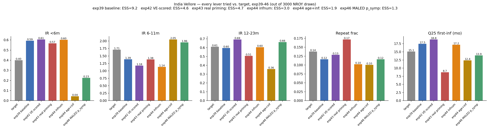

# India Vellore calibration — status for 2026-08-13 discussion

## Project context

Cross-setting achieved-VE gradient project: does the LMIC age-distribution of
infection produce a different *achieved* vaccine effectiveness than a
high-income setting, at similar underlying vaccine efficacy? Three sites:
Bangladesh (MAL-ED cohort), UK (pre-vaccine surveillance), India (MAL-ED
Vellore cohort + Tamil Nadu surveillance). Same model, same code, fit
independently per site.

## Bangladesh — done, high confidence

`infnum` (infection-number symptom model) selected via a decisive model
comparison (exp09, `age_only` vs `infnum` under a shape-aware Poisson
likelihood). Fits the MAL-ED Bangladesh cohort well, and independently
validated against icddr,b Dhaka surveillance (exp29, no refit) — predicted
risk-by-age matched observed. Closed, not currently active.

## UK — done, moderate confidence

Same `infnum` structure selected (exp28, decisive vs 3 alternatives). Vaccine
validation (exp30): direct VE at take=0.9 predicts 74%, matching the UK
test-negative estimate of 77%. Known gap: the model (no waning) doesn't
reproduce the observed post-vaccine age-shift — a diagnosed, understood
limitation, not an open mystery. Closed, not currently active.

## India — the open problem

**The core issue, since exp31 (first India attempt):** the model persistently
overshoots symptomatic incidence at &lt;6 months and undershoots the 6-11 month
peak, no matter what else is changed. `age_binned` (exp39) is the best
structure found — ESS 9.15/3000, but that pair remains off:

| Target | exp39 (best fit) | Target |
|---|---|---|
| IR &lt;6m | 0.59 | **0.40** |
| IR 6-11m | 1.39 | **1.71** |
| IR 12-23m | 0.60 | 0.61 (good) |
| repeat_frac | 0.12 | 0.14 (close) |
| Q25 first-infection | 17.5mo | 15.1mo |

### What's been tried (all failed to close the &lt;6m/6-11m gap)

| Exp | Lever | Result |
|---|---|---|
| 31-38 | infnum + various neonatal-priming symptom-flag designs | Same &lt;6m/6-11m pattern persists across every variant |
| 40 | `age_and_infection` symptom model | **Invalidated by a bug** found 2026-08-12 (`MALEDCohort` never implemented it — silently scored 100% of infections as symptomatic). Fixed; re-tested properly in exp44 |
| 42 | Add VE as a trajectory-selection scoring target | Pulls VE toward target but only by moving &lt;6m/6-11m further off; ESS 9.15→4.60 |
| 43 | Make neonatal priming a real, detected infection | &lt;6m/6-11m untouched; overshoots Q25 the *other* direction; ESS→4.73 |
| 44 | Fractional neonatal order-crediting, under `infnum` and (bug-fixed) `age_and_infection` | Both negative; `age_and_infection`'s ESS collapsed to 1.9/3000 (14 free params — too many for 44 cases) |
| 45 | Per-agent infection-count distribution check | One homogeneous exposure pool, not two risk groups — rules out simple agent heterogeneity as the explanation. Separately: ~85-87% of sampled parameter space goes fully extinct, consistent across every model tried |
| **46** | **Swap p_symp source: MAL-ED-derived (ascertainment-corrected) instead of slum-cohort-derived** | **First lever with correctly-signed effect on both &lt;6m and 6-11m** — overshot past target on both sides, but in the *right direction*. ESS→1.26 |

**Every other lever failed outright. exp46 is the first to move the actual
problem in the correct direction at all** — it just overshot. Both targets
(&lt;6m=0.40, 6-11m=1.71) sit *between* the slum-derived and MAL-ED-derived
p_symp anchors for their bins, which is why exp47 (below) frees p_symp
between those two anchors rather than fixing it at either endpoint.

### A separate, structural issue found today: single-seed extinction scoring

Every India HM run (39 through 47) scores whether a parameter point is
"extinct" from **one simulation seed per point**. Given this fit sits at an
~85-87% baseline extinction rate — a knife's edge — a parameter set with a
genuinely low (say 15%) extinction *probability* has a real chance of losing
its one coin flip and being wrongly treated as fully implausible. Since this
signal is cycled first in history matching and shapes wave-1 NROY before
anything else, this could be adding real noise to *every* result above, not
just a specific run.

**Fix staged (exp48, no new simulations needed):** replace the raw
single-draw signal with a logistic classifier's predicted P(extinct), fit on
all (parameters, extinct/not) pairs accumulated across waves — borrows
information across nearby already-sampled points the way logistic regression
normally does. Smoke-tested clean; staged to run automatically after exp47.

### Where things stand right now (as of this morning)

- **exp47** (p_symp freed between the two exp39/46 anchors) — running on
  zebra, staged to finish around midday.
- **exp48** (exp47's design + the classifier-based extinction fix) — staged
  to launch automatically the moment exp47 finishes, no manual step needed.
- Both use the same free-parameter set otherwise (`base_beta`, `sus_after_*`,
  maternal titer params) as exp39.

### Open questions for discussion

1. **Is the &lt;6m/6-11m tension a p_symp-calibration problem (exp46/47 line) or
   a deeper structural one (two-strain population, not yet tried)?** exp46
   is the first evidence for "calibration problem" — worth seeing exp47/48
   out before concluding either way.
2. **Is ESS collapsing because the joint constraint is genuinely tight, or
   because single-seed extinction noise has been distorting the search this
   whole time?** exp48 is a direct test of the second hypothesis.
3. If exp47/48 don't resolve it: pursue a two-strain structural model
   (the persistent Vellore community strain vs. wild-type, weakly
   cross-protective), or lean on the larger-N Tamil Nadu surveillance data
   instead of continuing to refine against the sparse 44-case Vellore cohort.
