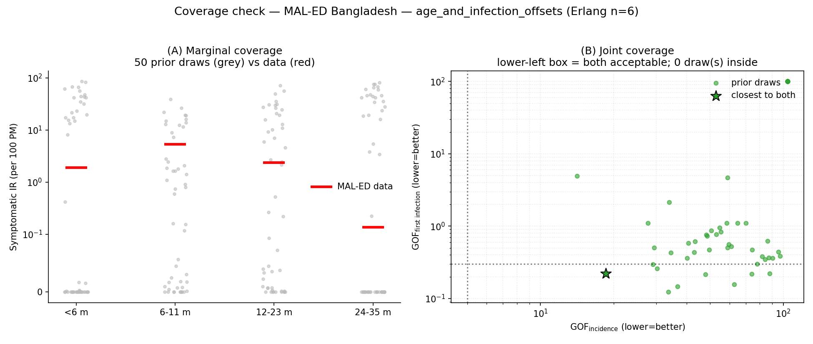

# Exp 01 — Prior-predictive coverage check: are symptomatic incidence and age-at-first-infection jointly achievable?

**Date:** 2026-06-04.

**Question.** Optimizer-driven runs (Optuna/TPE, multiple symptom-model and
maternal-waning variants) have not been able to fit MAL-ED Bangladesh
symptomatic-IR-by-age and age-at-first-infection at the same time. This
experiment asked the *prior* instead of the optimizer: drawing 50 parameter
sets independently from the prior, does any single set reach both targets — to
separate a structural mismatch from a search/likelihood failure (the step-3
coverage check that was skipped before iteration). See `README.md` for the
pre-registered plan and `../../CLAUDE.md` for project intake.

**Result.** **Inconclusive — and the wrong instrument for this question.** The
random wide-prior predictive check confirms only that the model can reach each
target's *magnitude* range (marginal coverage, trivially); it cannot settle
*joint* achievability, because 50 random draws reach just `gof_inc = 14.1` at
best vs. the TPE-calibrated `~4.4`. The script's auto "0/50 joint → STRUCTURAL"
print is therefore an **artifact of random-sampling inefficiency, not evidence
of structural impossibility**, and is not used.

## Observations

1. **Marginal IR coverage passes trivially.** Simulated IR spans ~0–85 /100 PM
   per bin (Panel A), so the data (1.9–5.4) sits inside by default — the classic
   "prior too wide → coverage passes uninformatively." It tells us the model can
   produce the data magnitudes, nothing about shape.
2. **The joint miss is confounded by sampling, not structure.** Best random draw
   `gof_inc = 14.14` (median 59.2) vs. TPE-calibrated `~4.4`; Panel B shows the
   whole cloud at `gof_inc > 14`. With 50 random draws in ~9 dimensions, no draw
   reaching calibrated quality is expected regardless of structure.
3. **The joint thresholds were also too loose.** `gof_inc ≤ 5 & gof_first ≤ 0.3`
   would *pass* TPE trial #19 (`4.38 / 0.21`) — yet #19 overshoots the `<6m` bin
   6× (model 11.97 vs data 1.91). "In the box" ≠ right shape.
4. **9/50 draws produced no detected infections** (NaN first-infection), and the
   script's marginal first-infection coverage is not nan-aware (reported OUT
   spuriously). Does not affect the joint conclusion.
5. **Weak anti-correlation** between the two GOFs across finite draws (−0.25) —
   a faint tradeoff hint, far from conclusive.

## Lesson

A uniform wide-prior random predictive check is the wrong instrument for a
**joint-shape / identifiability** question in a ~9-parameter model: random draws
are dominated by the optimizer already run, and a scalar GOF threshold conflates
"near the data" with "right shape." Marginal coverage answers *"can the model
reach the data magnitudes?"* (yes, trivially here); it does not answer *"can one
parameter set reproduce the shape of both targets at once?"* — which is the
actual question.

## Acceptance

Blocks as a structural verdict — does **not** establish (or refute) the
structural tension. The operative evidence moves to the **optimized** Pareto
frontier from the completed TPE comparison studies, analyzed against the real
data targets.

## Next

**Exp 02 — joint-identifiability on the optimized fits.** Characterize the
achievable `(gof_inc, gof_first)` Pareto frontier from the existing TPE
comparison studies (offsets / age_only / infection_number, plus the earlier
age and maternal variants) against the real data targets — specifically the
6–11 mo peak height, the near-zero 24–35 mo bin, and the first-infection
median — and show whether the achievable frontier excludes the data corner.
That is the rigorous structural-tension test this experiment could not provide.
