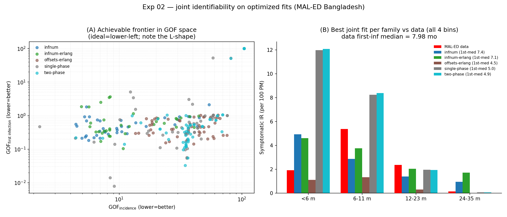

# Exp 02 — Joint identifiability on the optimized fits: the achievable frontier excludes the data corner

**Date:** 2026-06-04.

**Question.** `01_coverage_check` was the wrong instrument (random prior draws
can't reach calibrated quality). This experiment asked joint achievability with
the right instrument — the **optimized** fits already in hand. Pooling every
completed TPE trial across 5 model families (250 trials), does *any single
parameterization* reproduce the MAL-ED Bangladesh shape on both targets at once?
See `../01_coverage_check/SUMMARY.md`.

**Result.** **No — structural tension confirmed.** Across **0 of 250** optimized
trials (5 families) does the full symptomatic-IR profile fall within a *generous*
factor-of-2 of the data in all four age bins while also matching the
first-infection median (±1.5 mo). The data's signature — a **sharp 6–11 mo peak
(5.37) sitting on a low `<6m` shoulder (1.91) and a near-zero 24–35 mo bin
(0.14)** — is reproduced by no symptom-model or maternal-waning variant.

## Observations

1. **No family reaches the shape** (Panel B). Best joint attempt per family vs
   data `[1.91, 5.37, 2.35, 0.14]`, first-med 8.0:
   - single-phase / two-phase (age): `[~12, ~8.3, ~1.9, 0.05]` — overshoot `<6m`
     **6×** and the peak, first-inf too early (5.0).
   - infnum / infnum-erlang: `[~4.7, ~3.3, ~1.7, ~1.3]` — overshoot `<6m`,
     **undershoot the peak**, overshoot the oldest bin 7–12×; first-inf right (~7).
   - offsets-erlang: `[1.1, 1.3, 0.3, 0]` — undershoots everything.
2. **The mechanism of the tension.** Age-symptom models can only build a 6–11 mo
   peak by overshooting the *younger* bins (the age curve is smooth); infection-
   number models get first-infection timing right but can't make the peak tall
   without overshooting the *oldest* bin. The sharp-peak-on-low-shoulders shape
   needs something neither provides.
3. **GOF frontier is L-shaped** (Panel A): best `gof_inc = 2.24`, best
   `gof_first = 0.008`, achieved by *different* trials; no trial is near both.
4. **34/250 pass the first-infection-median test; 0/250 pass the all-4-bins
   shape test; 0 pass both.** You can match first-infection timing *or* get a
   peak-ish IR, never the full shape.
5. **Instrument correction (recorded honestly).** A first pass used a 3-feature
   tolerance box (peak, oldest, first-med) and reported "1/250 reaches corner" —
   but that one trial had `gof_inc = 9.18` and only qualified because the box
   ignored the `<6m` and `12–23m` bins. The corrected all-4-bins test gives 0/250.
   Lesson echoing exp 01: scalar/partial summaries hide shape failures; check the
   full profile.

## Acceptance

Decision-grade. The Pareto tension is **structural** — it lives in the infection/
age structure, not in the symptom observation model (4 symptom families tried) or
the optimizer (250 optimized trials). Symptom-side and maternal-waning changes are
exhausted; the next move is a structural change.

## Next

**Exp 03 — structural change.** The unreproduced feature (a sharp 6–11 mo peak on
low `<6m` and near-zero oldest shoulders) is the maternal-protection-then-first-
infection signature that no symptom-side mechanism can create. Candidate
structural changes, to test one at a time against the full-profile fit:
(a) **age-modulated protection against *infection*** (susceptibility), the
original hypothesis — currently age only affects symptoms; and/or
(b) **age-structured contacts / force-of-infection** that concentrate first
infections into 6–11 mo. Route through `parameter-engineering` then a fresh
coverage/identifiability check on the new structure.
