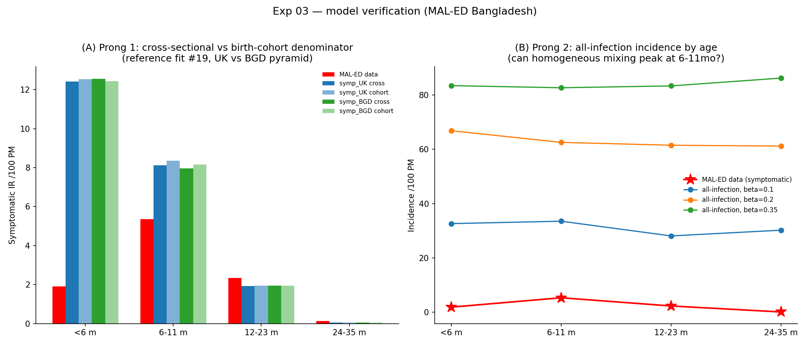

# Exp 03 — Model verification: no bug; homogeneous mixing gives a flat infection profile

**Date:** 2026-06-05.

**Question.** `02_joint_identifiability` showed no optimized fit reproduces the
MAL-ED Bangladesh shape. Before adding age-structured contacts, rule out the
alternative the researcher flagged — that the failure is a model **bug/artifact**
rather than a real structural need (many groups fit rotavirus without age-
structured mixing). See `../02_joint_identifiability/SUMMARY.md`.

**Result.** **No bug found; the limitation is structural.** The person-time
denominator and population pyramid are cleanly exonerated, and homogeneous mixing
produces a **flat all-infection age profile** that cannot be reshaped into the
data's peaked symptomatic profile by the symptom/maternal mechanisms already
exhausted in exp 02. Age-structured contacts is therefore justified — on
mechanism, not just on "we couldn't fit it."

## Observations

1. **Denominator/pyramid exonerated (Panel A).** For the reference fit (#19), the
   four variants — UK vs Bangladesh pyramid × cross-sectional vs birth-cohort
   person-time — give essentially identical IR-by-age (`<6m` ≈ 12.4–12.6 in all),
   because the headcount:bin-width ratio is flat (~175 across bins, i.e. the
   population is already cohort-like for young ages). The `<6m` overshoot
   (12.4 vs data 1.91) is **not** a denominator or pyramid artifact.
2. **Homogeneous mixing is flat (Panel B).** All-infection incidence is
   ~age-constant at every `base_beta` (0.1: `[32.6, 33.5, 28.1, 30.2]`; 0.2:
   `[66.8, 62.5, 61.5, 61.2]`; 0.35: `[83.4, 82.6, 83.3, 86.2]`) — no 6–11 mo
   surge, and `<6m` is not suppressed (at the reference maternal). The data (red)
   is sharply peaked at 6–11 mo.
3. **Why the symptom curve can't rescue it.** Turning a flat infection base into
   the data's peaked symptomatic profile needs P(symptomatic | age) ≈
   `[0.06, 0.18, 0.08, 0.005]` — an *asymmetric* peak with 12–23 mo ≳ `<6m` around
   a 6–11 mo maximum. A single age-centered quadratic logistic can't carve that (a
   parabola peaking at ~9 mo forces the farther bin, 12–23 mo, *below* `<6m`) —
   exactly why exp 02's age fits overshoot `<6m`. So neither the flat infection
   base nor the symptom curve produces the peak alone.
4. **Caveat.** Prongs 1–2 were run; the prong-3 seeding-washout (`init_prevalence=0`)
   was not separately executed (it's a t=0 transient 5 yr upstream of the window,
   low risk) and `rel_sus`-by-age was not snapshotted — though the flat `<6m`
   all-infection is consistent with the intentionally-weak reference maternal, no
   anomaly.

## Acceptance

No bug in the demographics / denominator / core mechanisms. The inability to
reproduce the age-incidence shape is a genuine consequence of homogeneous mixing
(age-constant force of infection). The peak must come from a **peaked infection
process** — concentrating infection, and first infections, into 6–11 mo.

## Next

**Exp 04 — age-structured contacts.** Replace homogeneous mixing with an
age-structured contact pattern (infants exposed preferentially by slightly older
children) so the force of infection — and the first-infection peak — concentrates
into 6–11 mo, then re-check the full-profile fit. This leaves the immunity/
age-vs-infection-number question uncontaminated (per the exp-02→03 reasoning,
additive age-on-susceptibility was rejected as confounding). If contacts also
fail, revisit the symptom-curve flexibility / likelihood.
