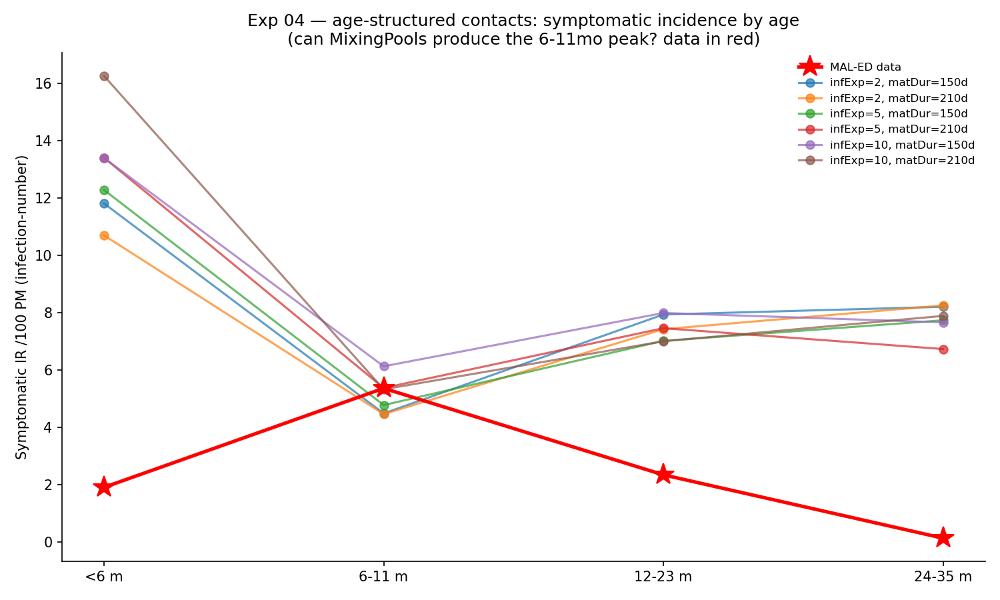

# Exp 04 — Age-structured contacts can't make the peak; the peak is a symptom-severity-by-age effect

**Date:** 2026-06-05.

**Question.** exp 03 showed homogeneous mixing gives a flat infection profile that
can't make the data's 6–11 mo peak. Can age-structured contacts (ss.MixingPools)
concentrate the force of infection enough to produce it — and is the persistent
`<6m` overshoot a maternal-immunity bug? See `../03_model_verification/SUMMARY.md`.

**Result.** **No — and it's not a bug.** Age-structured contacts (2-group, then a
3-group infants/young-children/5+ with low infant exposure) can shift the *timing*
of infection but cannot produce a 6–11 mo symptomatic peak: every swept profile is
flat/U-shaped (`<6m` overshoots, 6–11 mo is a *dip*). Separately, maternal immunity
was verified to work correctly. The real missing piece is that **symptom severity
is non-linear in age** (mild `<6m`, worst 6–12 mo, milder after) — a *symptom-
severity-by-age* peak, not an infection-rate peak.

## Observations

1. **MixingPools integration works** (de-risked the hard way): rotasim uses base
   `ss.Infection.infect()`, so `ss.MixingPools` transmits. Wiring: pool `beta=1.0`
   (the *disease* beta carries transmission — they multiply), `diseases='G1P8'`,
   set disease beta before `init`, grab the connector after.
2. **Contacts shift timing, not shape.** 3-group sweep (infant exposure ×
   maternal duration, 15k agents): low infant exposure + long maternal pushed
   first-infection median to ~6 mo, but symptomatic profiles stayed flat/U-shaped
   (e.g. `[10.7, 4.5, 7.4, 8.3]` — `<6m` over, 6–11 mo a dip). No combo peaked.
   Low exposure *delays* first infections but *spreads* them into 12–23 mo rather
   than concentrating them at 6–11 mo.
3. **Maternal immunity works (not the bug).** Off→On (eff 0.97, Erlang 210 d):
   `rel_sus` `<6m` 0.40→0.11, all-infection `<6m` 32.6→11.1 (3×), first-inf median
   1.0→6.0 mo. And `n_contacts=1` → epidemic fades (FOI lever confirmed).
4. **The crux.** Even with maternal suppressing `<6m` *infections*, `<6m`
   *symptomatic* stays high because infection-number symptoms make a *first*
   infection ~symptomatic regardless of age. The data needs `<6m` first infections
   to be *mild* and 6–12 mo *most severe* — i.e. a **non-linear (quadratic) age
   curve for symptom probability** (the Lewnard form), applied on top of the
   infection process.

## Acceptance

Age-structured contacts are **not** the fix and likely not needed. The 6–11 mo
peak is a property of symptom *severity* by age, not infection *rate* by age.
With strong maternal verified working, homogeneous mixing + a peaked age-symptom
curve should reproduce the shape.

## Next

**Exp 05 — non-linear (quadratic, peaked-at-6-12mo) age-symptom curve + strong
maternal, homogeneous mixing.** Anchor the curve near Lewnard's peaked betas so it
realizes a peak (exp 02's optimizer drifted to a monotone-declining curve).
**Exp 06** will repeat with infection-number-only symptoms as the model-selection
comparison. Contacts (this experiment's machinery) are shelved unless exp 05/06
fail.
