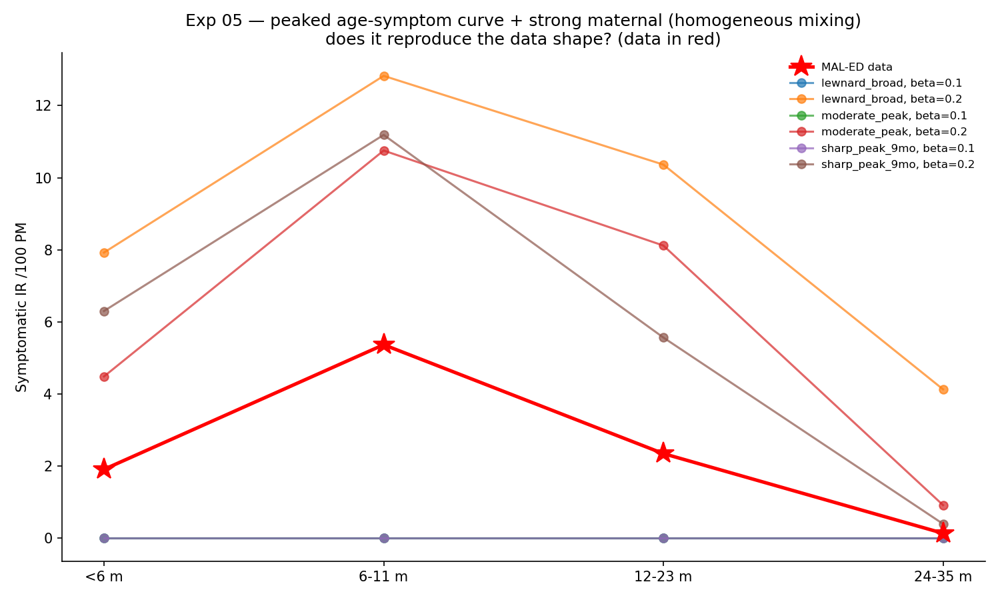

# Exp 05 — Peaked age-symptom curve + strong maternal reproduces the shape (homogeneous mixing)

**Date:** 2026-06-05.

**Question.** exp 03–04 established the 6–11 mo peak is a symptom-severity-by-age
effect (non-linear/quadratic), not an infection-rate effect, and that maternal
immunity works. Does a **peaked** (quadratic) age-symptom curve + strong maternal,
under **homogeneous mixing**, reproduce the data shape — where exp 02's age-quadratic
(which drifted to a monotone-declining curve + weaker maternal) failed? See
`../04_age_structured_contacts/SUMMARY.md`.

**Result.** **Yes — feasibility passed.** With strong Erlang maternal (eff 0.95,
n=6, mean 200 d) and a peaked age-symptom curve, all three peaked beta sets at
`base_beta=0.20` reproduce the **low-`<6m` → 6–11 mo peak → declining-tail** shape.
`sharp_peak_9mo` matches best: model `[6.3, 11.2, 5.6, 0.4]` vs data
`[1.91, 5.37, 2.35, 0.14]` — same shape, ~2–3× too high in level (a calibration
job, not a structural one). **Homogeneous mixing is sufficient; age-structured
contacts are not needed.**

## Observations

1. **Shape reproduced** (Panel): all peaked curves at β=0.20 rise from `<6m` to a
   6–11 mo peak then decline — parallel to the red data line, shifted up ~2–3×.
   First-infection median ~5.8–6.0 mo (data 8.0; close, will refine in calibration).
2. **Sharper peak → better tail.** `sharp_peak_9mo` declines to 0.4 at 24–35 mo
   (data 0.14); `moderate_peak` to 0.9; `lewnard_broad` stays at 4.1 (too broad).
   So the curvature (quadratic strength) matters and is calibratable.
3. **Levels overshoot ~2–3×** — expected; `base_beta`, the reporting/severity scale,
   and the curve height are free to bring levels down. The *shape* is the hard part
   and it's solved.
4. **β=0.10 fades** (0 infections) — the epidemic needs `base_beta ≳ 0.2` to sustain
   under these susceptibility/maternal settings (a constraint for calibration bounds).
5. This vindicates the researcher's biology call: symptom severity is non-monotonic
   in age (mild `<6m`, worst 6–12 mo, milder after), and that single non-linearity —
   *not* contacts, *not* a maternal bug — is what the data needed.

## Acceptance

Feasibility **passed**: the model can produce the MAL-ED shape with homogeneous
mixing + peaked age-symptom curve + strong maternal. This is the structure to
calibrate. The exhaustive negative path (exps 01–04) is what made this the
confident, decision-grade answer.

## Next

1. **Exp 06 — infection-number-only comparison** (researcher's plan): same setup
   (homogeneous mixing, strong maternal), infection-number symptoms instead of the
   age curve — confirm it does *not* reproduce the shape (expected from exp 04),
   giving the clean age-vs-infection-number model-selection answer.
2. **Calibrate** the peaked-age + maternal model to fit levels quantitatively —
   anchoring the symptom curve to stay peaked (avoid exp 02's monotone-declining
   drift), fitting `base_beta` / curve height / maternal to the 4 IR bins +
   first-infection target.
