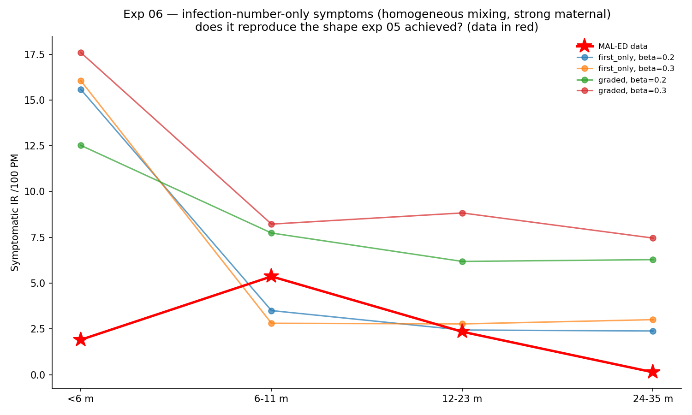

# Exp 06 — Infection-number-only can't make the peak: age-based symptom severity is needed

**Date:** 2026-06-05.

**Question.** Under the *identical* setup that worked in exp 05 (homogeneous mixing,
strong Erlang maternal), can the canonical **infection-number-only** symptom model
reproduce the MAL-ED shape, or is age-based symptom severity genuinely required?
This is the project's central model-selection question. See
`../05_nonlinear_age_symptom/SUMMARY.md`.

**Result.** **Infection-number-only cannot reproduce the shape — it is qualitatively
wrong.** Every `p_symp` × `base_beta` combination gives a profile that is *highest at
`<6m`* and then declines/flattens — the opposite of the data, which is *low at `<6m`*
and *peaks at 6–11 mo*. So age-based (non-monotonic) symptom severity is **needed**
over the infection-number model. This is the headline answer.

## Observations

1. **Wrong shape, not just wrong level.** `first_only` β=0.20: `[15.6, 3.5, 2.4, 2.4]`;
   `graded` β=0.20: `[12.5, 7.7, 6.2, 6.3]`. All are `<6m`-highest with no 6–11 mo
   peak. The data is `[1.91, 5.37, 2.35, 0.14]` (peak at 6–11 mo). The qualitative
   mismatch is independent of any level/`base_beta` rescaling.
2. **Mechanism.** Even with strong maternal suppressing `<6m` *infections*, the first
   infections that do occur in `<6m` are symptomatic (`p_symp_1` high) *regardless of
   age* — so `<6m` symptomatic is high. There is nothing to make young first
   infections *mild*. That "mild when young" is precisely the age effect exp 05 adds.
3. **Direct contrast.** Same maternal, same mixing, same susceptibility — only the
   symptom model differs: peaked age curve (exp 05) → reproduces the shape;
   infection-number-only (here) → `<6m`-highest, no peak.

## Acceptance

Model-selection answer, decision-grade: **age-based symptom severity (non-monotonic,
peaked at 6–12 mo) is required to reproduce the MAL-ED Bangladesh age-incidence shape;
the infection-number-only model cannot.** This is the result the project set out to
establish.

## Next

**Calibrate both models** quantitatively (researcher's request) to put numbers on the
comparison — fit each (peaked-age vs infection-number, both homogeneous + strong
maternal) to the 4 IR bins + first-infection target, report GOF and the held-out
first-infection fit. The qualitative answer is already clear; calibration quantifies
the gap and gives the fitted age-symptom parameters for the downstream VE work.
