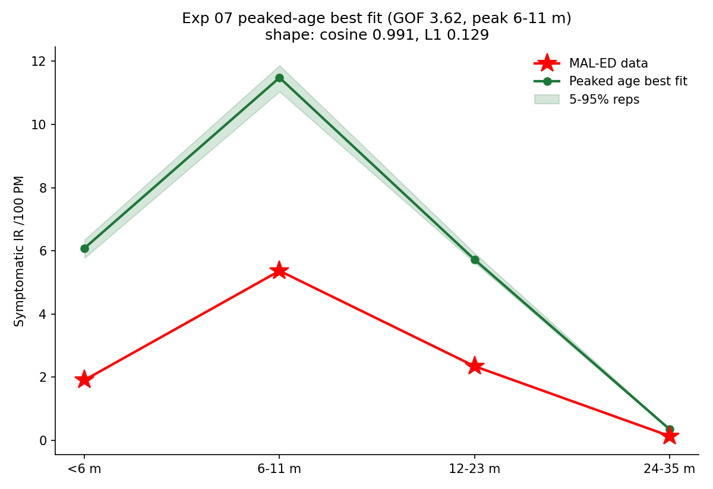

# Exp 07 — Calibrated peaked-age model reproduces the MAL-ED shape (but overshoots level ~3x)

**Date:** 2026-06-08.

**Question.** Exp 05 showed *qualitatively* that a peaked (quadratic) age-symptom
curve + strong Erlang maternal immunity under homogeneous mixing reproduces the
MAL-ED Bangladesh age-incidence shape. This experiment puts numbers on it: a full
TPE calibration (40 trials x 20 reps, joint objective) on Bangladesh demographics,
to compare head-to-head with the infection-number model (`../08_calibrate_infection_number/`).

**Result.** **The peaked-age model reproduces the shape — best joint GOF 3.62.** The
best fit dips at `<6m`, peaks at 6-11 mo, and declines through 24-35 mo, matching the
data's *shape* almost exactly (normalized-profile cosine 0.991, shape L1 0.13, peak
in the correct 6-11 mo bin). The remaining error is almost entirely **level**: the
fit overshoots the data by ~3x (best-fit IR `[6.1, 11.5, 5.7, 0.35]` vs target
`[1.9, 5.4, 2.4, 0.14]`). The enqueued exp-05 seed (trial 0) was the best point; TPE
explored widely but never beat it, so the peaked configuration is a strong attractor.

## Observations

1. **Shape is essentially solved.** cosine 0.991 / L1 0.13 against the level-normalized
   target; the peak sits in the correct 6-11 mo bin. The mechanism (mild when very
   young, worst at 6-12 mo, milder after) is doing exactly what the data needs.
2. **Level is not.** All four bins overshoot ~3x. Because the squared-log objective is
   a per-bin *level* penalty, this overshoot is what dominates the GOF (3.62) -- the
   shape contributes almost nothing to the error. The fix is a scale term in the
   objective (see exp 09), not a structural change.
3. **Fitted parameters are plausible.** base_beta 0.20; susceptibility 0.60/0.40/0.25
   by infection number; maternal efficacy 0.95, mean duration **200 d (~6.6 mo)** with
   Erlang-6 sharpening. The maternal duration is on the long side of the Pitzer/Lopman
   ~3-7 mo range but within reach; worth revisiting once the level is calibrated.
4. **First-infection timing slightly early.** median 5.88 mo vs target 7.98 (gof_first
   0.11). Minor under the joint objective; the infection-number model actually fits
   this one target better (exp 08), which the joint scalar partly rewards.

## Acceptance

Usable as the peaked-age baseline for the model comparison. The shape result is
decision-grade; the ~3x level overshoot is a calibration artifact of the level-only
objective and is the motivation for exp 09, not a defect of the model structure.

## Next

The scalar joint GOF (3.62) barely separates this model from the infection-number
model (4.80) even though the shapes are very different -- see the head-to-head in
[`../08_calibrate_infection_number/SUMMARY.md`](../08_calibrate_infection_number/SUMMARY.md).
Re-calibrate both under a **scale x shape likelihood** (Poisson on total incidence +
multinomial on the age-proportions) so the objective rewards the correct shape and
pulls the level overshoot down -- `../09_shape_aware_likelihood/`.
