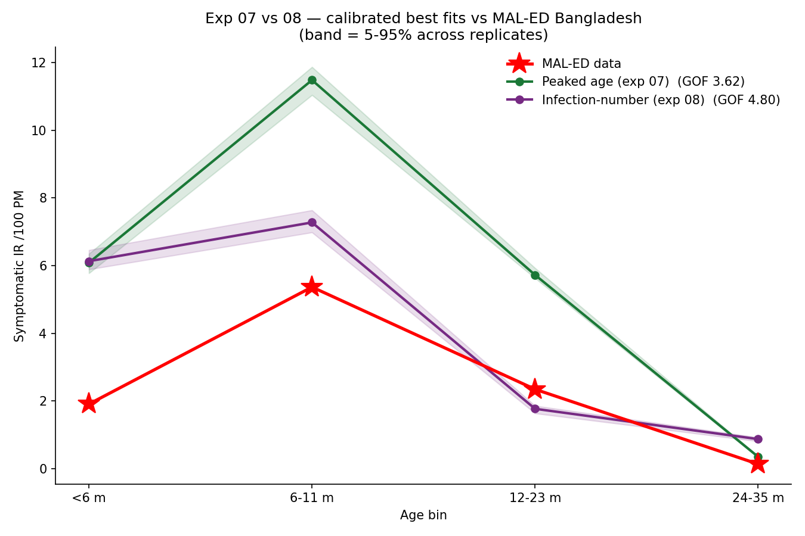

# Exp 08 — Infection-number model: nearly ties on scalar GOF, decisively worse on shape

**Date:** 2026-06-08.

**Question.** The matched comparison to exp 07. Exp 06 showed *qualitatively* that the
canonical infection-number-only symptom model can't make the 6-11 mo peak. Calibrating
it to the same targets under the same setup (Bangladesh demographics, homogeneous
mixing, Erlang-6 maternal, joint objective, 40 trials x 20 reps) quantifies the
model-selection gap against the peaked-age model
(`../07_calibrate_peaked_age/SUMMARY.md`).

**Result.** **The scalar joint GOF nearly ties the two models (4.80 vs peaked 3.62,
only 1.3x), but every shape metric separates them decisively.** The best
infection-number fit is *too flat at the young end* -- best-fit IR `[6.1, 7.3, 1.8, 0.9]`
vs target `[1.9, 5.4, 2.4, 0.14]`: `<6m` (6.1) is almost as high as its weak peak
(7.3), so it never makes the real rise into 6-11 mo, and its 24-35 mo tail (0.87) is
~6x the target. Normalized-profile shape L1 is **0.45 vs the peaked model's 0.13**
(3.5x worse), cosine 0.919 vs 0.991, and the multinomial shape log-likelihood of the
observed case counts is ~40 log-units worse (-218 vs -178).

## Observations

1. **The scalar objective hides the difference.** peaked-age's GOF (3.62) is almost
   entirely *level* overshoot with near-perfect shape; infection-number's (4.80) mixes
   a smaller level error with a genuine *shape* error. So the squared-log joint GOF
   penalizes the right model for level while letting the wrong model's flat shape slide
   -- exactly the failure mode that motivates exp 09.
2. **The binary peak-bin test is too coarse.** Both models nominally peak in the 6-11 mo
   bin (infection-number's [6.1, **7.3**, 1.8, 0.9] has its max there by a hair). Only
   the *continuous* shape distance (L1, cosine, multinomial LL) reveals that the
   infection-number profile is nearly flat where the data rises 2.8x.
3. **It does fit first-infection timing slightly better.** median 7.73 mo vs target 7.98
   (gof_first 0.02, vs peaked 0.11). The joint scalar rewards this, which is part of why
   the two models' scalar GOFs are so close despite the shape gap.
4. **Calibration didn't rescue exp 06's qualitative finding.** With strong maternal +
   tuned beta the model manages a faint young-end bump, but the steep
   low-`<6m`/peaked-6-11mo/declining structure remains out of reach without an age term.

## Scorecard

| metric | peaked age (07) | infection-# (08) | better |
|---|---|---|---|
| joint GOF (scalar) | 3.62 | 4.80 | peaked (1.3x) |
| shape L1 (normalized) | 0.13 | 0.45 | peaked (3.5x) |
| shape cosine | 0.991 | 0.919 | peaked |
| multinomial shape-LL | -178 | -218 | peaked (~40) |
| first-infection median | 5.88 mo | 7.73 mo | infection-# |
| target | [1.9, 5.4, 2.4, 0.14] | peak 6-11 mo | |

## Acceptance

Decision-grade for model selection: under a level-focused objective the peaked-age
model is better but not decisively (3.62 vs 4.80); under any shape-aware comparison it
is decisively better (3.5x on L1). The conclusion that age-based symptom severity is
needed holds, and the near-tie on the scalar metric is itself the result that justifies
moving to a shape-aware likelihood.

## Next

Re-calibrate **both** models under a **scale x shape likelihood** (Poisson on total
incidence + multinomial on the age-proportions) -- `../09_shape_aware_likelihood/`.
Expectation: the multinomial term penalizes infection-number's flat shape hard
(widening the gap to decisive), while the Poisson scale term pulls the peaked model's
~3x level overshoot down toward the data.
