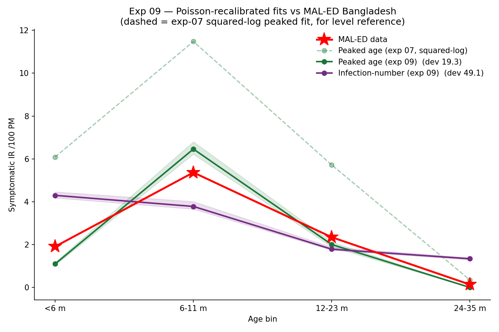

# Exp 09 — Shape-aware (Poisson) objective: fixes the level overshoot and makes the model selection decisive

**Date:** 2026-06-08.

**Question.** Exp 07/08 showed the squared-log joint GOF was level-dominated: it nearly
tied the peaked-age and infection-number models on the scalar (3.62 vs 4.80) despite
very different shapes, and let the peaked model overshoot incidence ~3x. Does a
shape-aware **per-bin Poisson** objective (deviance of the MAL-ED age-bin case counts;
= total-count scale x age-multinomial shape) (a) fix the level overshoot and (b)
sharpen the comparison? Both models re-calibrated under it, incidence-driven
(`--fit-target poisson`, w_first=1 so first-infection is only lightly weighted). See
`../07_calibrate_peaked_age/SUMMARY.md`, `../08_calibrate_infection_number/SUMMARY.md`.

**Result.** **Yes, on both counts — and the selection is now qualitative, not just
quantitative.** At 40 trials the peaked model reaches Poisson deviance **19.3** vs the
infection-number model's **49.1** (2.6x), with the level overshoot gone (total cases
155 vs observed 161; was ~3x over under squared-log) and — unprompted — the
age-at-first-infection landing right (median **8.22 vs target 7.98 mo**, with no
first-infection weight). The fully-optimized infection-number model peaks at **<6 mo**
(IR `[4.3, 3.8, 1.8, 1.3]`) — the canonical wrong shape from exp 06 — while the peaked
model peaks at **6-11 mo** (IR `[1.1, 6.5, 2.0, 0.0]`), tracking the data. They now
differ in *where the peak is*, not merely by how much.

## Observations

1. **The earlier "peaked won't optimize" was trial budget, not the objective.** Stopped
   prematurely at 25 trials (9-parameter search), peaked's best was stuck at the
   enqueued seed (deviance 28.9) and undershot total cases ~35% (104 vs 161). Resuming
   the same study to 40 trials (pure TPE, 0 startup) let TPE beat the seed (**19.3**)
   and close the undershoot. So the steep Poisson surface + wide base_beta prior needed
   the full budget; the objective itself was sound.
2. **The Poisson objective did its job on level.** Peaked dropped from exp-07's
   `[6.1, 11.5, 5.7, 0.35]` (3x over) to `[1.1, 6.5, 2.0, 0.0]` (total 155 vs 161). The
   scale (total-count) term pulled magnitude to the data without a first-infection term.
3. **First-infection came right for free.** Median 8.22 vs 7.98 mo, despite being
   near-zero-weighted — matching the incidence age-distribution naturally places
   age-at-first-infection correctly. This removes the original motivation for a
   first-infection-weighted joint (planned exp 10).
4. **Infection-number is structurally wrong, confirmed under full optimization.** Its
   best fit matches total cases (168) but peaks at `<6m` with a fat 24-35mo tail
   (1.3 vs 0.14) — shape L1 0.59, cosine 0.87. No `p_symp` set + maternal can make the
   6-11mo peak; the age term is required.
5. **Minor blemish.** The peaked best slightly *over*-sharpens (peak 6.5 vs 5.4, `<6m`
   1.1 vs 1.9, tail 0.0 vs 0.14), so normalized-shape L1 (0.25) is worse than the
   under-leveled 25-trial fit (0.08) even though deviance is better. Cosmetic.

## Fitted peaked-age parameters (trial 33)

base_beta 0.108; susceptibility by infection number 0.93 / 0.82 / 0.48; maternal
efficacy 0.95, mean duration **194 d (~6.4 mo)**, Erlang-6; age logistic beta0 -1.52,
beta1 -0.12, beta2 -0.036 (negative beta2 -> peaked). Maternal duration is on the long
side of the Pitzer/Lopman ~3-7 mo literature but within reach. Full record in
`outputs/scorecard.json`.

## Acceptance

Decision-grade. The shape-aware objective confirms the model-selection result of exp
06-08 in its strongest form (qualitative peak-location difference, decisive deviance
gap) and yields a peaked best-fit that matches level, shape, **and** age-at-first-
infection simultaneously. This is a usable pre-vaccine baseline for the downstream VE
work.

## Next

- **Exp 10 (first-infection joint) is no longer motivated** — first-infection and level
  both came right from the incidence-driven Poisson at full budget, so a `w_first` term
  has nothing left to fix. The shape-weight fallback is likewise not needed.
- **Pull in and compare a colleague's alternative fitting approach** — he fit the model
  differently; reconcile the two on the same targets/objective (deviance + the shape
  scorecard here) before carrying a single baseline forward.
- **Downstream VE work**: carry the peaked baseline forward; set force-of-infection so
  simulated age-at-first-infection matches the empirical ~38 wk (LMIC) vs ~65 wk
  (high-income) targets (PMC6736387, logged in `../../CLAUDE.md`) and read off the
  achieved-VE gap.
