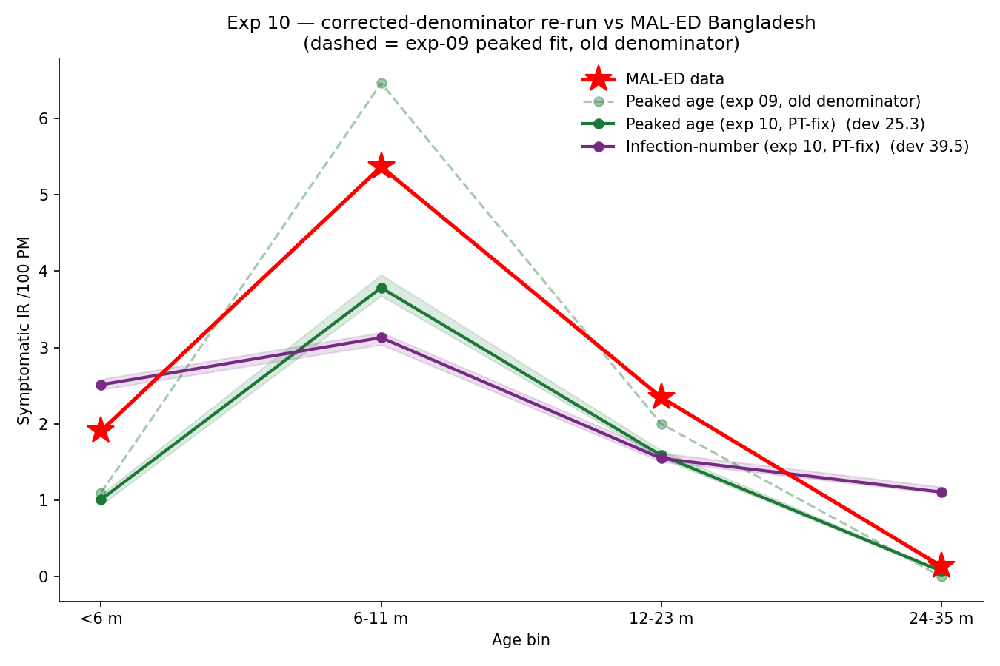

# Exp 10 — Corrected denominator doesn't change the result: peaked still wins decisively

**Date:** 2026-06-09.

**Question.** Exp 09 (peaked age beats infection-number under the shape-aware Poisson
objective) used the end-of-sim person-time *snapshot* as the IR denominator, which
overstates older cohorts by up to ~16% in a growing population. We adopted D. Klein's
`PersonTimeByAge` accumulator (count x dt over living agents) plus the starsim#1343
memory-leak mitigation, and re-ran both models identically (Poisson objective, 40 trials
x 20 reps, fresh `*_ptfix` DBs). Does the exp-09 conclusion hold under the unbiased
denominator? See `../09_shape_aware_likelihood/SUMMARY.md`.

**Result.** **Yes — the result is robust.** Under the corrected denominator the peaked
model still beats infection-number **decisively on shape**: normalized-profile L1
**0.083 vs 0.454** (5.5x), cosine **0.997 vs 0.927**, Poisson deviance **25.3 vs 39.5**.
Both nominally peak in the 6-11 mo bin, but the peaked fit tracks the data
(`[1.0, 3.8, 1.6, 0.07]` vs target `[1.9, 5.4, 2.4, 0.14]`) while infection-number is
the familiar too-flat profile (`[2.5, 3.1, 1.6, 1.1]` — `<6m` too high, weak peak, fat
24-35 mo tail). The ~16% older-bin denominator correction was warranted but left the
model selection intact.

## Observations

1. **Model selection is robust to the denominator.** The qualitative + quantitative
   shape gap (peaked wins) survives the correction; the fix changes older-bin IR levels,
   not which model reproduces the shape.
2. **Peaked reproduces the shape excellently** (cosine 0.997, peak in the right bin),
   confirming the age-symptom mechanism still fits under the unbiased denominator.
3. **Infection-number remains structurally too flat** (`<6m` ~ peak; fat tail), as in
   exp 06/08/09 — no `p_symp` x maternal combination makes the sharp peak.
4. **First-infection floats under the incidence-driven Poisson.** exp 10's best-deviance
   fit landed on the great-shape / low-level / late-first-infection corner (total 107 vs
   161, first-inf median 10.88), whereas exp 09's landed on matched-level / good-first-
   infection (155, 8.22). Both are near-equivalent optima -- the objective is fairly flat
   along the level/first-infection frontier, so TPE picks different points across runs
   and age-at-first-infection (weight ~0) is not reliably pinned. This is the clearest
   signal yet that a weighted first-infection term (`w_first`) is worth adding for the
   downstream VE work, where age-of-infection is the lever.
5. **Infrastructure adopted from D. Klein** (committed): `PersonTimeByAge` denominator
   (wired), starsim#1343 memory mitigation (`sim.shrink` + worker recycling).
   `MALEDTargets` reporter ported but not wired (supports `age_only` only).

## Acceptance

Decision-grade. The denominator fix is validated (warranted, and the model-selection
conclusion is unchanged), and the peaked age-symptom model remains the pre-vaccine
baseline. The unbiased denominator should be used going forward.

## Next

The pre-vaccine model-selection arc (exp 05-10) is settled: **age-based symptom severity
is required, robustly.** Open decisions, all on D. Klein's substantive items (see
`../../CLAUDE.md` and `../../DETECTION_MODEL_NOTES.md`):
- **Decisive model-selection follow-up:** test infection-number under DK's **titer
  maternal** (gated `immunity.py` change) -- his exp 06 suggests titer maternal + low
  young-reservoir lets infection-number make the peak, which would reframe the
  conclusion toward "either peaked symptom curve, or monotone symptom + titer maternal."
- **`w_first` joint** to pin age-at-first-infection (motivated by Observation 4), needed
  for the VE work.
- **Repeat-infection-fraction target** (~0.43 Bangladesh-among-detected) as an
  identifiability constraint; tighten `base_beta` upper bound.
- **Cohort/detection emulation** (per `DETECTION_MODEL_NOTES.md`: EIA sensitivity ~0.85
  both branches, no specificity term, age-varying asymptomatic schedule).
- **History matching -> posterior** for the VE uncertainty, once structure is locked.
