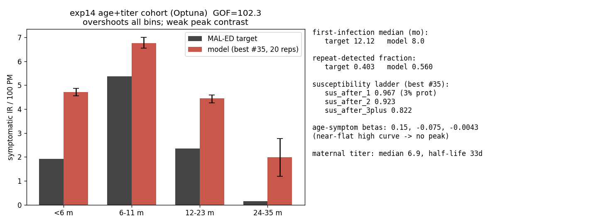

# Exp 14 — Age-symptom + titer maternal under the cohort observation (Set-2 partner)

**Date:** 2026-06-10.

**Question.** Can the age-symptom model fit the MAL-ED Bangladesh cohort under *titer*
maternal — i.e. is there a region where the age curve carries the peak and titer barely
suppresses `<6m` — so that exp 13 (infnum+titer+cohort) and exp 14 form a clean
same-maternal matched pair for the VE comparison? exp 12 said no under `process_model`
(titer crushed `<6m` to 0.21). This is the cohort-observation + repeat-fraction re-ask.
See [`../12_age_titer/`](../12_age_titer/), [`../13_cohort_emulation/`](../13_cohort_emulation/).

**Result.** **No — age+titer fits poorly (best GOF 102.3 over 40 trials × 20 reps), the
second independent Optuna failure of this model.** The best trial overshoots *every*
symptomatic-IR bin and reproduces almost none of the peak contrast: model 4.71 / 6.75 /
4.44 / 1.98 vs target 1.91 / 5.37 / 2.35 / 0.14 per 100 PM (`<6m` 2.5× over, `12-23m` 1.9×
over). The misfit is entirely in the incidence term (`gof_inc` median 87.2) not timing
(`gof_first` median 0.11). The optimizer *chose* a near-flat, high age curve (beta = 0.15,
−0.075, −0.004) with a near-absent susceptibility ladder (sus_after_1 = 0.97, only 3%
protection) over the alternative peaked-low curve — runner-up #0 (beta0 = −1.52, which
*does* suppress `<6m`) scored worse at 129.1. Repeat-detected fraction also overshoots
(0.56 vs 0.40) and first infection arrives too early (median ~8.0 vs 12.1 mo).

## Observations

1. **The failure direction flipped from exp 12 but the conclusion is identical.** exp 12
   crushed `<6m` (titer over-suppressed); exp 14 overshoots `<6m`. Under the cohort
   objective the optimizer found it scores better to abandon the peak shape entirely
   (flat-high curve, weak immunity) than to carve out the low shoulders. Either way,
   age+titer cannot produce the sharp 1.9 → 5.4 → 2.4 → 0.14 shape under Optuna.

2. **The tension is the susceptibility ladder vs the other two targets.** Pulling the
   `12-23m`+ shoulders down needs strong acquired immunity (low sus_after_1), but that
   thins out reinfections and breaks the repeat-fraction (already 0.56 vs 0.40) and shifts
   first-infection timing. The optimizer relieved the IR misfit only by making the curve
   flat and immunity weak — which is why the peak contrast collapses.

3. **`gof_inc` (87) dwarfs `gof_first` (0.11).** First-infection timing is essentially free
   to satisfy; the entire fight is the symptomatic-IR-by-age shape. This is the same Pareto
   tension seen pre-titer, now confirmed to persist under titer maternal + cohort detection.

4. **Two Optuna attempts, two failures — but Optuna is not the final word.** exp 12
   (process_model) and exp 14 (cohort) both fail; this corroborates the collaborator's
   read that age+titer is a poor fit. The open possibility is that TPE simply did not find
   a peaked region in a ~12-D surface, which is precisely what the history-matching re-test
   (exp 16) is designed to settle.

## Acceptance

Usable downstream as a clean negative result. Per this experiment's own success criteria, a
poor fit pushes toward the fallback structural pair {age+Erlang (exp 10)} vs
{infnum+titer (exp 11/13)} rather than the clean same-maternal pair. That fallback is held
pending exp 16: if history matching recovers a peaked age+titer NROY, the clean
same-maternal pair is back on; if it also collapses, the entanglement is structural and the
fallback stands.

## Next

- [Running — see [`../16_hm_age_titer/`](../16_hm_age_titer/)] History-matching re-test of
  age+titer: does the NROY survive with a peak in 6-11m and uncrushed/un-overshot `<6m`,
  i.e. was exp 12/14's failure an Optuna artifact or structural?
- Matched partner [`../13_cohort_emulation/`](../13_cohort_emulation/) (infnum+titer+cohort),
  and its HM posterior [`../17_hm_infnum_titer/`](../17_hm_infnum_titer/).
