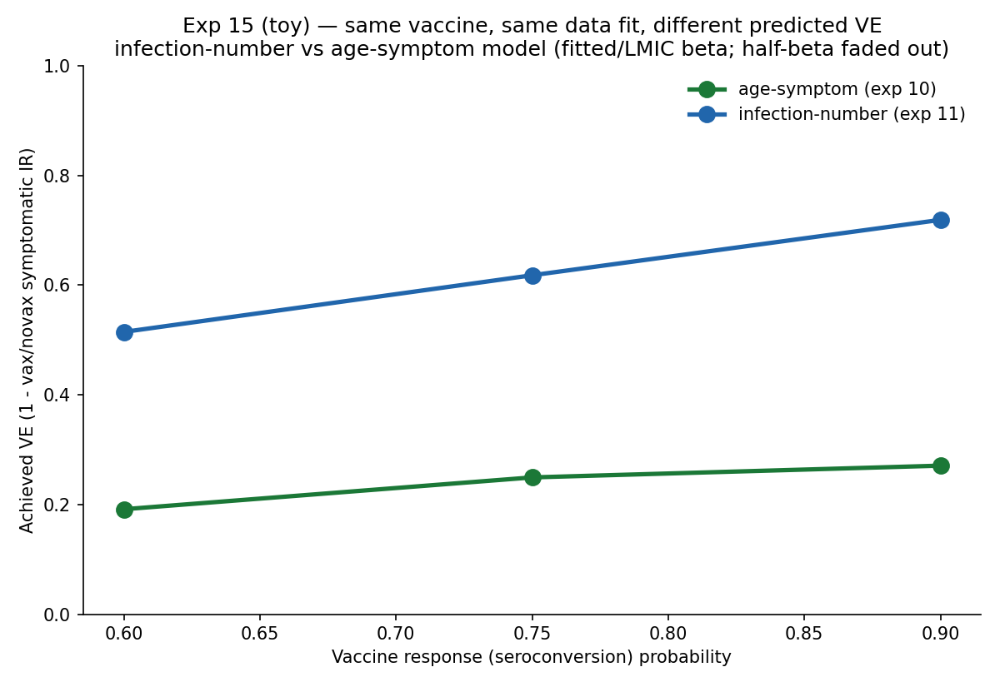

# Exp 15 — Same vaccine, same data fit, very different predicted VE

**Date:** 2026-06-10.

**Question.** Two structurally-different models both fit the pre-vaccine MAL-ED data —
age-symptom + Erlang (exp 10) and infection-number + titer (exp 11). Apply the *same*
hypothetical vaccine to both: do they predict different vaccine impact? See
`../10_denominator_rerun/SUMMARY.md`, `../11_titer_maternal_infnum/`, and `README.md` for
the vaccine mechanism (2 doses at 2 & 4 mo; each seroconversion advances one
infection-equivalent, per A. Kraay's VIMC SI).

**Result.** **Yes — sharply.** The infection-number model predicts **~2–2.6× higher VE
than the age-symptom model** at every response level, and the gap widens with
seroconversion:

| response (seroconversion) | age-symptom VE | infection-number VE |
|---|---|---|
| 0.60 | 0.19 | 0.52 |
| 0.75 | 0.25 | 0.62 |
| 0.90 | 0.27 | 0.72 |

(50k agents, 3 reps, fitted/LMIC beta, total-effect VE on symptomatic IR ≤36 mo.)

## Observations

1. **The divergence is the mechanism.** A vaccine "infection" advances the counter, which
   in the infection-number model cuts BOTH acquisition (`sus_after_k`) AND
   symptom-given-infection (`p_symp` ladder); in the age model it cuts only acquisition
   (symptoms are age-driven, untouched). So the same vaccine yields a much larger VE under
   infection-number — a clean illustration of VE depending on unidentifiable pre-vaccine
   structure.
2. **It grows with response.** Age VE saturates (~0.19→0.27 over response 0.6→0.9) because
   only the acquisition channel scales; infnum VE keeps climbing (0.52→0.72) because the
   symptom channel stacks per seroconverted dose.
3. **The half-beta "HIC proxy" faded out** (both models, 0 cases / VE undefined).
   Homogeneous mixing can't sustain endemic rotavirus at low beta, so a beta knockdown is
   NOT a usable HIC proxy. The real high-income / older-age-of-infection contrast needs the
   UK surveillance calibration (a proper second setting), not a beta reduction.

## Acceptance

Decision-grade as a SCOPING result: the two data-consistent models predict markedly
different VE, so the structural-uncertainty question is real and worth the rigorous
treatment. It is NOT a final VE estimate — it uses POINT-FIT parameters (no uncertainty),
total-effect VE (whole-population, includes herd), and a single setting.

## Next

- **HM posteriors → VE distributions** (`../../VE_HM_PLAN.md`): redo both models as history
  matching posteriors and compare VE *distributions* (do they overlap?), now that the
  point estimates diverge so much. Unblocked once the `historymatching` API is available
  (the updated calib plugin is expected to embed it).
- **HM re-test of age+titer** (collaborator's point): the exp-12/14 "age+titer fits poorly
  → symptom/maternal entanglement" conclusion was OPTUNA-based and may be an optimization
  artifact (Optuna struggled on these surfaces). If HM finds a good age+titer fit, the
  clean *same-maternal* matched pair (infnum+titer vs age+titer) is recoverable — a better
  basis for the VE comparison than the current age+Erlang vs infnum+titer pair.
- **UK as the HIC setting** for the cross-FOI VE-gap question (surveillance, not cohort).
