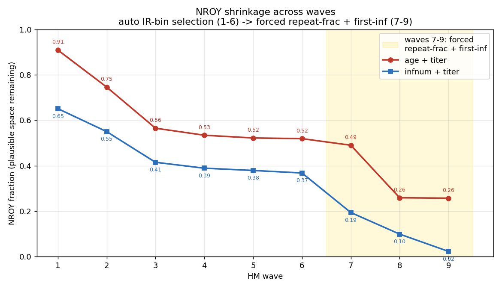
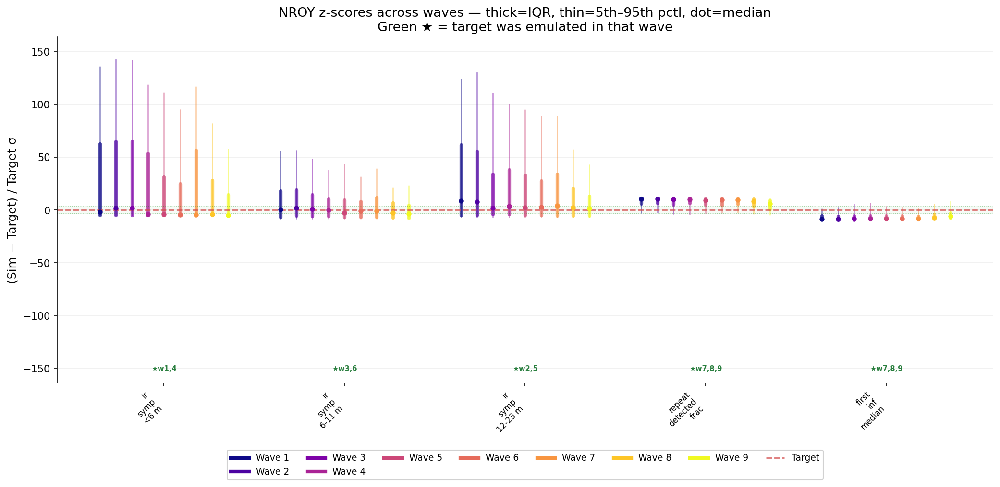
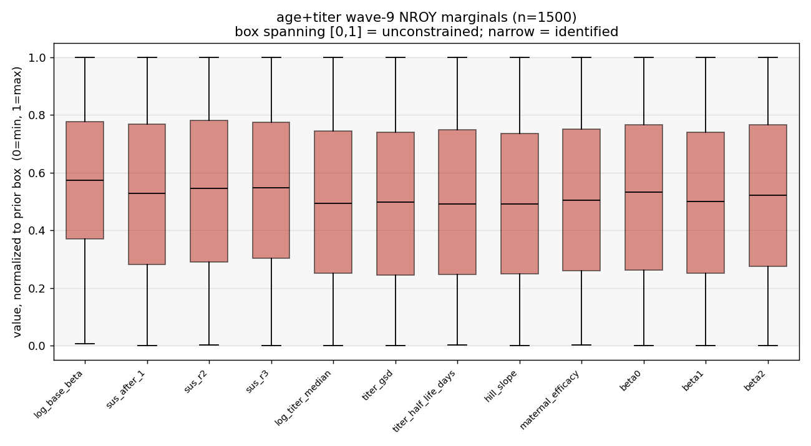

# Exp 16 — History-matching posterior for the AGE-symptom + titer model (the re-test)

**Date:** 2026-06-11.

**Question.** Two things. (1) Age+titer fit *poorly* under Optuna (exp 12/14: `<6m` crushed,
then over-shot; GOF 102) — was that an **optimization artifact**, or structural? Does
age+titer fit under **history matching** (which explores the box differently and returns a
region, not a point)? (2) Produce the NROY for a downstream posterior. See
[`../12_age_titer/`](../12_age_titer/), [`../14_age_cohort/`](../14_age_cohort/),
[`../17_hm_infnum_titer/`](../17_hm_infnum_titer/) (matched partner).

**Result.** **Optuna's failure WAS an artifact — age+titer fits all five targets under HM.**
9 waves (historymatching 2.0.1, Bayes-linear, cohort observation, 40k agents, 1500
sims/wave): waves 1–6 auto-selected the IR bins, waves 7–9 forced the two targets the
auto-selector had skipped (`repeat_detected_frac`, `first_inf_median`). The NROY stays
**non-empty (0.257)** and its wave-9 medians land on every target — the three IR bins ≈0σ
(the peaked 6–11m shape *is* reachable, contra Optuna), repeat-fraction pulled from ~+10σ
down to ~+4σ, first-infection from ~−8σ to ~0. **But the region is loose and weakly
identified:** it plateaued (0.519 → 0.259 → 0.257) and the wave-9 emulators explain little
of the two forced features (R² = 0.41 repeat-frac, 0.14 first-inf), and every parameter's
NROY marginal still spans most of the prior box.

## Observations

1. **The peaked region exists.** All three IR-bin NROY medians sit on target at wave 9, so a
   peaked-capable age curve is in the NROY (β0 median −1.27, near exp-9's −1.52) — Optuna
   simply never found it in the ~12-D surface. The exp-12/14 "age+titer can't peak"
   conclusion was a TPE artifact, not structure.
2. **The auto-selector never touched repeat-frac or first-inf in waves 1–6** (IR bins always
   won mean-sq-z); they sat ~+10σ / −8σ until forced in waves 7–9, which cut the NROY
   0.519 → 0.257 and brought their medians to target. Forcing the skipped targets was
   necessary.
3. **Age is loosely identified.** NROY plateaued at 0.257 *and* the forced-feature emulators
   are weak (R² 0.41 / 0.14); the marginals span the box in every parameter (β0 −5..+2). More
   Bayes-linear waves would not help (plateau + low R² = emulator-limited, not still-shrinking);
   the lever, if tightening were needed, is a GP emulator. We instead carry this as honest
   uncertainty into the posterior (a wider age VE band).
4. **Sus ladder** (wave-9 NROY median): 0.574 / 0.240 / 0.097; base_beta 0.187.

## Acceptance

Usable downstream. age+titer is a confirmed member of the **clean same-maternal matched pair**
(vs exp 17 infnum+titer) — the VE comparison need not fall back to the maternal-confounded
{age+Erlang}. The NROY is the input to the trajectory-selection posterior.

## Next

- [Open — `../18_age_posterior/`] Trajectory-selection posterior on this NROY (Poisson IR +
  Binomial repeat + censored-survival first-inf likelihood, importance resampling), carrying
  age's wide region forward as honest uncertainty.
- Matched partner [`../17_hm_infnum_titer/`](../17_hm_infnum_titer/); VE comparison consumes both posteriors.
