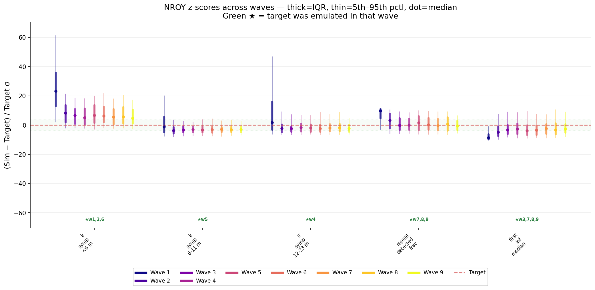
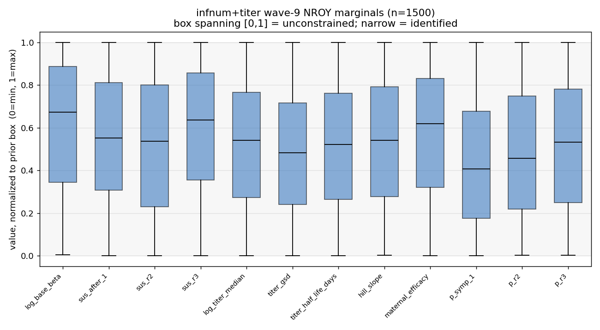

# Exp 17 — History-matching posterior for the INFECTION-NUMBER + titer model

**Date:** 2026-06-11.

**Question.** The matched partner to exp 16. infnum+titer already fit under Optuna (exp 11,
cosine 0.974). Produce its **HM NROY** so the VE comparison is over distributions, and so the
repeat-fraction target properly constrains the susceptibility ladder — exp 11's
`sus_after_1 = 0.93` was under-identified (fit without the repeat fraction). Same
observation/objective/method as exp 16; only the symptom model differs. See
[`../11_titer_maternal_infnum/`](../11_titer_maternal_infnum/),
[`../16_hm_age_titer/`](../16_hm_age_titer/) (matched partner).

**Result.** **infnum+titer fits cleanly and is well-identified under HM.** Same 9-wave setup
as exp 16 (1–6 auto IR bins; 7–9 force `repeat_detected_frac` + `first_inf_median`). The NROY
shrank monotonically and was **still converging** at the end — 0.368 → 0.194 → 0.099 →
**0.023** — i.e. it did *not* plateau (contrast exp 16's plateau at 0.257). By wave 9 all five
targets are within ~±5σ (IR `<6m` ~+5σ, the others tighter; repeat-fraction ~0σ;
first-infection ~−3σ). The forced repeat-fraction did its job on the ladder: **`sus_after_1`
came down to a NROY median of 0.60** (range 0.10–1.0), versus Optuna's under-identified 0.93.

## Observations

1. **Well-identified, unlike age.** NROY 0.023 (vs age 0.257), and the wave-9 forced-feature
   emulators are usable for repeat-fraction (R² = 0.84; first-inf weaker at 0.25). It was still
   cutting at wave 9 — a couple more waves would tighten further, but 0.023 is already a small
   region.
2. **Repeat-fraction pins the ladder.** Wave-9 NROY medians: sus ladder 0.597 / 0.277 / 0.117,
   p_symp ladder 0.644 / 0.277 / 0.107, base_beta 0.235. The susceptibility ladder is now
   constrained by the repeat structure rather than floating (Optuna's 0.93 was an artifact of
   fitting without the repeat-fraction).
3. **Auto-selection skipped repeat-fraction in waves 1–6** here too (it sat ~+1σ from the IR +
   first-inf constraints), but forcing it waves 7–9 is what drove the sharp 0.368 → 0.023 cut
   and the ladder identification.

## Acceptance

Usable downstream. infnum+titer is the well-identified member of the clean same-maternal
matched pair (vs exp 16). Its NROY is the input to the trajectory-selection posterior.

## Next

- [Open — `../19_infnum_posterior/`] Trajectory-selection posterior on this NROY (Poisson IR +
  Binomial repeat + censored-survival first-inf likelihood, importance resampling).
- Matched partner [`../16_hm_age_titer/`](../16_hm_age_titer/); VE comparison (exp 20) consumes both posteriors.
