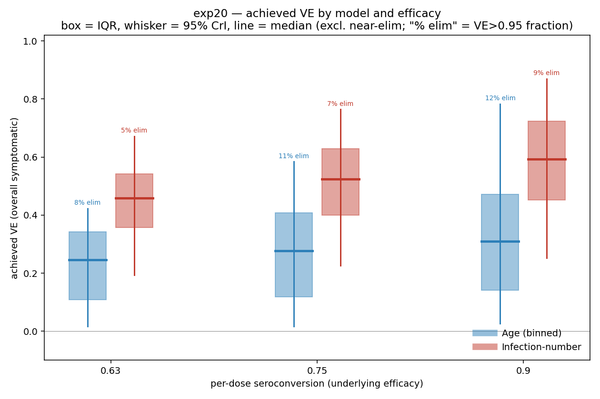

# Exp 20 — VE comparison: age-symptom vs infection-number, over the clean same-maternal pair

**Date:** 2026-06-17.

**Question.** The payoff. Two structurally-different models that *both* fit the pre-vaccine MAL-ED
data — [exp 25 binned age](../25_age_binned_titer_fixedshape/) and
[exp 27 infnum](../27_infnum_titer_fixedshape_corrected/), both on the corrected maternal (PR #38),
both titer-fixed-shape (so the pair is **same-maternal**, differing only in the symptom model).
For each posterior draw, apply the 2-dose vaccine (advances `num_recovered_infections`; seroconversion
0.63/0.75/0.9) and measure achieved total-effect VE = 1 − IR(vax)/IR(novax), paired seeds. Do the
two VE *distributions* separate (robust structural divergence → value-of-information for vaccinated
data) or overlap (pre-vaccine data can't resolve the VE-relevant structure)?

**Result.** **Central tendency separates and is mechanistically efficacy-dependent; the full
distributions overlap at the tails.** Median achieved VE is ~1.7× higher for infnum than age, and
the gap *widens* with efficacy (the infnum-only symptom-reduction channel grows with efficacy):

| efficacy | Age VE (cond.) | Infnum VE (cond.) | median gap | near-elim (age / infnum) |
|---|---|---|---|---|
| 0.63 | 0.25 [0.02, 0.42] | 0.46 [0.19, 0.67] | +0.21 | 8% / 5% |
| 0.75 | 0.28 [0.02, 0.58] | 0.52 [0.23, 0.76] | +0.25 | 11% / 7% |
| 0.90 | 0.31 [0.03, 0.78] | 0.59 [0.25, 0.87] | +0.28 | 12% / 9% |

*(Conditional VE = median [95% CrI] excluding near-elimination draws; see below.)*

The **IQR boxes (25–75%) separate** at all three efficacy levels — infnum clearly above age — but
the **95% CrI whiskers overlap** (age reaches up to ~0.4–0.78; infnum down to ~0.19–0.25). The age
distribution is especially wide, and that width is the **unidentified age-symptom shape**
propagating into VE (the identifiability sloppiness, made consequential).

## Observations
1. **Near-elimination reported separately.** 5–12% of draws give VE > 0.95 — *not* a denominator
   artifact (their baseline IR is normal, ~3.5–4.0) but genuine total-effect near-elimination
   (the vaccine tips transmission below threshold in some regimes). Excluded from the CrIs above
   and reported as a fraction; it rises with efficacy and is slightly higher for the age model
   (8–12% vs 5–9%) — the age arm's VE comes only through acquisition, so when it "works" it tends
   to tip to elimination rather than partial protection.
2. **The gap widens with efficacy** (+0.21 → +0.25 → +0.28): higher seroconversion → more of the
   symptom-given-infection reduction that *only* infnum has → wider divergence. The mechanism from
   the exp-15 toy reproduces over the full posteriors.
3. **Separation is cleanest at low efficacy** (least CrI overlap at 0.63) and degrades upward as the
   age posterior's upper tail widens.

## Acceptance
**The VOI result we set up.** Achieved VE depends on the symptom structure that pre-vaccine MAL-ED
data *cannot identify* — the medians diverge clearly and mechanistically, but the posterior VE
distributions overlap, so pre-vaccine data alone cannot decisively distinguish the two models'
achieved VE. This is the quantified value-of-information case for **vaccinated-site data** (e.g.
MAL-ED Brazil/Peru/SA) to resolve the structure. Total-effect VE (incl. herd); maternal held at the
identified fixed curve (sensitivity sweep pending).

## Next
1. **Maternal-sensitivity sweep** — re-run over a few plausible fixed maternal curves; does the
   divergence hold? (~1.5–2h/curve on zebra.)
2. **Vaccinated-site calibration** — the actual VOI payoff: does observed VE land in the age band,
   the infnum band, or between?
3. Optionally tighten the age arm via a GP-emulator HM wave (won't fix the *structural*
   non-identifiability, but would sharpen the within-arm CrI).

## Reproduction
`ve_compare.py --model {age_binned,infnum} --n-ve 800 --responses 0.63 0.75 0.9` (zebra, 274/373
unique posterior draws × {novax + 3 vax}, paired seeds) → `plot_ve.py` + `ve_boxplot.py`. Reuses
the exp-15 `vaccine_toy` machinery (VaccinePrime, SympIRObserver), with `age_binned` added.
</content>
