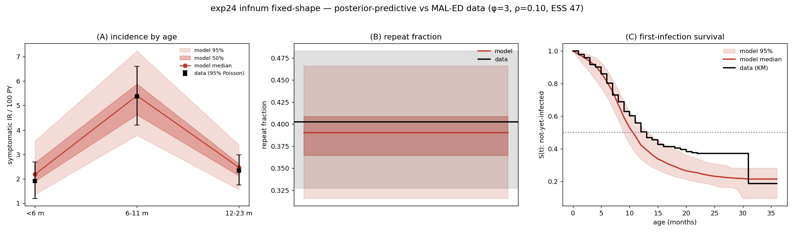
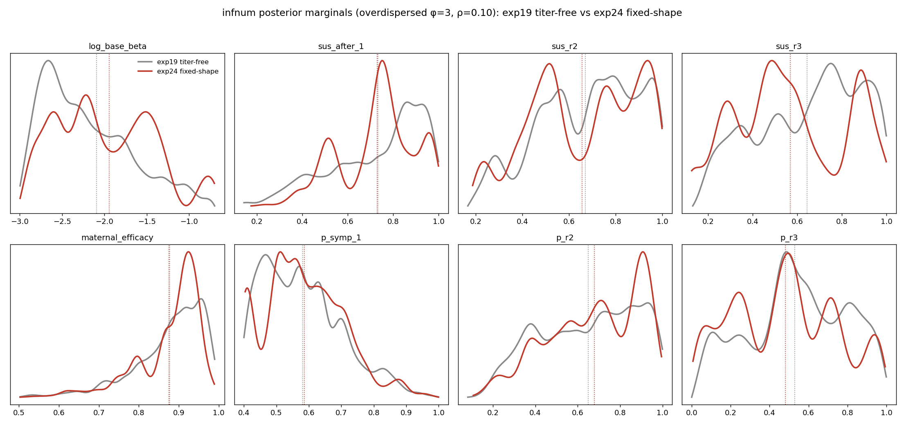

# Exp 24 — infnum + titer with the titer SHAPE fixed (infnum member of the clean same-maternal pair)

**Date:** 2026-06-15.

**Question.** The infnum partner to [exp 23](../23_age_titer_fixedshape/). Fit infnum with
the maternal titer *shape* held at the identified curve (`FIXED_TITER_SHAPE`), so the only
difference from exp 23 is age- vs infection-number symptoms — giving a **clean same-maternal
pair** for the exp-20 VE comparison. Hoped-for bonus: a *tighter, more identifiable* infnum
posterior than [exp 19](../19_infnum_posterior/) (titer-free, ESS 59, titer shape spanning its
prior).

**Result.** Trajectory-selection's raw composite likelihood collapses (ESS **1.05**,
1631/5000 finite) as expected for infnum; **overdispersed reweighting** (Dan's recipe, settled
at **φ=3, ρ=0.10**) recovers **ESS 47** with a posterior-predictive that lands IR-by-age and
repeat-fraction on target. But at the settled tuning the fixed-shape posterior is **not
materially tighter than exp 19** (shared-param 95% CI width ratios 0.87–1.11×; only `sus_after_1`
clearly narrows), and the age-at-first-infection target is missed by ~1.5 mo **regardless of
weighting** (structural). Net: exp 24 delivers a usable, clean same-maternal infnum posterior for
the VE comparison — but not the tightening that was hoped for.

## Observations

1. **Raw collapse is the expected infnum failure mode, not a real misfit.** ESS 1.05, max_logL
   −217. `reweight_overdispersed.py`'s own docstring flags that the raw likelihood collapses for
   infnum — the reweight is designed to repair it.
2. **Finite fraction is low (1631/5000 = 33%, vs exp19's 62%).** Fixing the titer shape pushes
   ~two-thirds of NROY draws to zero incidence in some age bin (non-finite Poisson log-L). Worth
   a footnote, but the surviving draws cover the targets.
3. **Collapse is driven by the survival term.** Per-draw log-L spread: KM first-infection
   sd≈67.5 > IR sd≈59 >> repeat-binomial sd≈16. So ρ (survival design-effect, `DEFF=1+(N−1)ρ`,
   N=265) is the stronger knob; the **uncorrected repeat-binomial is harmless** (smallest spread).
4. **φ/ρ sweep: ESS rises with both knobs, fit is invariant.** φ3/ρ05→ESS 41, φ3/ρ10→47,
   φ3/ρ15→49, φ2/ρ20→31. Across the whole grid the weighted PP barely moves. Settled on
   **φ=3, ρ=0.10** (both dominant terms corrected, ESS 47 ≈ exp19's 59, defensible magnitudes).
5. **PP vs data (φ3/ρ10): two of three target families fit well.** wIR `<6/6-11/12-23` =
   [2.27, 5.38, 2.42] vs target [1.91, 5.37, 2.35] (excellent); repeat 0.387 vs 0.403 (good);
   first-infection median **10.65 vs 12.12 mo** — model infects too early and leaves only ~20%
   uninfected by 36 mo vs ~40% in data. This is **invariant across the φ/ρ grid → structural**,
   the symptomatic-IR vs age-at-first-infection Pareto tension documented at intake.
6. **No material tightening at the settled tuning.** Shared-param width ratios (exp24/exp19,
   both φ3/ρ10): `sus_after_1` 0.87×, `maternal_efficacy` 0.95×, `p_symp_1` 1.04×, rest ≈1.0.
   The heavier correction that buys ESS also flattens both posteriors toward the NROY prior,
   **erasing the fixed-shape advantage** that was visible at the lighter φ2/ρ05 (where
   `maternal_efficacy` was 0.80×, `sus_after_1` 0.85×). Genuine tuning-vs-tightening tradeoff.
7. **Low effective sample limits the marginal comparison.** exp24 resampled from only **248
   unique draws** (exp19: 807), so sub-10% width differences are within Monte-Carlo noise; the
   bumpy multimodality in the reinfection-ladder marginals (`sus_r2/r3`, `p_r2/r3`) is resampling
   lumpiness, not real structure — those params are prior-driven (sparse-tail data).

## Acceptance

**Usable downstream** as the infnum member of the clean same-maternal pair (maternal held at
`FIXED_TITER_SHAPE`, matching exp 23) for the exp-20 VE comparison. **Not** a tightness win over
exp 19. The structural first-infection-timing miss is a documented limitation of the infnum
symptom model, not a calibration failure.

## Next

- **exp 23 (age) member** — emulator-MCMC posterior produced (12,000 pooled samples, acceptance
  0.55) since trajectory-selection reweighting collapses for age too (ESS 5.0). See
  [`../23_age_titer_fixedshape/`](../23_age_titer_fixedshape/). **Needs ABM validation** of the
  emulator posterior (age's repeat / first-inf emulators are weak, R² 0.41 / 0.14).
- **exp 20 VE comparison** over the clean same-maternal pair (exp 23 age × exp 24 infnum).
- Decide whether to report both tunings (φ2/ρ05 for the tightening story, φ3/ρ10 for ESS) or
  commit to φ3/ρ10 as the posterior of record.

## Artifacts / reproduction

No per-experiment `run.py`/`config.yaml` — this experiment uses shared drivers (the repo
convention is README + shared driver + this SUMMARY):

- HM + trajectory-selection: `hm_calibrate.py --model infnum --maternal titer --fix-titer-shape
  --all-targets` (on covaguest). Raw outputs in `outputs/`: `sir_results.jsonl`, `nroy_draw.csv`,
  `posterior.csv`, `ts_stats.json`.
- Overdispersed reweight (settled): `python reweight_overdispersed.py --model infnum --exp-dir
  24_infnum_titer_fixedshape --phi 3 --rho 0.10 --tag _phi3_rho10`
  → `outputs/posterior_overdispersed_phi3_rho10.csv` + `overdispersed_stats_phi3_rho10.json`.
- Figures: `figures/predictions_vs_data_exp24.png`, `figures/marginals_exp19_vs_exp24.png`.
</content>
</invoke>
