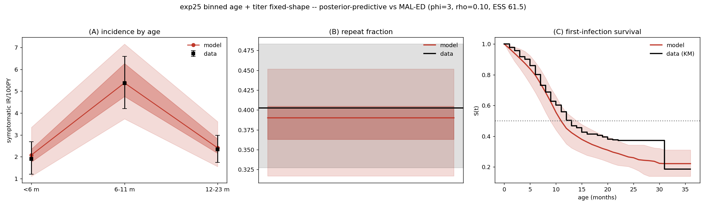
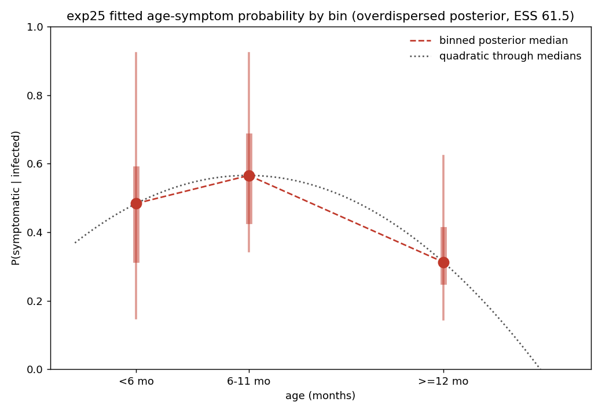
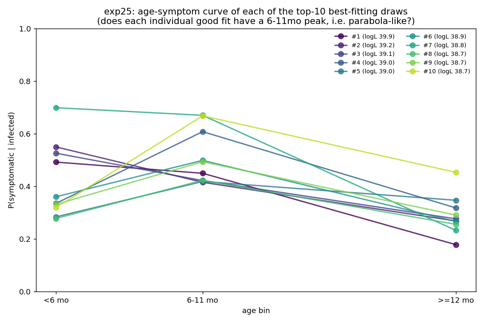

# Exp 25 — binned age-symptom + titer (fixed shape): a usable age fit at last

**Date:** 2026-06-16.

**Question.** Is the *quadratic* age-symptom logistic (exp 23) over-constraining age? Every age
variant so far failed to yield a usable posterior — age+titer (quadratic) and age+Erlang both
collapsed under trajectory selection (reweighted ESS 5 and 1.0), and the age+titer emulator-MCMC
failed real-sim validation (60% extinct). Replace the parabola with a **non-parametric** free
`P(symptomatic)` per age bin (<6 / 6–11 / ≥12 mo) and see whether the extra freedom fixes it.
This is also the first titer run on the **corrected maternal** (PR #38 — per-infant titer now
persists instead of being redrawn every step).

**Result.** The binned model is **the best age fit we have produced.** HM converged to a tight
NROY (**4.7%**, vs the quadratic's 19% and Erlang's ~24%), and the overdispersed reweight
(φ=3, ρ=0.10) gives **ESS 61.5** — higher than infnum (47) and far above the collapsed quadratic
(5) / Erlang (1.0). The real-sim posterior-predictive hits all five targets: IR-by-age
**[2.09, 5.53, 2.47]** (target [1.91, 5.37, 2.35]), repeat **0.387** (0.403), and first-infection
median **11.02 mo** (target 12.12) — the closest any model has come to the first-infection target
(infnum sat at 10.65). The age member for the exp-20 VE comparison is now viable.

**But the fitted shape does not *rule out* a quadratic — so the win may be the bug fix, not the
binning.** The bin posterior medians are **0.48 / 0.57 / 0.31** (<6 / 6–11 / ≥12 mo): a 6–11mo
peak. CAVEAT: with only 3 bins, a quadratic passes through the 3 medians *exactly* (3 points fix a
parabola), so this is **not** evidence the quadratic form is adequate — only that the binned shape
isn't grossly non-parabolic. Whether a quadratic actually reproduces the *full* fit is what exp26
tests; it is not shown by the overlay below.

## Observations

1. **NROY convergence (emulator-confirmed but modest emulators).** 36.6% → 13% → 9.5% → 4.8% →
   4.7% → 4.7%; all 5 targets within ±3σ by waves 5–6. Emulator R² (bayes_linear): first-inf
   **0.38**, repeat **0.59**, ir<6 **0.57** — better than age+titer (0.14/0.41) but still modest,
   so the plateau is partly linear-emulator-limited. The decisive confirmation is the real-sim
   posterior-predictive below, not the emulator.
2. **Reweight ESS 61.5, finite 1565/5000 (31%).** The raw composite likelihood collapsed (ESS
   1.73) as it does for every model; the overdispersion reweight (Dan's φ=3/ρ=0.10) rescued it.
   The 31% finite fraction (vs age+titer 14%, Erlang 12%) is why the rescue worked here and not
   for the other age variants.
3. **Real-sim validation passes implicitly.** The wPP above is computed from the real 40k-agent
   sims in `sir_results.jsonl` (the emulator only shaped which region got sampled). All five
   targets are hit, so the modest emulator R² does not undermine the result.
4. **First-infection timing essentially resolved.** Model KM tracks the data through ~15 mo and
   crosses S=0.5 near the 12-mo target; only the 30+ mo tail slightly over-infects. This is the
   target that defeated every prior fit.
5. **The shape is a 6–11mo peak** (0.48/0.57/0.31) with wide individual bin CIs (the NROY
   constrains β×p_symp combinations, not single bins — see `constrained_dims`: PC1 60%, PC2 21%).
   With only 3 bins a quadratic trivially interpolates the 3 medians, so the *form's* adequacy is
   not testable from this — it is deferred to exp26.
6. **The symptom-curve SHAPE is under-identified — only the post-12mo decline is robust.** Plotting
   the top-10 best-fitting draws *individually* (not the median), the good fits split into two
   shape families: ~6 peak at 6–11mo (bump/parabola-like), but ~4 — *including the single best fit*
   (0.49/0.45/0.18, logL 39.9) — are highest at <6mo and decline monotonically. All 10 agree only
   on a strong drop after ~12mo. So the "6–11mo peak" is an average of two clusters, not a robust
   feature, and the expected "mild <6mo / worst 6–12mo" biology is **not reliably recovered** — the
   data mainly constrains the post-12mo decline. Honest under-identification (the β × p_symp
   trade-off), to carry forward as uncertainty rather than over-interpret as a clean peak.

## Acceptance

**Usable downstream** as the age member of the exp-20 VE comparison — the first age variant to
fit all five MAL-ED targets with a non-degenerate ESS. But the *scientific* claim "the quadratic
was over-constraining" is **not yet established**: exp 25 changed two things vs exp 23 (binned
symptoms **and** the corrected maternal), and the 3-bin fitted shape does not rule out a quadratic
(a parabola interpolates 3 medians exactly), so it carries no evidence on the form question —
exp 26 settles that.

## Next

- **Disambiguation (exp 26):** re-run the **quadratic** age-symptom model on the corrected
  maternal (titer fixed-shape, same pipeline). If the quadratic now fits too → the maternal bug,
  not the functional form, was the limiter. If it still collapses → the parabola genuinely
  over-constrains. The quadratic prior box will be checked to contain the binned-equivalent curve
  so the test is fair.
- If exp 26's quadratic fits, prefer it (3 smooth params, fewer DoF) as the age member; otherwise
  use exp 25 (binned).
- Either way, **the full titer pipeline (exp 16/17/19/23/24) ran on the buggy maternal and should
  be re-run on the PR #38 fix** before the VE comparison is finalised.

## Artifacts / reproduction

No per-experiment `run.py` (shared-driver repo). HM: `hm_calibrate.py --model age_binned
--maternal titer --fix-titer-shape --all-targets --out-dir <hm dir> --early-stop --n-samples 5000
--max-iter 10` (covaguest, ~66 min/wave with early-stop). Posterior:
`reweight_overdispersed.py --model age_binned --exp-dir 25_age_binned_titer_fixedshape --phi 3
--rho 0.10 --tag _phi3_rho10`. Figures from the inline plotting in this session.
</content>
