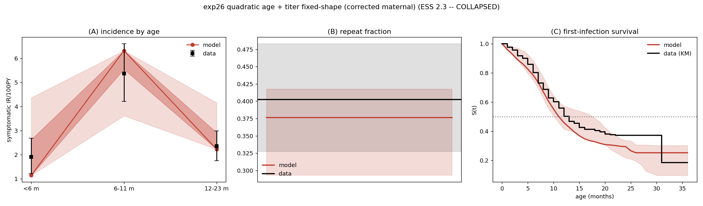

# Exp 26 — quadratic age-symptom on the corrected maternal: the parabola over-constrains

**Date:** 2026-06-17.

**Question.** Disambiguate exp 25. The binned age model fit cleanly (ESS 61.5) where the quadratic
(exp 23) collapsed — but exp 25 changed *two* things vs exp 23 (binned symptoms **and** the
PR #38 maternal fix). This re-runs the **quadratic** with *only* the maternal corrected, so the
comparison to the binned model (exp 25) is a clean test of the symptom *parameterization* (both
have 3 symptom DoF, same corrected maternal, same pipeline).

**Result.** **The quadratic over-constrains — confirmed.** Even on the corrected maternal, the
quadratic plateaus at a looser NROY (**0.136** vs binned's 0.047) and its overdispersed-reweight
posterior **collapses (ESS 2.3**, finite 1010/5000 = 20%). Same maternal, same everything except
the symptom form → the parabola, not the maternal bug, is the limiter. The **binned model
(exp 25, ESS 61.5) is the age member**; the quadratic does not yield a usable posterior.

## Observations
1. **NROY plateaued loose:** 0.909 → 0.364 → 0.326 → … → **0.136** (wave 8), ~3× looser than the
   binned model's 0.047 over the same cycled targets. Consistent with the weaker wave-1 ir<6
   emulator (R² 0.58 quadratic vs 0.97 binned) — the β-parameters map weakly to per-age incidence.
2. **Reweight collapsed: ESS 2.3** (vs binned 61.5, infnum 107.9). Only 20% of draws finite (vs
   31% for binned/infnum). The wPP looks on-target-ish ([1.79, 5.9, 2.53], first-inf 11.6) but is
   dominated by ~2 effective draws — not a usable posterior.
3. **Clean attribution:** binned and quadratic differ *only* in symptom parameterization here
   (both corrected maternal, both 3 DoF). So the collapse is the quadratic form's doing.

## Acceptance
**Not usable** as the age member. Settles the disambiguation: the quadratic functional form
genuinely over-constrains age (it was not merely the maternal bug). Use the **binned** model
(exp 25). Caveat from exp 25 stands — "binned works" means it yields a usable importance-sampled
posterior, not that it identifies the age-symptom *shape* (still unidentified, carried as
uncertainty).

## Next
- **Drop the quadratic.** The clean same-maternal pair for exp 20 VE is
  [exp 25 binned age](../25_age_binned_titer_fixedshape/) + [exp 27 corrected infnum](../27_infnum_titer_fixedshape_corrected/).

## Reproduction
`hm_calibrate.py --model age --maternal titer --fix-titer-shape --all-targets --out-dir
experiments/26_…/outputs/hm --early-stop --n-samples 5000 --max-iter 8` → `trajectory_select.py
--model age …` → `reweight_overdispersed.py --model age --exp-dir 26_… --phi 3 --rho 0.10`.
Ran on zebra (migrated from covaguest mid-run).
</content>
