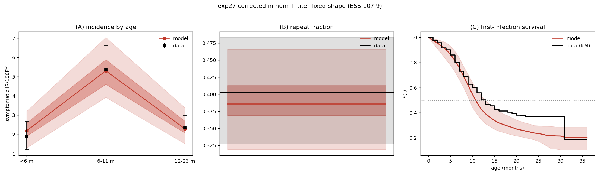

# Exp 27 — infnum + titer (fixed shape) on the corrected maternal: the infnum member

**Date:** 2026-06-17.

**Question.** Produce the infnum member of the clean same-maternal pair on the **corrected
maternal** (PR #38: per-infant titer now persists). Exp 24's infnum (ESS 47) ran on the buggy
redraw-every-step maternal, so it isn't valid for the exp-20 VE comparison; this re-runs it
corrected, to pair with the corrected-maternal age member (exp 25 binned).

**Result.** **The best calibration we've produced.** NROY converged tight (**0.047**), and the
overdispersed reweight (φ=3/ρ=0.10) gives **ESS 107.9** — more than double exp 24's 47, and the
highest of any model. The posterior-predictive hits all five targets: IR-by-age
**[2.22, 5.29, 2.37]** (target [1.91, 5.37, 2.35]), repeat **0.389** (0.403), first-infection
median **10.74 mo** (target 12.12). The corrected-maternal infnum member is ready for exp 20.

## Observations
1. **NROY 0.047, ESS 107.9, finite 31%** — tight and well-behaved (vs buggy exp 24: ESS 47).
2. **The bug fix improved identifiability, not the central fit.** First-infection median 10.74
   ≈ exp 24's 10.65 — i.e. the persistence fix barely moved the *central* first-inf timing, but
   it more than doubled the ESS. So the earlier single-seed "+2.4 mo" signal did **not** hold over
   the full posterior; the bug's real effect was making the likelihood/NROY better-behaved
   (persistent per-infant heterogeneity → fewer pathological draws), not shifting the fit.
3. First-inf still ~1.4 mo early (10.74 vs 12.12) — a residual, milder than the structural miss
   seen elsewhere; IR-by-age and repeat are on target.

## Acceptance
**Usable** as the infnum member of the clean same-maternal pair for exp 20. Pairs with exp 25
(binned age) — both corrected maternal, both usable posteriors.

## Next
- **exp 20 VE comparison** over the pair: [exp 25 binned age](../25_age_binned_titer_fixedshape/)
  × exp 27 infnum, full posteriors → VE *distributions*, + maternal-sensitivity sweep.
- Optional: quantify how much the bug moved the infnum *posterior* (vs exp 24) beyond the ESS.

## Reproduction
`hm_calibrate.py --model infnum --maternal titer --fix-titer-shape --all-targets --out-dir
experiments/27_…/outputs/hm --early-stop --n-samples 5000 --max-iter 8` → `trajectory_select.py
--model infnum …` → `reweight_overdispersed.py --model infnum --exp-dir 27_… --phi 3 --rho 0.10`.
Ran on zebra (migrated from raccoon mid-run).
</content>
