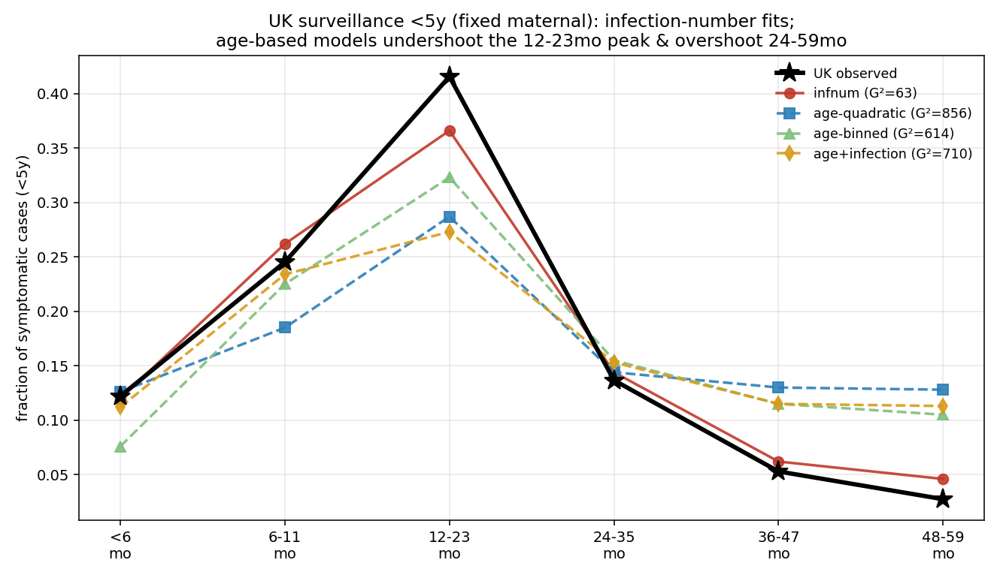
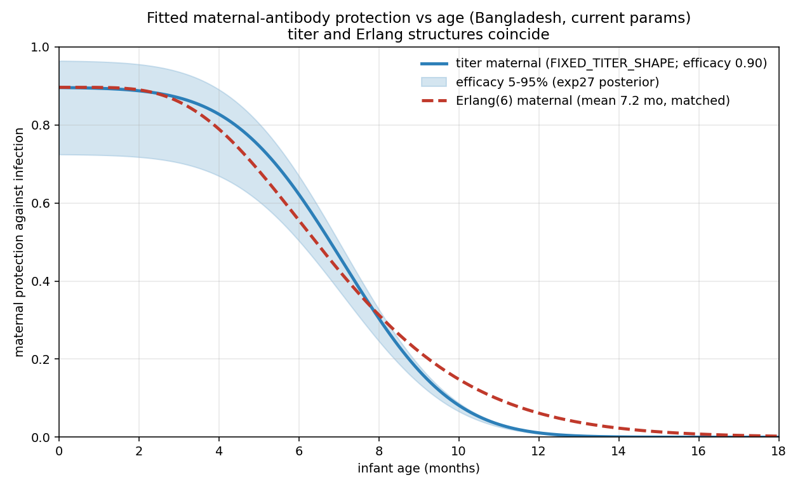

# Exp 28 — UK surveillance model selection: infection-number symptoms required

**Date:** 2026-06-23.

**Question.** The MAL-ED Bangladesh birth cohort could not discriminate the symptom structure —
both an **age**-based and an **infection-number** P(symptomatic|infection) fit the cohort's
incidence + first-detection + repeat targets equally well (the value-of-information premise behind
the VE comparison, [exp 20](../20_ve_comparison/)). Does an independent, **lower-FOI** setting
break the tie? We calibrate to **UK pre-vaccine surveillance** (England & Wales, 2008–2012): the
age distribution of (genotyped) symptomatic rotavirus cases — a cross-sectional *surveillance*
construct, not a cohort, so we were deliberately careful about the observation model. This is also
the low-FOI / older-age-of-infection anchor for the FOI→achieved-VE gradient. Symptom models tried:
`infnum` (P_symp by infection order), `age` (quadratic-logit), `age_binned` (free P_symp per age
bin), `age_and_infection` (age quadratic **+** an infection-order slope).

**Result.** **Infection-number is the only symptom structure that reproduces the UK case
age-distribution; every age-based structure fails decisively.** Best-fit goodness-of-fit
(multinomial deviance G² vs the saturated model, <5y, 6 bins, N=3,498 cases):

| model | free-maternal G² | fixed-maternal G² |
|---|---|---|
| **infnum** | **49** | **63** |
| age (quadratic) | 834 | 856 |
| age_binned | 544 (NROY emptied wave 4) | 614 (emptied again) |
| age_and_infection | 598 | 710 |

infnum beats the age structures by a **>10× G² margin**, and holding maternal fixed (infnum 49→63)
leaves the conclusion unchanged — so the maternal simplification is lossless. The age-based models
all fail the *same* way: they **undershoot the 12-23mo peak and overshoot the 24-59mo bins**,
because without an infection-order channel they cannot suppress older-child (reinfection) symptoms
while keeping the young peak.

**Maternal immunity is consistent across settings and was fixed.** Freeing the maternal-titer
shape for the UK landed it on the Bangladesh values (titer median 13-24 vs BD 20; half-life
42-55 vs 50d; Hill 4.7-6 vs 4.7), so we hold it fixed (`FIXED_TITER_SHAPE`) — making FOI and the
symptom channel the only setting-specific levers. The fitted maternal curve (titer ≈ Erlang) is
the same biology used in both settings:

## Observations

1. **Observation model (surveillance ≠ cohort).** New `Surveillance` analyzer
   (`rotasim/analyzers.py`): counts symptomatic case *episodes* by age over the steady-state
   window → case-age proportions, capped at **<5y** (`cap_age_m=60`). The cap matters: under
   *all-age* surveillance a flat ≥12mo symptom probability piles ~96% of cases into adults, which
   passive/genotyped surveillance does not capture. Care-seeking is high/uniform through age 5, so
   <5y stays out of the confounded adult regime. No detection filter: for a shape-only target with
   age-independent genotyping (confirmed), any overall reporting rate cancels.
2. **Population structure verified.** Surveillance counts are population-weighted (bin width × age
   structure), so raw proportions ≠ per-child risk. The model's standing under-5 structure is
   uniform-per-year (12-23mo / 6-11mo population ratio = **1.99**), matching the `bangladesh_age_data`
   / UK pyramid assumption (2.5%/yr). So model and data proportions are on the same footing, and
   per-child *risk* (incidence rate) peaks at 6-11mo in both UK and Bangladesh.
3. **The discrimination is the 12-23-vs-24-59 contrast.** infnum suppresses 24-59mo as higher-order
   (mild) reinfections → matches the steep observed drop-off; age-based models apply the same
   symptom probability to older-child reinfections → overshoot 36-47mo (+0.06) and 48-59mo (+0.08).
4. **`age_and_infection` is under-identified, not cleanly falsified.** It *nests* infnum (zero the
   age coefficients, use the order slope → G²~63), so its 710 means the 8-parameter optimum wasn't
   sampled (ESS=1 best-of-9000), not that the combined structure can't fit. The take-home is that
   the **order channel is necessary**; pure-age is not sufficient.
5. **Model selection by GOF, not posterior.** With N≈3,500 the multinomial likelihood is razor-sharp:
   the importance-reweight ESS stays ~1 even at design-effect 2 (the empirical between-year value);
   reaching a Bangladesh-like ESS would need deff≈50-100, far beyond what's justified. So we compare
   *best-fit* GOF (robust) rather than posterior spread (degenerate).
6. **Reconciles with the prior all-age finding.** Earlier all-age *incidence* work favored age
   (its 60mo cap suppresses adult incidence); here the <5y case-*distribution* favors infnum. Each
   structure is right in a different regime → neither is right everywhere, consistent with needing
   both channels — but for the policy-relevant young-child distribution, infnum wins.

## Acceptance

Usable downstream. The UK anchor **breaks the Bangladesh degeneracy in favour of infection-number**,
so the achieved-VE comparison ([exp 20](../20_ve_comparison/)) should weight toward infnum's
predictions rather than treating the two structures as equally credible. **Honest scope:** this
rejects *these* age structures (3-bin and quadratic), not "age effects" universally — a finer
age curve declining past 12mo could mimic the order channel; and the result is a *shape* GOF, not
a tight posterior.

## Next

- **icddr,b Dhaka validation (running).** Posterior-predictive overlay: push the MAL-ED posterior
  through the `Surveillance` observer (Bangladesh demographics, icddr,b bins) and compare to the
  independent same-country surveillance — see [`../29_icddrb_validation/`](../29_icddrb_validation/).
  Risk-adjusted, icddr,b agrees with the cohort (both peak 6-11mo); the medically-attended severity
  selection trims the older tail.
- **Cross-setting FOI gradient.** UK (low-FOI surveillance) vs icddr,b Dhaka (high-FOI surveillance),
  same observation construct → the age-of-infection shift is attributable to FOI; the policy-relevant
  severe-disease distribution is much younger in high-FOI settings, the mechanism for lower achieved VE.
- **Re-frame exp 20** with infnum favoured.

## Artifacts

- `outputs/hm/uk_<model>_titer[_fixedshape]/` — HM checkpoints per model.
- `outputs/hmreweight_stats.json` — best-fit predicted proportions (fixed-maternal).
- Sibling model dirs: `../28_hm_uk_age/`, `../28_hm_uk_age_binned/`, `../28_hm_uk_age_and_infection/`.
- Drivers: `hm_calibrate_uk.py`, `score_hm_uk.py`, `process_surveillance_uk.py` (UK targets).
- `figures/uk_4model_compare.png`, `figures/maternal_protection_by_age_current.png`,
  `figures/uk_vs_bangladesh_maternal.png`, `figures/uk_posterior_predictive_infnum.png`.
