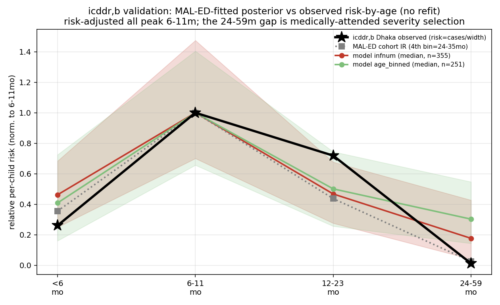

# Exp 29 — icddr,b Dhaka surveillance validation (no refit)

**Date:** 2026-06-23.

**Question.** Does the MAL-ED-cohort-fitted model reproduce *independent, same-country* surveillance
— the age distribution of medically-attended rotavirus at icddr,b Dhaka (pooled 2010-2014, matched
to the MAL-ED window)? This is a **validation, not a calibration** (no parameters fit to icddr,b),
and it characterizes the cohort-vs-surveillance observation difference flagged in
[exp 28](../28_hm_uk_infnum/SUMMARY.md).

**Result.** **The MAL-ED-fitted posterior reproduces the icddr,b risk peak.** Pushing the exp25/27
posteriors through the `Surveillance` observer (Bangladesh demographics, icddr,b bins, no refit),
the predicted per-child risk-by-age **peaks at 6-11mo**, matching both the icddr,b observed risk
and the MAL-ED cohort. The residual differences — icddr,b is *sharper* (relative risk 0.72 at
12-23mo, ~0.01 at 24-59mo) vs the model/cohort (~0.47 and ~0.18) — reflect **medically-attended
severity selection** (severe disease ≈ young first infections; mild older-child reinfections don't
reach care) plus some model **over-extrapolation** of the >2y tail beyond the <2y calibration window
(see Observation 3) — not a failure of the fitted age-of-infection.

## Observations

1. **Population structure is decisive for interpretation.** These are population-level surveillance
   counts, so raw case *proportions* conflate per-child risk with bin width (the 24-59mo bin is 60%
   of the <5y population, uniform-per-year). On proportions the model "over-predicts" 24-59mo
   (0.30 vs observed 0.03); on **incidence rate** (cases/width) that mostly resolves — both peak
   6-11mo (see [`relative_incidence_fig.py`](relative_incidence_fig.py)).
2. **Risk-adjusted, surveillance is NOT younger than the cohort** — both peak 6-11mo. The "younger
   surveillance" impression came from the count/population artifact + the severity tail being trimmed.
   If anything icddr,b has relatively *more* 12-23mo risk than the cohort.
3. **The 24-59mo gap is partly severity selection, partly model over-extrapolation.** Medically-
   attended = severe = first/young infections; the model counts all symptomatic episodes. *But the
   MAL-ED cohort also shows ~0 disease >2y* (rel risk 0.03 at 24-35mo; see
   [`figures/maled_vs_icddrb_data_only.png`](figures/maled_vs_icddrb_data_only.png)), so the model
   over-predicts the tail vs **both** data sources — partly because the cohort fit dropped 24-35mo
   for sparsity, leaving older-child symptomatic incidence unconstrained (over-extrapolation), not
   purely surveillance severity selection. We still deliberately do NOT add an age/order detection
   filter (it largely cancels in relative incidence with the denominator set, and is unidentifiable
   from the sparse older tail); compare on relative incidence in the well-attended young bins.
4. **Policy relevance.** Severe (medically-attended) disease is the VE-relevant outcome, and it is
   concentrated in very young first infections in high-FOI Dhaka — the mechanism by which a 2+4-month
   vaccine has little window before severe disease hits → lower achieved VE.

## Acceptance

Validation passes for the purpose: the infection-timing fitted to the MAL-ED cohort generalizes to
independent same-country surveillance (risk peak + shape, modulo severity selection). Use icddr,b as
a **validation + FOI anchor**, not a fit target.

## Next

- **Cross-setting FOI gradient:** icddr,b Dhaka (high-FOI surveillance) vs UK (low-FOI surveillance),
  *same* observation construct → the age-of-infection shift is attributable to FOI (UK has 22% of
  cases >2y vs Dhaka 3%). This is the clean empirical anchor for the achieved-VE gradient.

## Artifacts

- `process_surveillance_icddrb.py` (loader; counts [84,322,463,24], 2010-2014 Dhaka).
- `posterior_overlay_run.py` (VM: posterior → Surveillance observer); `outputs/posterior_overlay.json`.
- `relative_incidence_fig.py`; `figures/icddrb_posterior_overlay.png`,
  `figures/icddrb_vs_cohort_relative_incidence.png`.
