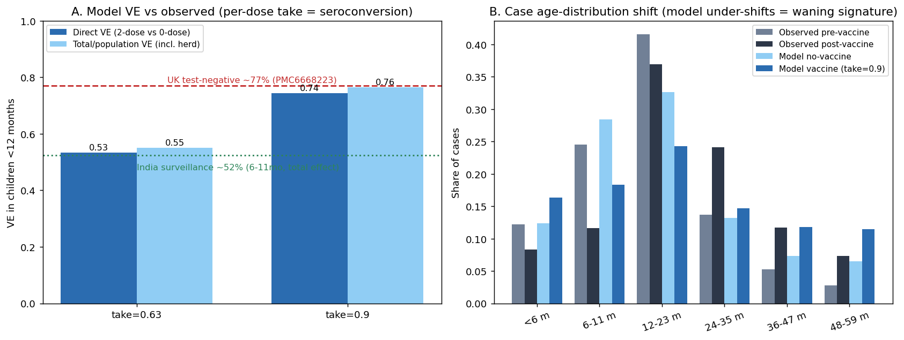

# Exp 30 — UK vaccine-impact validation by forward prediction (no refit)

**Date:** 2026-06-24.

**Question.** Does the UK pre-vaccine-calibrated `infnum` model, given a 2+4-month vaccine at the
observed ~90% coverage, **forward-predict** the post-vaccine reality — both the achieved vaccine
effectiveness and the post-vaccine case age-distribution? This is a validation, **not** a fit to
post-vaccine data (the user's preferred design): the pre-vaccine calibration ([exp 28](../28_hm_uk_infnum/SUMMARY.md))
is the counterfactual, per-dose efficacy (`take`) is a fixed input, and the UK post-vaccine
surveillance (`UK_age_byEra.xlsx`, 2015-2019, vaccine-derived strains excluded) is the held-out target.

**Result.** **At per-dose take ≈ 0.9 (HIC seroconversion), the model reproduces the reported UK
test-negative VE.** The model's direct 2-dose VE in children <12mo is **0.74 (Poisson 95% CI ~0.71–0.77)**,
matching the **~77%** test-negative 2-dose VE against lab-confirmed rotavirus from PMC6668223. At
take 0.63 it is only 0.53. **But the model does not reproduce the post-vaccine age-distribution
shift**: observed surveillance moves case mass out of 6–11mo (0.245→0.116) into 24–35mo
(0.137→0.241), whereas the no-waning model barely builds the 24–35mo bump (0.132→0.147) and instead
*raises* the <6mo share. The VE magnitude is right; the older shift is missing — a **waning signature**.

## Observations

1. **The estimand matters — direct vs total VE.** PMC6668223 is a test-negative case-control design,
   which measures **direct** individual protection (vaccinated vs unvaccinated within the same
   herd-affected population). The model's clean analog is the symptomatic-case incidence rate ratio
   of **fully-vaccinated (2-dose) vs zero-dose** children sharing the same FOI, ages ≥4mo (past the
   last dose, so unvaccinated-by-age infants don't confound). The model's *total* (population, direct
   + herd) <12mo VE is higher (0.76 at take 0.9) and is **not** the comparable number.
2. **The dose definition moved the answer.** Defining "vaccinated" as *any* dose dilutes VE with
   1-dose-only children (each responding dose = +1 infection-equivalent in the model), giving 0.70.
   Restricting to the 2-dose vs 0-dose contrast the study actually makes raises it to **0.74**.
3. **`take` is the seroconversion gradient.** The same model at take ≈ 0.6 (LMIC Rotarix
   seroconversion) gives a <12mo *total* VE of **0.55**, matching the independently-estimated
   India surveillance population (total-effect) VE of **52.4%** at 6–11mo (all-states). So UK
   (take 0.9 → ~74–77%) and India (take ~0.6 → ~52–55%) are reproduced by the *same* structure with
   only the per-dose take differing — a substantial fraction of the high-vs-low-income VE gap carried
   by the seroconversion (titer-spike) channel alone.
4. **No-waning baseline.** Vaccine protection here is permanent (infection_blocking advances the
   infection-number counter once per responding dose). <12mo VE is the least waning-sensitive band
   (soon after the 2+4mo doses), which is why the magnitude validates even though the older shift does
   not. The missing 24–35mo bump is consistent with protection that *wanes* over the second year,
   re-exposing vaccinated children to symptomatic reinfection at older ages.
5. **Ensemble, not a single fit.** Predictions are pooled over the top-40 best-fitting UK `infnum`
   draws (by multinomial logL on the pre-vaccine target), 40k agents, 38 draws with ≥300 no-vax cases
   retained — the ESS≈1 single best fit sat in a fragile near-extinct low-FOI corner.

## Acceptance

Validation **passes on VE magnitude** (the policy-relevant outcome) for both the UK direct estimand
and, read-across, the India total-effect estimand — under a single mechanism where take encodes
setting-specific seroconversion. It **fails to reproduce the age-distribution shift** without waning;
that is the diagnosed next mechanism, not a flaw in the pre-vaccine calibration.

## Next

- **Titer-based waning** (gated on user's antibody-kinetics data): vaccine = a titer spike on the
  existing maternal-titer machinery (decay + Hill → susceptibility), spike height setting-specific
  (LMIC smaller ≈ HIC years-later). Tests whether waning produces the observed older shift in B.
- **India cross-setting validation** (data in hand: MAL-ED Vellore pre-vaccine cohort + Tamil Nadu
  surveillance pre/post, all-states surveillance VE 52.4% @ 6–11mo): repeat this forward-prediction
  in a high-FOI LMIC at LMIC take, and test whether the take gradient alone reproduces the LMIC
  post-vaccine age shift — the natural second setting for calibrating LMIC (faster) waning.

## Artifacts

- `uk_vaccine_predict_run.py` (VM forward-prediction; top-K ensemble; total + direct VE).
- `outputs/uk_vaccine_predict.json` (2-dose direct VE — current); `_anydose.json`, `_totalonly.json`,
  `_nowaning.json` (earlier dose-definition / VE-only variants, kept for transparency).
- `fig_uk_vaccine_validation.py` → `figures/uk_vaccine_validation.png`.
