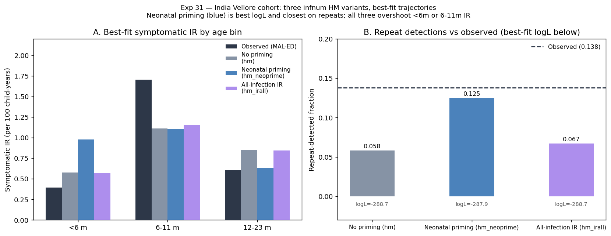

# Exp 31 — India Vellore cohort: infnum HM variants

**Date:** 2026-06-25 (runs) / 2026-06-29 (closed).

**Question.** Can the infection-number (infnum) symptom model fit the MAL-ED Vellore/India birth cohort — symptomatic IR by age (<6m, 6-11m, 12-23m), repeat-detected fraction (0.138), and KM Q25 first-infection timing (15.1mo) — and if not, what structural gap does the failure reveal? Motivated by the Bangladesh/UK infnum selection (exp 19, 27, 28); India is the third site in the cross-setting FOI-gradient arc and the first LMIC with post-vaccine surveillance data.

**Result.** Infnum cannot simultaneously fit all Vellore targets under any of the three HM configurations tested. Neonatal priming (hm_neoprime) is the best variant — best logL (−287.95 vs −288.69 / −288.72), most finite-logL trajectories (566/3000 vs 323/478), and closest on repeats (0.125 vs target 0.138). All three runs collapse to ESS≈1 (point estimates, not posteriors). The residual failure is structural: infnum's order-based symptom decline cannot simultaneously reproduce the symptomatic-IR peak at 6-11m AND suppress <6m IR to the observed level.

## Observations

1. **All three runs: ESS≈1.** The composite Poisson + Binomial + survival likelihood is sharp enough to select a single point; this is consistent with the UK experience (exp 28). These are MLE point estimates, not posterior distributions.

2. **Neonatal priming wins on all metrics.** hm_neoprime: max logL −287.95, 566/3000 finite trajectories, repeat fraction 0.125 (cf. target 0.138), 12-23m IR 0.633 (cf. target 0.609). No-priming and ir_all variants both undershoot repeats (0.058–0.067) and overshoot 12-23m IR (0.84–0.85).

3. **Adding all-infection IR targets (hm_irall) did not improve fit.** The hm_irall trajectory selection logL (−288.72) is essentially identical to the no-priming baseline (−288.69). The extra HM constraint pushed the model toward higher FOI but the composite likelihood did not benefit.

4. **Persistent structural miss: <6m vs 6-11m IR.** All three variants fail on the same pair: <6m IR overshoots (0.57–0.98 vs target 0.40) while 6-11m IR undershoots (1.10–1.15 vs target 1.71). Lowering beta fixes <6m but causes extinction; raising it overshoots <6m. This is the Pareto tension between bins that infnum-only cannot resolve.

5. **Symptomatic fraction data (Vellore biweekly cohort) clarifies the symptom structure.** Observed P(symp|infected) by age bin: <6m=0.381, 6-11m=0.407, 12-23m=0.189, 24-35m=0.122. The near-equal <6m and 6-11m fractions suggest no strong age-on-severity effect at young ages; the steep post-6m decline is consistent with the infnum order structure. The primary failure is therefore in the FOI/transmission side (too few 6-11m infections modelled), not in the symptom model structure per se.

6. **HM NROY remained broad (58–64% at wave 3).** Three waves did not strongly constrain the parameter space, likely because the model goes extinct for ≥88% of sampled parameter combinations at wave 3. The high extinction rate limits HM effectiveness and prevents the emulators from learning informative boundaries.

7. **Neonatal priming (p_neo=0.5, sus_effect=0) is biologically supported but mechanistically incomplete.** Shifting symptom order for 50% of neonates helps repeats and 12-23m IR but inflates <6m IR (0.976 vs 0.40) because the higher FOI needed to sustain transmission post-priming creates too many detected <6m infections.

## Next

**Exp 32 — Fix infnum p_symp parameters from Vellore biweekly data and refit FOI + maternal only.** The Vellore biweekly symptomatic fractions (0.381 / 0.407 / 0.189 / 0.122) provide direct estimates of p_symp by infection order (approximately: p_symp_1≈0.40, p_symp_2≈0.19, p_symp_3+≈0.12). Fixing these reduces the free parameters from 8 to ~5 (log_base_beta, sus_after_1/2/3, maternal_efficacy) and tests whether the structural miss is due to the symptom parameters being under-constrained rather than the model being wrong. If HM converges with these fixed symptoms, the remaining residuals will cleanly implicate FOI/immunity. If it still fails, a combined age×infnum symptom model may be needed.
