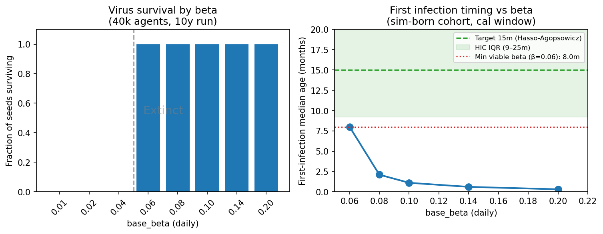

# Exp 36 — UK HM (infnum): FOI anchor via first-infection timing target

**Date:** 2026-07-06.

**Question.** Exp 28's shape-only target could not constrain the absolute force of infection,
producing a degenerate NROY posterior (ESS=2, 1 unique draw) with median first-infection age of
1.7 months — far below the expected UK value of ~15 months from Hasso-Agopsowicz. This
experiment added a `first_inf_median_months` target (obs = 15.0 ± 3.5 mo) alongside the case
shape, using the fixed `Surveillance` analyzer that tracks sim-born agents in the calibration
window only.

**Result.** The HM run produced a fully degenerate result: 2/3000 trajectory draws had finite
log-likelihood, ESS≈1. Diagnosis: the entire NROY from wave 1 had base_beta in [0.050, 0.125];
at 40k agents, the virus goes extinct at all but 2 of those draws. The emulator had incorrectly
extrapolated that low-beta draws would satisfy the first_inf=15m target. Additional diagnostic
sweep (v2) confirmed the structural problem: even the minimum viable beta (0.060) yields
`first_inf_median_months = 8.0 months`, not 15m. The target is unreachable with the infnum
model under this metric.

## Observations

1. **Extinction floor at β ≈ 0.05.** At 40k agents, all seeds go extinct for beta ≤ 0.04. The
   minimum viable beta is 0.060 (5/5 seeds survive, median 2,348 cases over 10 years).

2. **`first_inf_median_months` is monotonically decreasing with beta and cannot reach 15m.** At
   β = 0.06 (minimum viable): fim = 8.0m. At β = 0.08: fim = 2.1m. Higher beta → more
   infections → earlier median first-infection age. There is no beta at which fim = 15m while
   the virus is also viable.

3. **Root cause of metric failure.** The metric is structurally bounded: the calibration window
   starts at year 5 of a 10-year run; by that point, even a low-FOI simulation has pushed most
   first infections to early childhood. The 15m target is an empirical estimate of the age of
   first *symptomatic episode* in a birth cohort from inception — not a steady-state
   age-at-first-infection. The ABM metric measures the latter.

4. **`first_inf_median_months` metric was also broken before this experiment.** The original
   code tracked first infections of all agents (including the initial naive adult population),
   which dominated the median (50–120m) at any beta. The fix (sim-born cohort, calibration
   window only) corrected the direction but exposed the structural problem above.

5. **Emulator extrapolation failure.** The wave-1 NROY had all draws at beta = [0.050, 0.125].
   The Bayes-linear emulator was fitting a surface where lower beta → higher fim (correct
   direction) and incorrectly projected that beta ≈ 0.05–0.07 would satisfy fim = 15m.
   The actual surface drops below 10m everywhere the virus can persist.

## Next

The `first_inf_median_months` metric is not a reliable FOI anchor for this model. Replace with
empirical seroprevalence (Hungerford 2025, UK pre-vaccine era, vaccine-ineligible cohort).
Seroprevalence at 2y (0.69) and 5-6y (0.80) directly constrains cumulative incidence without the
calibration-window artefact, and implies a pre-vaccine median first-infection age of ~14 months —
consistent with the original target.

→ [Exp 37 — UK HM: seroprevalence FOI anchor + fixed Bangladesh immunity](../37_uk_seroprev_hm/README.md)

## Artifacts

- `outputs/diag_init_sweep_v2.json` — 8-beta × 5-seed sweep (beta 0.01–0.20); corrected
  first_inf metric; init_prevalence=0.005, flat age dist, 40k agents.
- `figures/diag_init_sweep.png` — virus survival and first-infection timing vs. beta.
