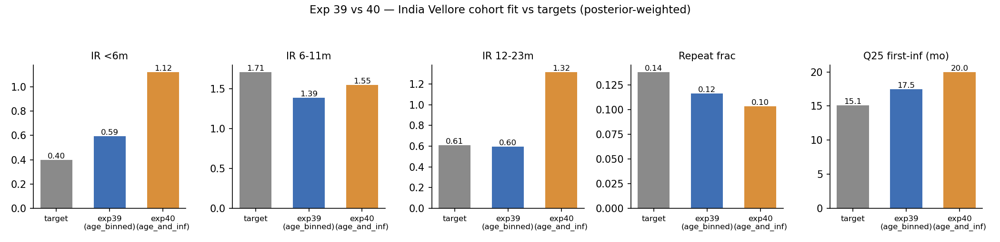

# Exp 40 — India Vellore: age_and_infection with extinction penalty

**Date:** 2026-07-14 (run) / 2026-08-11 (closed).

**Question.** Exp 33 tried `age_and_infection` (age-binned offset + infection-order
symptom modifier, combining both structures) for India but only ran 3 waves with
no extinction penalty and came back with ESS=1 (under-identified, not a clean
result). Does 6 waves + an extinction penalty (`EXT_PENALTY=1`, same treatment
that helped exp39/exp35) let `age_and_infection` mix well enough to judge fairly
against `age_binned` (exp39)?

**Result.** No — still degenerate. ESS = 1.25/3000 (442/3000 finite logL),
barely better than exp33's ESS≈1 and far below exp39's 9.15. The (unreliable,
because ESS≈1) weighted fit is also worse than exp39 on 4 of 5 targets: IR&lt;6m
1.12 (target 0.40, badly overshooting), IR 6-11m 1.55 (target 1.71, closer than
exp39 but not meaningfully — see caveat below), IR 12-23m 1.32 (target 0.61,
badly overshooting), repeat_frac 0.103 (target 0.138), Q25 20.0mo (target
15.1mo, worse than exp39's 17.5).

## Observations

1. **`age_and_infection` loses the India model comparison**, same pattern as the
   UK result in exp28 (`age_and_infection` nests `infnum`, has more free
   parameters, and is under-identified rather than genuinely well-fit — its
   better-looking G²/logL there was flagged as not a clean win either).
2. **ESS=1.25 means these numbers are close to a single best-fit point**, not a
   real posterior average — treat the "closer on 6-11m" reading with real
   skepticism rather than as a genuine advantage.
3. **`age_binned` (exp39) is the working India structure going forward.** No
   further tuning of `age_and_infection` is planned unless a future structural
   change (e.g. decoupled neonatal priming, higher FOI) changes the picture.

## Next

- `age_binned` (exp39) carries forward into VE validation:
  `../41_india_ve_validation/SUMMARY.md`.
