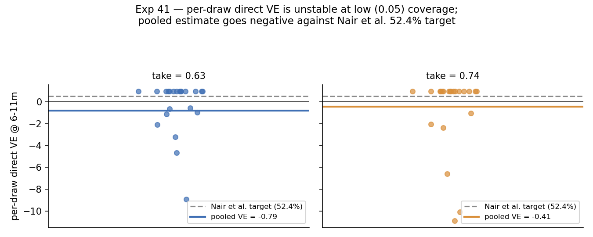

# Exp 41 — India VE validation from exp39 posterior

**Date:** 2026-07-17 (run) / 2026-08-11 (closed).

**Question.** The UK cross-setting story (exp30) forward-predicted vaccine
impact from a cohort-only posterior and validated well against UK test-negative
VE (model 0.74 vs observed 0.77 at take=0.9). Does the same move work for India:
take the top-40 best-fitting exp39 (`age_binned`, fixed p_symp) NROY draws, add
Rotavac (3 doses at 6/10/14 weeks), and check forward-predicted VE against Nair
et al. 2025's India test-negative estimates (6-11m 59% [47-68%], 12-23m ~51-54%,
overall 54% [45-62%]; user's ecologic estimate 52.4% at 6-11m)? Direct VE used
low coverage (0.05) by design, to isolate the individual-level effect from
within-sim herd immunity (which at higher coverage would collapse a real ~57%
direct VE toward zero in the test-negative comparison); a separate parallel run
at 0.90 coverage reports population-impact VE.

**Result.** No — the posterior does not reproduce plausible vaccine impact.
Direct VE at 6-11m came out **negative**: -79% (take=0.63) to -41% (take=0.74),
opposite sign from the ~52-59% target. Per-draw direct VE is extremely unstable
(38 healthy draws, but the low-coverage vax arm accumulates only ~9-40
person-years pooled across all of them combined) — individual draws range from
+1.0 (zero vax cases, a ceiling artifact) down to -28. Population-impact VE
(0.90 coverage, a different estimand) is more moderate but still off-target:
0.33-0.45 across age bins and take rates, vs. the ~50-54% total-effect anchor.

## Observations

1. **Sign flip, not just magnitude.** A negative direct VE is a much stronger
   signal than "undershoots the target" — it means, in the person-time-weighted
   pooled estimate, the vaccinated arm's incidence rate is *higher* than the
   unvaccinated arm's at 6-11m under this posterior. That is not a subtle
   overshoot to tune away.
2. **Low-coverage design trades bias for variance.** 0.05 coverage isolates the
   direct effect from herd contamination but leaves so few vaccinated cases
   (single digits per draw, see `outputs/india_ve.json`) that per-draw VE
   swings from +1.0 to -28 — the pooled estimate is dominated by whichever
   draws happen to log a case, not a stable signal.
3. **This differs from exp39/40's cohort-fit miss but is likely downstream of
   it** — exp39's posterior already undershoots the 6-11m IR peak and detects
   first infection too late; a posterior with too little early-life
   transmission pressure is exactly the kind of miss that could produce
   implausible vaccine dynamics once doses are layered on top.
4. Full per-bin, per-take numbers (aggregate + per-draw) are in
   `outputs/india_ve.json`.

## Next

`../42_india_ve_scored_ts/SUMMARY.md` — test whether adding VE as an explicit
scoring target (rather than just forward-predicting) can pull the exp39
posterior toward a region that is both cohort-consistent and vaccine-plausible.
