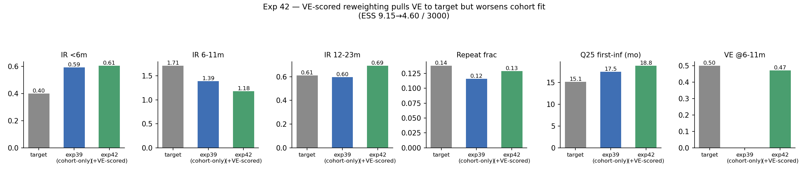

# Exp 42 — India: VE-scored trajectory selection on exp39's NROY pool

**Date:** 2026-07-17 (run) / 2026-08-11 (closed).

**Question.** Exp 41 forward-predicted implausible (negative) direct VE from
exp39's cohort-only posterior. Is that a search/weighting problem — i.e. does
the existing exp39 NROY pool already *contain* draws that are both
cohort-consistent and vaccine-plausible, just under-weighted by a cohort-only
likelihood — or is it structural? Test: re-score the same exp39 NROY draws
(reusing its HM checkpoint, no new HM run) by adding a Gaussian VE logL term
centred at 0.50 ± 0.07 (population-impact VE at 6-11m, take=0.74,
coverage=0.90 — a different, non-degenerate-herd design from exp41's
direct-VE isolation setup) directly into the trajectory-selection weight.

**Result.** No — this is structural, not a weighting artifact. Reweighting
*does* pull the weighted-mean VE to 0.471 (close to the 0.50 target, as
expected — that's what the term is built to do), but only by moving the cohort
fit *further* from target in exactly the two dimensions that were already
exp39's weakest: IR 6-11m **1.39 → 1.18** (target 1.71 — worse), Q25
first-infection **17.5 → 18.8mo** (target 15.1 — worse). IR 12-23m also
worsened slightly (0.60 → 0.69). repeat_frac improved marginally (0.116 →
0.129). The effective sample size collapsed further, ESS 9.15 → 4.60 (out of
3000) — an even thinner slice of the pool satisfies both constraints at once.

## Observations

1. **This confirms, with a number, what `calibration/CLAUDE.md` already named
   as the project's core open problem** ("Pareto tension" between
   symptomatic-IR-by-age and age-at-first-infection) — and extends it: VE
   plausibility is in the *same* tension, not a separate, fixable issue.
   Pulling toward one objective provably costs the other.
2. **Reweighting an existing sample cannot resolve a structural tension.**
   The exp39 NROY pool was generated under a cohort-only likelihood; there is
   no evidence in these 3000 draws of a region that satisfies both the cohort
   data and a plausible VE simultaneously. Fixing this needs either a new HM
   run under a joint likelihood from the start, or a model-structure change.
3. **ESS 4.60/3000 is thin enough that the "0.471 ≈ target" result should not
   be over-read as a validated fit** — it's ~5 effective draws carrying the
   weight, consistent with the same sharp-multinomial/degenerate-posterior
   pattern seen in the UK (exp28) and Bangladesh work.
4. This result sat un-synced on the remote VM (`zebra`) from completion
   (2026-07-17) until this review (2026-08-11) — the delay was purely a
   sync/documentation gap, not a stalled run.

## Artifacts

Outputs write into the exp39 directory by design (reuses its HM checkpoint,
does not duplicate it): `../39_india_age_binned_fixed/outputs/ts/posterior_ve50.csv`,
`sir_results_ve50.jsonl`, `ts_stats_ve50.json`. Exp39's own `posterior.csv` /
`sir_results.jsonl` (cohort-only) are untouched.

## Next

[Done — see `../43_india_neonatal_detected/SUMMARY.md`.] That experiment found
`NeonatalPriming` had actually been a silent no-op under `age_binned` in exp39-42
(the order-bump it applied has zero effect on an age-only symptom model), fixed
that, and made priming a real detectable event — but the fix overshot Q25 in
the opposite direction and did not touch the underlying &lt;6m/6-11m tension this
experiment was trying to resolve. The Pareto tension remains open.

The standing hypothesis from the exp31-35 arc, not yet attempted in 39-42: let
FOI go higher and **decouple neonatal priming's `sus_effect`** into a true
early asymptomatic infection event (rather than a symptom-flag-only
intervention), motivated by the biweekly Vellore birth-cohort evidence
(2002-2006, urban slum, near-complete detection: 90.6% ever-reinfected vs
MAL-ED's apparent low-FOI signature) that Vellore may be high-FOI and
mostly-asymptomatic rather than genuinely low-FOI. That decoupled-priming,
high-FOI refit is the next open experiment — not started here.
