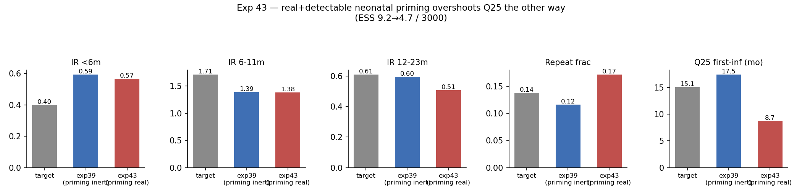

# Exp 43 — India Vellore: neonatal priming as a real, detectable event

**Date:** 2026-08-11.

**Question.** Exp 39-42 confirmed a structural Pareto tension (cohort fit vs. VE
plausibility), but a code re-read while planning this experiment found that
`NeonatalPriming` was a silent no-op in all of exp39-42: `age_binned`'s symptom
probability depends only on age, never on infection order, so priming's sole
effect (bumping the next infection's order by +1) never touched anything with
`sus_effect=0`. Per AK's narrow reading of the biology (maternal titer doesn't
block this specific antigenically-distinct neonatal strain, and an infection
occurring under high titer doesn't confer strong future protection), this
experiment made priming a **real, detectable, never-symptomatic** infection —
it increments true infection order (`n_inf`) and is checked for detection via
the same asymptomatic-surveillance pathway as any other subclinical infection
(`rotasim/analyzers.py`, `MALEDCohort`). No new free parameters: `p_neo=0.5`,
`age_weeks=2.0`, `sus_effect=0.0` all stayed literature-fixed. Same HM
configuration as exp39 (`age_binned`, fixed age-p_symp, titer maternal,
6 waves × 1500 samples).

**Result.** Negative — and informatively so. The mechanism has real bite (as
the pre-run smoke test predicted) but overshoots in a different, and net worse,
direction. Q25 first-detected-infection collapsed from exp39's 17.5mo (too late)
to **8.7mo (target 15.1 — now too early, by more than the original miss)**.
`repeat_frac` flipped from undershooting (0.116) to overshooting (0.172, target
0.138). IR 12-23m got worse (0.596→0.508, target 0.61). IR &lt;6m and 6-11m —
the original target of this whole arc — were essentially unmoved (0.593→0.567
and 1.389→1.384). ESS dropped further (9.15→4.73/3000), a more degenerate
posterior, not a better-constrained one.

## Observations

1. **The mechanism has a hard floor that the free parameters can't tune away.**
   `p_neo=0.5` × the asymptomatic-detection probability at 2 weeks
   (`_p_surv(age)*eia` ≈ 0.36) guarantees roughly 18% of the cohort a "detected"
   event at ~2 weeks by construction, independent of `base_beta` or any other
   fitted parameter. That alone consumes most of the 25th-percentile headroom
   before any FOI-driven community infection gets a chance to contribute — Q25
   can't land near 15.1mo under this parameterization no matter what the other
   9 parameters do. Six full HM waves confirm this isn't a search failure.
2. **This is a diagnosis, not a refutation of the underlying biology.** It
   specifically implicates the assumption that the neonatal-strain event is
   detected at the *same* rate as ordinary asymptomatic infections. That's the
   piece with the least direct support — `p_neo≈0.5` comes from Gladstone's
   Vellore serology work, but nothing pins the *detection probability* of this
   specific event to the general `_p_surv/eia` formula; it was chosen for
   parsimony (no new parameter), not because it's known to be correct.
3. **The original tension (IR &lt;6m overshoot / 6-11m undershoot) is untouched.**
   This mechanism was never mechanistically positioned to fix that pair — it
   only ever bore on detection timing and repeat fraction. Its failure here
   doesn't say anything new about that piece of the puzzle.
4. **ESS getting worse (not better) across the board is the clearest single
   signal that this isn't the fix** — a correct structural change should make
   the joint targets easier to satisfy together, not harder.

## Next

Two candidate follow-ups, not mutually exclusive:
- **Lower the priming event's detection probability below the general
  asymptomatic rate** (a new, small, literature-justifiable parameter or a
  fixed discount) and see if a lower floor lets Q25 land between exp39's 17.5
  and this run's 8.7 instead of at either extreme.
- **Revisit whether `p_neo≈0.5` (Gladstone's estimate) is the right value for
  the MAL-ED Vellore cohort specifically** — AK is independently checking
  Tamil Nadu strain-surveillance data for the dominant neonatal-strain age
  concentration and temporal stability, which bears directly on this.

Neither has been tried yet. The original &lt;6m/6-11m tension remains open and
untouched by this arc so far.
