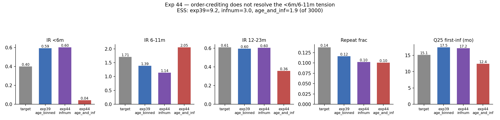

# Exp 44 (age_and_infection sibling) — fractional neonatal order-crediting under age_and_infection

**Date:** 2026-08-11 (run) / 2026-08-12 (closed).

**Question.** Same as `../44_india_order_effect_infnum/SUMMARY.md`, under
`age_and_infection` (age-sensitive AND order-sensitive) instead of plain
`infnum` — the first valid test of this model against the Vellore cohort,
since `MALEDCohort` never actually implemented it before now (bug fixed this
session; see the correction note on `../40_india_age_inf_extpen/SUMMARY.md`).
14 free parameters (no `--fix-*` mechanism exists yet for `beta0-3`), flagged
in the README as a real risk going in.

**Result.** Negative, and the numbers should not be trusted as a real fit.
ESS = **1.92/3000, only 62/3000 trajectories finite** — an order of magnitude
thinner than exp39's already-thin 9.15/438. The weighted values swing wildly
relative to every other India run: IR &lt;6m collapses to **0.04** (vs exp39's
persistent ~0.59 overshoot, target 0.40), IR 6-11m jumps to **2.05** (vs
target 1.71 and every other run's undershoot), IR 12-23m and repeat_frac both
undershoot, Q25 drops to 12.4mo (target 15.1). This is not a real
"age_and_infection fits better on some dimensions" result — with 62 finite
draws out of 3000, this is 1-2 lucky simulations dominating the weighted
average, not a posterior.

## Observations

1. **The parameter-count risk flagged in the README materialized exactly as
   warned.** 14 free parameters against 44 cases reproduces the same collapse
   the ORIGINAL (buggy) exp40 showed (ESS≈1.25) — meaning the bug fix
   revealed that `age_and_infection` is a genuinely hard model to identify
   here, not just that the old test was invalid. Both the broken and the
   fixed version land in the same degenerate place, for what look like
   different underlying reasons (a code bug vs. real non-identifiability).
2. **`neonatal_order_effect`'s posterior (median 0.61, 10-90% [0.51, 0.61])**
   looks tight, but is drawn from the same ~2-effective-sample pool as
   everything else here — not informative on its own. The infnum sibling's
   wider, still-above-zero range is the more trustworthy read of this
   parameter.
3. **More free parameters have now failed twice in a row** (this experiment
   and the infnum sibling, relative to `age_binned`'s 9). That's a specific,
   actionable signal for parameter engineering going forward: Vellore's 44
   cases cannot support model comparisons at this parameter count, regardless
   of which extra parameter is added or why.

## Next

See `../44_india_order_effect_infnum/SUMMARY.md` for the fuller discussion —
same two live candidates (two-strain structural representation, or leaning on
larger-N data instead of the sparse cohort). This experiment adds a concrete
data point to the parameter-engineering side of that decision: don't propose
adding MORE free parameters to `age_and_infection` (e.g. a fixed-beta
mechanism analogous to `--fix-psymp`) as a fix — the direction that's failed
twice now is adding capacity, and the fix, if there is one within a
single-strain model, likely needs to come from removing/fixing parameters or
from better-constraining data, not from more flexibility.
