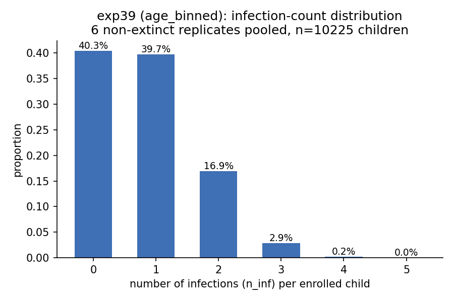

# Exp 45 — India Vellore: per-agent infection-count distribution (exp39)

**Date:** 2026-08-12.

**Question.** See README.md — does exp39's model show one exposure-risk pool
among enrolled children, or a low/high-exposure bimodal split?

**Result.** Two separate findings, in different places.

**(1) Within a viable (non-extinct) simulation: one pool, not two.** Pooling
6 of 8 replicates that didn't go extinct (10,225 enrolled children): 40.3%
never infected, 39.7% once, 16.9% twice, 2.9% three times, tapering to ~0 by
5 — a smooth, monotonic decline consistent with a single population under
declining post-infection susceptibility (`sus_after_1/2/3`), not two
distinct risk groups. Two checks against a homogeneous-Poisson null both
point the same direction: variance/mean = **0.82** (*under*dispersed, not
overdispersed — a genuine low/high-exposure mixture would push this above 1);
P(0 infections) = 40.3% observed vs. 43.6% Poisson-implied (no excess of
structural zeros — a distinct never-exposed subgroup would show up as zero-
inflation *above* Poisson, not below).

**(2) Across posterior draws, there IS a stark bimodality — but it's a
parameter regime split, not agent heterogeneity.** 2 of 8 draws (25%) went
**fully extinct** (zero infections across the entire 1700+-child cohort);
the other 6 landed in a fairly narrow band (mean 0.71-1.18 infections/child).
This is a direct, visual confirmation of the low-ESS/joint-identifiability
story already suspected from exp39/42/43/44's collapsing ESS values: the
posterior struggles not because of hidden agent-level structure, but because
a large fraction of the sampled parameter space produces no epidemic at all.

## Observations

1. **This is evidence against the simplest two-subpopulation hypothesis**
   (children being intrinsically high- vs. low-exposure) as the explanation
   for the persistent India tension — at least as a within-simulation,
   agent-level phenomenon.
2. **It does not rule out a two-STRAIN structural explanation** — that
   hypothesis is about two co-circulating pathogen populations with
   different symptom/immunity profiles, not about two classes of children;
   this check doesn't speak to it either way.
3. **The extinction fraction (25% of 8 draws) is a small sample** — worth
   re-checking against a larger draw set if this number is going to inform a
   decision, but it's consistent with the ~88% extinction rate at the
   parameter-space level reported for India back in exp31.

## Next

Bears on the open decision from exp44: this result leans (mildly, given the
small n) toward the data-adequacy/parameter-identifiability framing over the
agent-heterogeneity framing, for the specific question it can answer. Doesn't
resolve the two-strain-vs-data-adequacy choice on its own.
