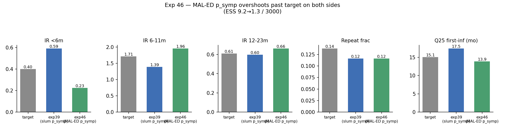

# Exp 46 — India Vellore: age_binned refit with MAL-ED-derived (not slum) p_symp

**Date:** 2026-08-12/13.

**Question.** See README.md — does swapping exp39's slum-cohort-derived
`p_symp` (&lt;6m 0.381, 6-11m 0.407, 12-23m 0.189) for AK's directly-recalculated,
ascertainment-corrected MAL-ED India values (&lt;6m 0.172, 6-11m 0.511, 12-23m
0.444) close the persistent &lt;6m-overshoot/6-11m-undershoot tension?

**Result.** The first lever in the whole India arc (14 experiments,
exp31-46) to move both problem bins in the *correct* direction — but it
overshot past the target on both, and the joint fit got harder to satisfy,
not easier. IR &lt;6m: 0.593→**0.225** (target 0.40 — crossed from overshoot to
undershoot). IR 6-11m: 1.389→**1.957** (target 1.71 — crossed from undershoot
to overshoot). IR 12-23m: 0.596→0.663 (target 0.61, still good). repeat_frac
unchanged (0.116). Q25: 17.46→**13.90** (target 15.1 — actually improved,
smaller deviation than exp39). ESS collapsed further: 9.15→**1.26/3000**.

## Observations

1. **Both targets are bracketed by the two p_symp choices.** &lt;6m's target
   (0.40) sits between exp46's IR (0.23) and exp39's IR (0.59); 6-11m's
   target (1.71) sits between exp39's IR (1.39) and exp46's IR (1.96). That's
   a strong, concrete signal that an *intermediate* p_symp — somewhere
   between the raw slum values and the fully-corrected MAL-ED values — could
   land close to both targets simultaneously, rather than either endpoint
   alone.
2. **In z-score terms this is not simply "worse."** 6-11m's deviation shrank
   (0.82σ→0.65σ) and Q25's shrank sharply (0.84σ→0.42σ); only 12-23m got
   mildly worse (0.06σ→0.25σ, still small) and &lt;6m stayed roughly the same
   magnitude (0.85σ→0.74σ, just flipped sign). The ESS collapse reflects the
   *joint* constraint tightening, not every individual target getting worse.
3. **This breaks the pattern of every other post-exp39 modification.**
   VE-reweighting (exp42), real-detected priming (exp43), and fractional
   order-crediting under two models (exp44) all left &lt;6m/6-11m completely
   untouched or moved them the wrong way. This is the first with correctly-
   signed leverage on the actual problem.

## Next

Free `p_symp_age_0_6/6_11/12plus` under `age_binned` with bounds spanning the
interval between the slum and MAL-ED values for each bin (rather than fixing
at either endpoint), letting HM find the interior point the joint likelihood
actually wants — see `../47_india_age_psymp_interp/README.md`.
