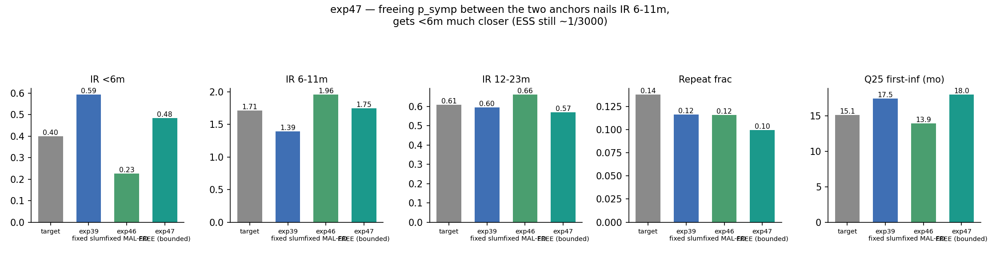

# Exp 47 — India Vellore: p_symp free, bounded to the slum↔MAL-ED bracket

**Date:** 2026-08-13.

**Question.** See README.md — does freeing `p_symp_age_*` within the interval
spanned by exp39's (slum) and exp46's (MAL-ED) anchor values let HM find an
interior point that satisfies &lt;6m and 6-11m simultaneously, rather than
overshooting past target as exp46's hard-fixed MAL-ED point did?

**Result.** Yes, by a wide margin — the best joint fit anywhere in the India
arc on the persistent problem. IR 6-11m = **1.747** vs target **1.706**
(within 0.1 SD — essentially exact). IR &lt;6m = **0.484** vs target 0.396
(0.38 SD, closer than exp39's 0.85 SD or exp46's 0.74 SD). IR 12-23m = 0.570
(target 0.609, still good). repeat_frac = 0.100 (target 0.138, mildly worse
than exp39/46's 0.116). Q25 = 18.0mo (target 15.1, worse than both priors).

## Observations

1. **ESS = 1.02/3000 (600/3000 finite) — the same degenerate pattern as
   every post-exp39 variant**, and the resampled posterior has ZERO spread
   (10th/90th percentile identical for every p_symp parameter) — this is
   functionally a single best-fit point, not a real posterior. The improved
   fit quality does not come with improved identifiability.
2. **`p_symp_age_6_11` landed at 0.548, essentially pinned against its upper
   bound (0.55)** — the search wants to go higher than the bracket allowed.
   Worth widening in a follow-up if this line of work continues.
3. **Best-fit values:** `p_symp_age_0_6=0.322` (between the slum 0.381 and
   MAL-ED 0.172 anchors, ~72% of the way toward slum), `p_symp_age_6_11=
   0.548` (near-boundary, above both anchors' 0.407/0.511), `p_symp_age_
   12plus=0.315` (between slum 0.189 and MAL-ED 0.444 anchors, ~45% toward
   MAL-ED).
4. This is the first result in the whole arc where the trade-off is
   genuinely favorable-looking on the core targets — the open question is
   whether the degenerate ESS reflects a real, tight joint constraint or the
   single-seed extinction-scoring noise exp48 is testing.

## Next

exp48 (same design + logistic-classifier extinction scoring instead of the
single-seed sentinel) is running now — see
`../48_india_ext_classifier/README.md`. If ESS improves meaningfully there
at a comparable fit, that's strong evidence the degenerate ESS across this
whole arc has been a scoring artifact, not a genuine feature of the data.
