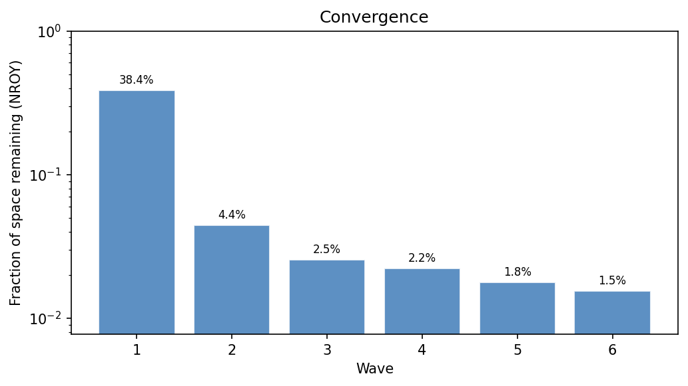
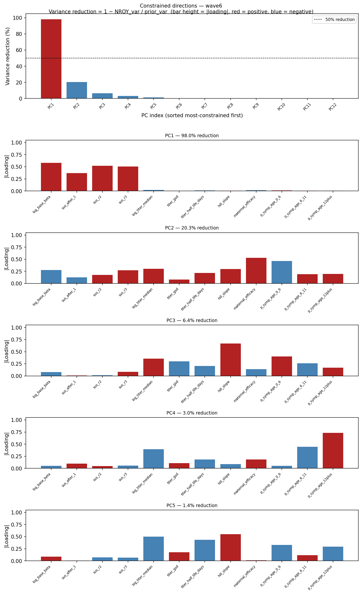
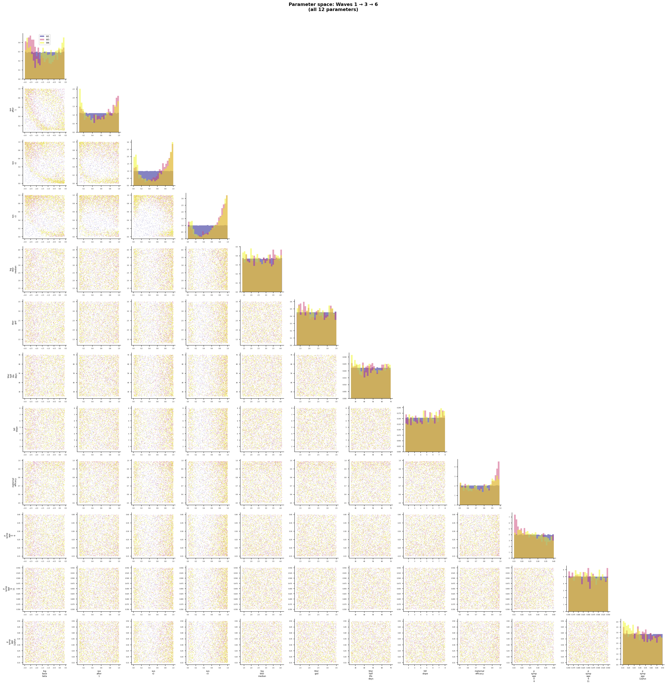

# Exp 48 — India Vellore: smoothed extinction-probability classifier

**Date:** 2026-08-13.

**Question.** See README.md — every India HM run (exp39-47) scores extinction
from a single simulation seed per sampled parameter point, at a fit that
sits on a ~85-87% baseline extinction knife-edge. Does replacing that raw
single-draw sentinel-mixed regression target with a logistic classifier's
smoothed P(extinct) (fit on all `(params, extinct)` pairs accumulated across
waves, no new simulations needed) change the ESS collapse pattern seen in
exp39-47?

**Result.** A real, measurable improvement — but a trade-off against
exp47's specific best-fit point, not a clean win.

| Metric | exp47 (single-seed) | exp48 (classifier) | Target |
|---|---|---|---|
| ESS (/3000) | 1.02 | **2.39** | — |
| Extinction rate | 79.0% | **63.8%** | — |
| IR &lt;6m | 0.484 | 0.451 | 0.40 |
| IR 6-11m | **1.747** (nailed) | 1.412 (worse) | 1.71 |
| IR 12-23m | 0.570 | 0.656 | 0.61 |
| repeat_frac | 0.100 | 0.101 | 0.138 |
| Q25 (mo) | 18.00 | **14.36** (much better) | 15.1 |

HM convergence is also much tighter: NROY narrows to **1.5%** by wave 6 (vs
exp47's 10.2%), and the PCA constrained-directions plot shows more variance
captured in more components (PC1 98.0%, PC2 20.3%, PC3 6.4% vs exp47's 93.6%,
10.7%, 4.4%). The final-wave pairplot shows a genuinely new, sensible
structure: a clear curved trade-off between `log_base_beta` and
`sus_after_1`/`sus_r2`/`sus_r3` that was pure unstructured noise in exp47's
pairplot.

## A resolved side-investigation: why did `log_symp_ir_sum` look so much worse than the other targets in exp47's z-scores-across-waves diagnostic?

AK's sharp observation: in exp47's `zscores_vs_targets.png`, `log_symp_ir_sum`
sat near z=-30 to -50 while the age-specific IR bins looked close to target —
even though none of these targets get retrained after their one wave in the
cycle, so "stale emulator" alone couldn't explain why only one of them looked
bad. Verified directly against the wave-6 checkpoint's real simulation
output (not a guess):

| | `log_symp_ir_sum` | `ir_symp_<6 m` |
|---|---|---|
| % NaN | **0%** | **81.5%** |
| Median (valid rows) | -20.72 (the extinct sentinel) | 1.128 |
| Median z-score | **-28.56** | 3.16 |

**Root cause: `log_symp_ir_sum` never gets `NaN`'d for extinct sims — by
design, so the emulator has a learnable signal — while every real target
correctly gets `NaN`'d for extinct sims** (those quantities are genuinely
undefined for an extinct population). The (third-party) plotting utility
does `.dropna()` per column before computing the displayed z-score
percentiles. So `ir_symp_<6m`'s displayed distribution silently excludes the
81.5% extinct rows (only the 278 survivors show up), while
`log_symp_ir_sum`'s distribution keeps *all* 1500 rows — and since the
median row is still the extinct sentinel, the displayed median z-score is
-28.6. **It isn't apples-to-apples**: the chart makes `log_symp_ir_sum` look
uniquely bad only because it's the one column still showing the majority-
extinct reality the others have quietly filtered out. Confirmed in exp48's
version of the same chart: once `log_symp_ir_sum` is a genuine bounded
probability that's never `NaN`'d, the -30 spike disappears entirely and it
sits in the same small range as everything else.

This isn't a bug in our code — it's a real quirk in how a generic diagnostic
plot handles a deliberately-sentineled column differently from `NaN`-able
ones. Worth remembering when reading this chart in future experiments: don't
compare `log_symp_ir_sum`'s (or any never-NaN'd proxy's) displayed z-score
band directly against a real target's — they're drawn from different
subsets of the same wave's rows.

## Observations

1. **Confirms single-seed noise was real** (lower extinction rate, better
   ESS, better convergence, more structured pairplot) — but the improvement
   comes with exp47's near-exact 6-11m fit trading away to something closer
   to exp39's original undershoot. Neither run is a clean winner on its own.
2. **The corrected slum p_symp anchor (0.593, not 0.407) hasn't been tried
   with the classifier fix yet** — exp49 (widened 6-11m bracket) is staged
   but not run; worth running under `EXT_CLASSIFIER=1` too, not just
   exp47's design, given exp48's generally healthier NROY behavior.
3. **Bangladesh (exp09) did not have this problem**: checked directly from
   its Optuna trial data — 11.2%/15.5% extinct (age_only/infnum) vs India's
   79-87%, for two reasons: (a) Bangladesh's much higher FOI sits well clear
   of the extinction knife-edge, and (b) exp09 already used 20 replicates
   per trial, which would have averaged out any residual single-seed noise
   even if extinction risk had been higher. India's low-FOI regime combined
   with the HM pipeline's one-simulation-per-point design is what makes this
   specifically an India problem.

## Next

Decide whether to build exp49 (widened p_symp bracket) on exp47's design or
exp48's classifier fix — given exp48's healthier convergence/ESS/pairplot
structure, it's probably the better base to extend, even though exp47's
specific point fit looked better on 6-11m.
