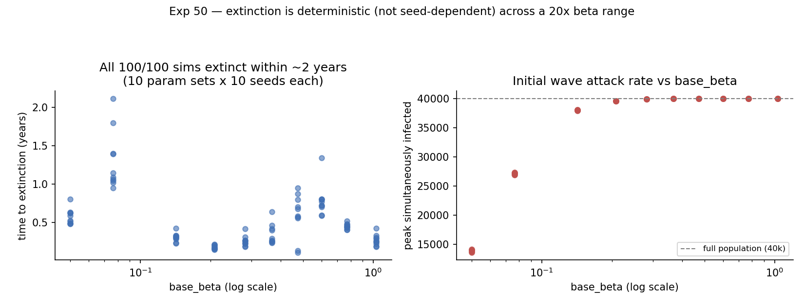

# Exp 50 — India Vellore: is extinction (or time-to-extinction) seed-dependent?

**Date:** 2026-08-13/14.

**Question.** See README.md — across a genuinely diverse set of parameter
points that were classified extinct in exp39's posterior, how much does the
extinction outcome (and time-to-extinction) vary across independent seeds?

**Result.** For these 10 points, **extinction was completely deterministic:
100/100 sims (10 parameter sets x 10 seeds) went extinct**, not a mix.
Across a 20x `base_beta` range (0.050 to 1.031), every single trajectory
burns through the population fast (once beta exceeds ~0.14, the initial
wave attacks 95-100% of the 40k population within weeks) and then goes
completely extinct within **at most ~2.1 years** — none survive anywhere
close to the 5-10 year MAL-ED calibration window, regardless of how hot or
mild the initial burn was.

## Observations

1. **This is a strong signature of a population-size ceiling, not a
   "haven't found the right beta yet" problem.** If viability were purely a
   function of tuning `base_beta`, some value across this 20x range should
   reach a sustained endemic equilibrium instead of universally collapsing
   within ~2 years. Instead the pattern looks like classic critical-
   community-size (CCS) behavior (per the measles literature, e.g. Bartlett):
   below some population threshold, stochastic extinction after the initial
   wave is close to certain regardless of transmissibility, because there
   aren't enough hosts to bridge the trough between generations of infection.
2. **Important design caveat: these 10 points were selected by spreading
   across `base_beta` alone**, not by proximity to the actual multi-
   dimensional viable corridor (exp47/48's constrained-dims analysis showed
   viability is a JOINT function of beta and the susceptibility-decay
   parameters together, not beta alone). So this experiment shows "far from
   the viable region is deterministically extinct" — it does not yet test
   whether points *near* the real viable corridor (close to exp39/47/48's
   best-fit parameter combination) show seed-to-seed variability. That
   remains open.
3. **The initial-wave attack rate saturates fast**: by `base_beta=0.14`,
   ~95% of the population is infected within the first month; by
   `base_beta≈0.28+`, it's essentially 100%. Even the mildest tested point
   (`base_beta=0.050`) still attacks 35% of the population initially and
   still goes fully extinct within ~2 years.

## Next

The natural, decisive test given observation 1: hold parameters fixed and
scale up population size alone. If extinction rate drops sharply with N,
that's direct evidence of a CCS effect specific to the 40k-agent population
size used throughout this India arc (and every Bangladesh HM experiment,
exp16-19, at the same N) — see
`../51_india_population_size/README.md`.
