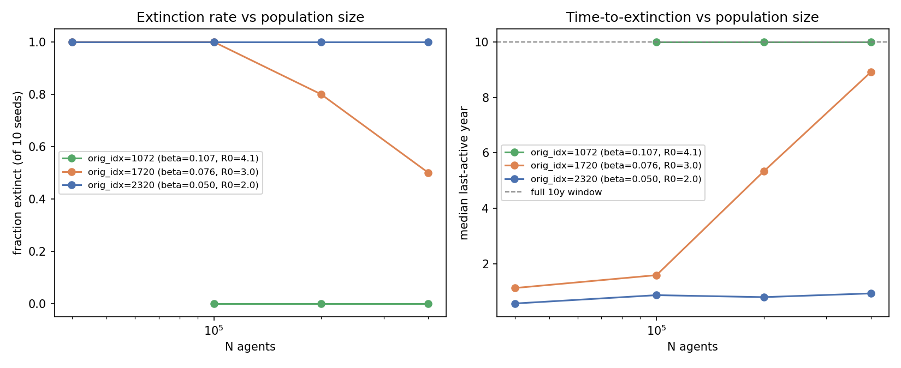

# Exp 51 — India Vellore: does population size alone rescue extinction? (near-critical persistence test)

**Date:** 2026-08-14.

**Question.** See README.md. exp50 showed 10 parameter sets spanning a 20x
`base_beta` range all deterministically extinct at N=40,000 within ~2 years —
a pattern initially framed as classic critical-community-size (CCS) behavior.
This experiment holds parameters fixed and scales population size alone
(100k/200k/400k) to test that directly, for two of exp50's points
(`orig_idx=2320`, `base_beta=0.050`; `orig_idx=1720`, `base_beta=0.076`, the
longest-surviving point in exp50). Midway through the run, AK raised a sharp
objection: picking the *lowest*-beta point as a rescue candidate may have been
the wrong test — a point with too-low R0 shouldn't respond to population size
at all, regardless of N (population size only rescues points that are already
supercritical but fighting stochastic fade-out). A third point,
`orig_idx=1072` (`base_beta=0.107`, chosen as the closest match to `1720` on
every *other* dimension — `sus_after_1`, `sus_r2/r3`, titer params,
`maternal_efficacy` all within ~1 std — so beta is close to the only thing
changing), was added overnight to test that directly.

**Result.** Population size rescues extinction, but only above a sharp
threshold in beta/R0 — not as a smooth, generic effect:

| orig_idx | base_beta | R0 (corrected, see below) | 40k | 100k | 200k | 400k |
|---|---|---|---|---|---|---|
| 2320 | 0.050 | **2.0** | 10/10 extinct | 10/10 extinct | 10/10 extinct | 10/10 extinct |
| 1720 | 0.076 | **3.0** | 10/10 extinct | 10/10 extinct | 8/10 extinct | 5/10 extinct |
| 1072 | 0.107 | **4.1** | (not run) | 0/10 extinct | 0/10 extinct | 0/10 extinct |

`2320` shows **no improvement at all** across a 10x population range (median
survival 0.56–0.92y at every N). `1720` shows a genuine, monotonic rescue
(extinction 100%→80%→50%, median survival 1.1y→5.3y→8.9y as N goes
40k→200k→400k). `1072` shows **complete rescue** — 0/30 runs went extinct at
any tested N; every run survived the full 10-year window.

## Observations

1. **The three points step through the threshold almost exactly as R0
   crosses it**: 100% → 50% → 0% extinct at N=400k as R0 goes 2.0 → 3.0 →
   4.1. This looks like a genuine near-critical persistence threshold, not a
   smooth generic population-size effect.
2. **The naive R0 estimate (`base_beta × dur_inf`) is wrong in both
   directions, and the correct formula matters a lot.** Ignoring the contact
   network's mean degree (`n_contacts=7`, `ss.RandomNet`, resampled daily —
   `hm_calibrate.py`/`calibrate_maled.py`) badly *underestimates* R0
   (AK's back-of-envelope, base_beta/dur_inf⁻¹, gave ~1.5–1.6). But naively
   multiplying by `n_contacts × dur_inf` (as this experiment's own README
   originally implied) badly *overestimates* it, because transmission is
   ~90% suppressed during the asymptomatic phase (`rel_trans=0.1` for ~8 of
   the ~13 infectious days — `rotasim/rotavirus.py:238,242`). The corrected
   formula, R0 ≈ `n_contacts × [(1−e^{−β})·dur_symp + (1−e^{−0.1β})·dur_asymp]`
   with `n_contacts=7`, `dur_symp≈5d`, `dur_asymp≈8d`, gives **R0≈2–6** across
   the full `base_beta∈[0.05,0.15]` range explored in this India arc — well
   below measles-scale CCS (R0≈12–18). This is a near-critical
   low/moderate-R0 stochastic-fadeout regime, not classic Bartlett/measles
   CCS, even though the qualitative population-size-rescue signature is the
   same family of phenomenon.
3. **This explains why the effect is a sharp cutoff rather than a gradual
   slope**: near-critical persistence theory predicts the population size
   needed to bridge the post-epidemic trough grows steeply as R0 approaches 1
   from above, so a modest R0 change (2.0→3.0→4.1) can flip the outcome from
   "unrescuable at 10x population" to "rescued at 1x population."
4. **This is directly relevant to the real India posterior, not just an
   abstract mechanism check.** India's actual best-supported fit (exp47,
   `base_beta≈0.079` at the single dominant point) implies **R0≈3.1** —
   almost exactly `1720`'s partial-rescue regime. That means the single-seed,
   N=40,000 extinction classification used throughout exp39–49's HM waves is
   plausibly misclassifying real, viable posterior mass as "extinct" simply
   because it sits near this threshold — not because the underlying
   parameters are actually implausible.
5. **Bangladesh's selected model (exp19, infnum) sits comfortably above the
   threshold**: median `base_beta≈0.111` → R0≈4.3, in `1072`'s fully-rescued
   regime. This is consistent with Bangladesh's lower single-seed extinction
   rate (37.5% for exp19 vs. India exp47's 79.0%) and suggests Bangladesh
   is not fighting this same near-critical-threshold problem on the
   transmission-rate dimension, at least not to the same degree.

## Next

- **The single-seed extinction penalty in `hm_calibrate.py` likely needs to
  change for India.** If a meaningful fraction of currently-"extinct"
  posterior mass is really near-threshold (sometimes-extinct) rather than
  truly non-viable, the current penalty is biasing the search away from a
  viable region, not correctly excluding an implausible one. Two candidate
  fixes: (a) raise `N_AGENTS` for India HM runs from 40k towards 100k–200k,
  where the exp47-adjacent R0≈3 region is no longer uniformly extinct; or
  (b) replace single-seed extinction classification with a cheap multi-seed
  vote (3–5 seeds) so near-threshold points like `1720`/exp47 are correctly
  scored as "sometimes viable" rather than deterministically extinct. (b) is
  cheaper to test first.
- exp49 (widened p_symp bracket, corrected slum anchor) remains queued — it
  probably should wait on the N_AGENTS/multi-seed decision above, since that
  choice will materially change which region of parameter space counts as
  "extinct" going into the next HM wave.
- Worth computing the *effective* reproduction number after the initial wave
  (accounting for `sus_after_1`/`sus_r2`/`sus_r3` susceptibility depletion and
  birth-rate susceptible replenishment) rather than relying on the naive
  fully-susceptible R0 used here — that's the number that actually governs
  trough-survival, and it may sharpen the threshold estimate further.
  [Done — see `../53_india_effective_r/SUMMARY.md`: Re after the wave is
  comfortably >1 for all three points (1.6-2.0), so the mechanism is a
  near-critical *stochastic* branching-process extinction risk, not a
  deterministic viability threshold.]
