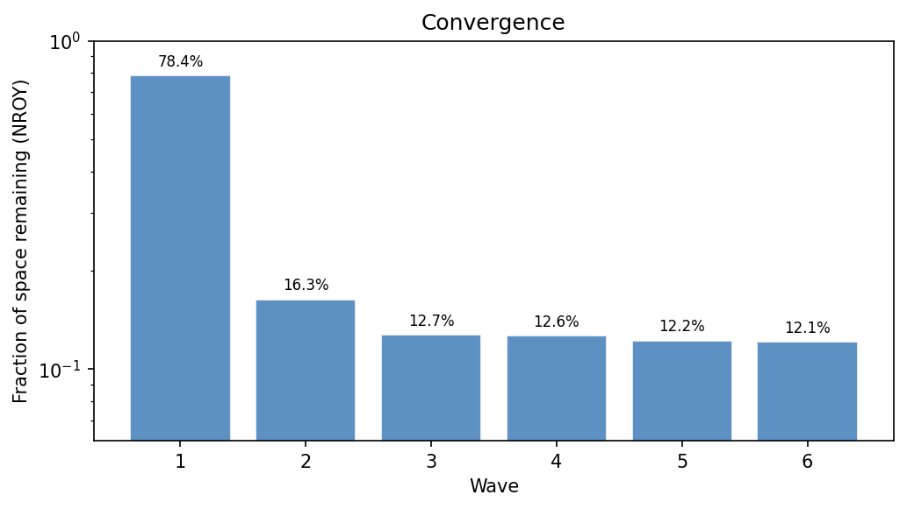
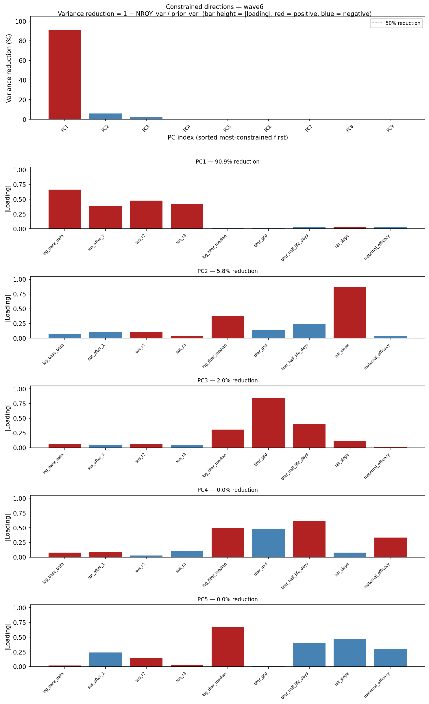
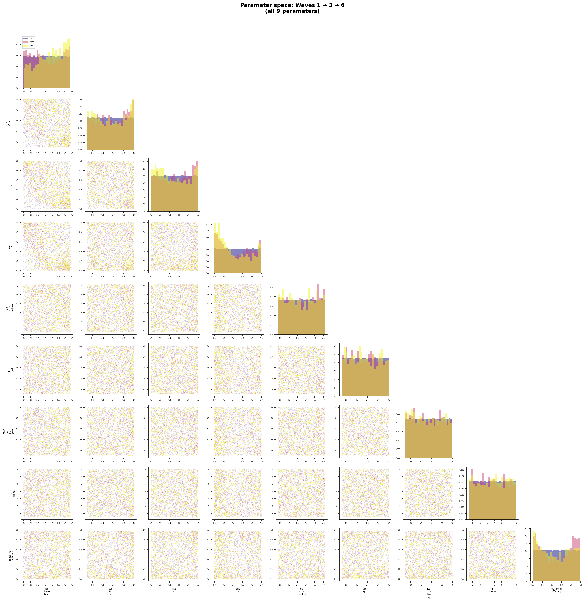
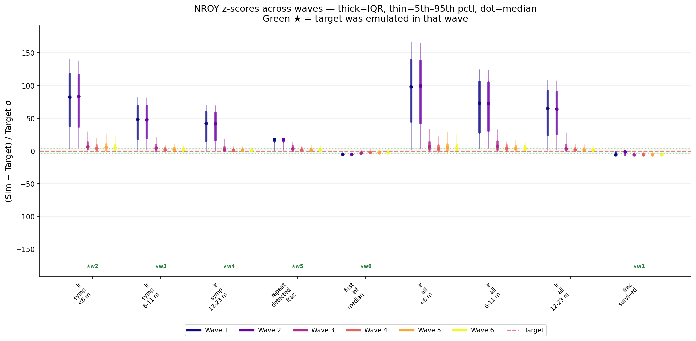

# Exp 52 — India Vellore: re-run the age_binned HM wave with the multi-seed survival vote

**Date:** 2026-08-14 (HM run) / 2026-08-17 (trajectory selection + close). Run on
the zebra VM (160 cores, non-spot) per README's compute note.

**Question.** See README.md — re-run exp39's exact config (age_binned, titer
maternal, NeonatalPriming, all-targets HM) with the new 5-seed survival vote
(`SURVIVAL_VOTE=1`, `frac_survived` as a wave-1 target, Laplace-smoothed)
replacing the old single-seed extinction sentinel/classifier, to see whether it
produces healthier mixing than exp39 (ESS 9.15), exp47 (ESS 1.02), or exp48
(ESS 2.39).

**Result.** ESS improves to **20.96/5000 (0.42%)** — the best fraction in the
India arc (exp39 0.305%, exp47 0.034%, exp48 0.080%) — and the all-5-seeds-extinct
rate drops to **75.8%** (vs exp39's single-seed 84.8%). But the posterior-weighted
fit itself is essentially unchanged from exp39: the same &lt;6m/6-11m tension
persists.

| Metric | exp39 (single-seed) | exp47 (freed p_symp) | exp48 (classifier) | **exp52 (survival vote)** | Target |
|---|---|---|---|---|---|
| ESS (fraction of pool) | 9.15/3000 (0.305%) | 1.02/3000 (0.034%) | 2.39/3000 (0.080%) | **20.96/5000 (0.419%)** | — |
| "Extinct" rate | 84.8% | 79.0% | 63.8% | **75.8%**† | — |
| IR &lt;6m | 0.59 | 0.484 | 0.451 | 0.617 | 0.396 |
| IR 6-11m | 1.39 | **1.747** (nailed) | 1.412 | 1.390 | 1.706 |
| IR 12-23m | 0.60 | 0.570 | 0.656 | 0.591 | 0.609 |
| repeat_frac | 0.116 | 0.100 | 0.101 | 0.110 | 0.138 |
| Q25 (mo) | 17.5 | 18.00 | **14.36** (best) | 17.0 | 15.1 |

† exp52's rate is the fraction of resampled draws where *all 5* seeds went
extinct (Laplace-smoothed `frac_survived` < 0.15); exp39/47/48's rates are
single-seed extinction fractions — related but not identical definitions,
included for a rough sense of scale rather than an exact comparison.

All exp52 values above are importance-weighted posterior means over the
1211/5000 finite-logL resampled draws (`outputs/ts/sir_results.jsonl`,
`outputs/ts/posterior.csv`); best-single-point values (idx 712, logL=-283.36)
are close: IR&lt;6m 0.526, IR6-11m 1.376, IR12-23m 0.576, repeat_frac 0.101,
Q25 17mo — same qualitative pattern.

## Observations

1. **The survival vote fixes mixing/convergence, not the fit.** ESS and
   extinction rate both improve materially over the single-seed sentinel
   (exp39) — confirming exp50/51's diagnosis that near-threshold extinction
   is genuinely seed-dependent noise the old scoring couldn't average out.
   But the posterior-weighted IR&lt;6m/IR6-11m/repeat_frac land at
   essentially the *same* values as exp39 (1.39 vs 1.39 on the 6-11m peak,
   to three significant figures) — the extra mixing headroom didn't move
   the fit toward the target, it just made the same fit region easier to
   find and characterize.
2. **This is the cleanest evidence yet that the &lt;6m/6-11m tension is
   structural, not a search/noise artifact.** Four different fixes now
   applied to exactly this symptom (exp47 freed p_symp, exp48 classifier
   extinction scoring, exp52 5-seed survival vote) each measurably improved
   ESS or convergence, and each left the same IR&lt;6m overshoot /
   IR6-11m undershoot pair essentially untouched (or, in exp52's case,
   IR&lt;6m got slightly *worse*: 0.617 vs exp39's 0.59). Consistent with
   calibration/CLAUDE.md's standing assessment: "This looks structural, not
   under-identification."
3. **No single mechanism here is a clean winner across all five targets** —
   exp47 nails 6-11m but overshoots Q25; exp48 nails Q25 but undershoots
   6-11m; exp52 sits in between on both, closest to exp39's original
   profile. The survival vote is best understood as a scoring-quality fix
   that should be *kept* going forward (better ESS, lower spurious
   extinction), not as a fit-quality fix.
4. Job cost matched the README's estimate: 5 seeds/draw × 1500 samples ×
   6 waves = 45,000 HM sims, plus 5000×5=25,000 more at trajectory
   selection — run entirely on zebra, ~3 days wall clock including one
   restart (see README's restart note).

## Next

The `age_binned`/single-strain/single-seed-noise/freed-p_symp/classifier
levers have each been tried in some combination and none closes the
&lt;6m/6-11m gap — this matches the standing "two live candidates" framing
from the India Vellore arc (two-strain structural representation, or
treat as a data-adequacy problem and lean on the larger-N TN surveillance).
Separately, exp53-56's deterministic-ODE side-track (run locally while this
HM job was on zebra) has now produced exp57, which fits the ODE+cohort
reduction directly against the same composite likelihood via
`differential_evolution` — a much cheaper way to explore this same
likelihood surface once the ODE approximation's fidelity (exp54-56) is
trusted. exp57's first attempt froze the local machine mid-run and never
completed; it is being re-launched on zebra next.
