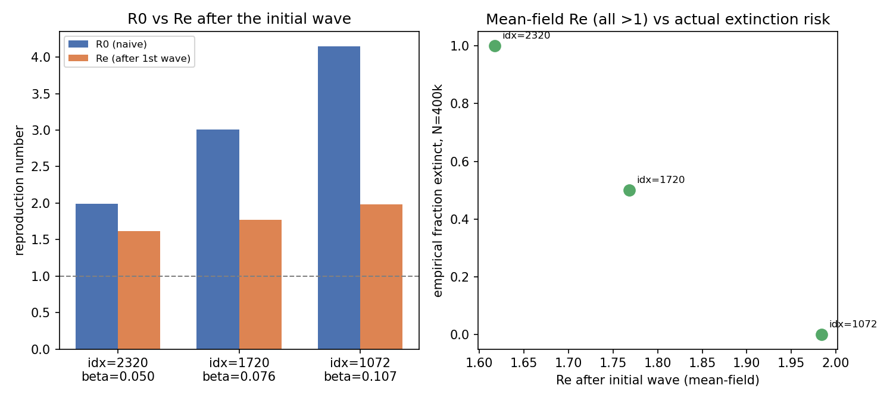

# Exp 53 — India Vellore: effective R after the initial wave

**Date:** 2026-08-14.

**Question.** See README.md. exp51 found a sharp population-size-rescue
threshold across R0≈2.0→3.0→4.1 (naive, fully-susceptible) and flagged
computing the *effective* R after the initial wave (accounting for
post-infection susceptibility depletion) as a sharper mechanistic lens.

**Result.** All three tested points have Re_after_wave comfortably **above
1** even after accounting for susceptibility depletion (1.62, 1.77, 1.98) —
yet empirical extinction risk at N=400k still swings from **100% → 50% →
0%** across that same range. Mean-field Re>1 is clearly necessary but far
from sufficient to predict persistence here.

| orig_idx | base_beta | R0 (naive) | peak_frac (attack rate) | sus_after_1 | Re_after_wave | frac_extinct (N=400k) |
|---|---|---|---|---|---|---|
| 2320 | 0.050 | 1.99 | 0.347 | 0.461 | **1.62** | 1.00 |
| 1720 | 0.076 | 3.00 | 0.679 | 0.394 | **1.77** | 0.50 |
| 1072 | 0.107 | 4.14 | 0.881 | 0.408 | **1.98** | 0.00 |

## Observations

1. **Deterministic Re alone cannot explain the empirical pattern.** All
   three points are "supercritical" by a comfortable margin (Re 1.6-2.0), so
   a naive deterministic reading would predict all three persist. The actual
   outcome (100%→50%→0% extinct) is a **stochastic** phenomenon layered on
   top of a uniformly-supercritical deterministic backbone.
2. **This is classic near-critical branching-process behavior, not a
   deterministic viability question.** For a mildly supercritical birth-death
   process, the probability that a small number of surviving lineages goes
   extinct by chance is exponentially sensitive to how far Re sits above 1
   and to the *absolute* number of lineages seeding the post-wave trough
   (roughly ~(1/Re)^n0 for n0 independent residual infections in the
   simplest linear approximation) — a modest Re increase (1.6→1.8→2.0) can
   swing extinction probability from near-certain to near-zero exactly as
   observed here. Population size (N) enters because it sets the absolute
   number of both naive hosts and residual infections surviving the trough,
   not because it changes Re per se — consistent with exp51's population-size
   rescue result, now with a specific mechanism attached rather than a loose
   analogy to measles CCS.
3. **This explains why an analytical Re "fix" isn't the right engineering
   answer.** Computing a sharper Re doesn't resolve the core problem — the
   relevant quantity is a *stochastic survival probability*, not a
   deterministic threshold, and that probability depends on details (exact
   post-wave case counts, age-structure of the residual susceptible pool,
   birth-rate replenishment timing) that a simple mean-field formula can't
   capture cleanly. This is exactly why exp52's fix (empirically measuring
   survival via a multi-seed vote, rather than computing a threshold
   analytically) is the right approach going forward.

## Next

exp52 (multi-seed survival vote, replacing the single-seed extinction
sentinel/classifier) is the direct engineering answer to this finding — see
`../52_india_survival_vote/README.md` (running as of this writing). A
sharper follow-up, if useful later: instrument `n_infected_series` at the
post-wave trough (minimum count between the initial peak and any recovery)
to get an actual n0 for each point and test the ~(1/Re)^n0 branching-process
approximation directly, rather than relying on the peak-wave attack rate as
a proxy.
