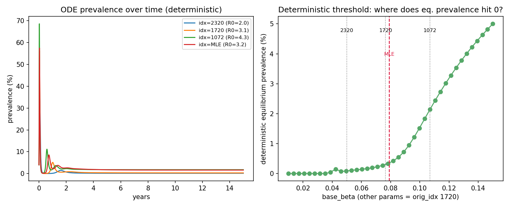

# Exp 54 — India Vellore: deterministic ODE reduction of the ABM

**Date:** 2026-08-14.

**Question.** See README.md — while exp52 (multi-seed survival vote) runs,
can a deterministic ODE reduction of the ABM's transmission mechanics
confirm/sharpen exp53's finding (all tested points have Re>1, yet extinction
risk varies sharply) and locate the exact deterministic viability threshold?

**Result.** Yes on both counts, and the ODE surfaces a specific, testable
mechanism the hand calculation in exp53 couldn't: **all three points ride
almost exactly at Re≈1 at the post-peak trough**, regardless of how far above
1 their naive R0 sits — the difference between them is the *absolute* case
count at that knife-edge moment, not how supercritical they are on average.

| orig_idx | base_beta | R0 (NGM) | R0 (exp51/53 discrete formula) | Deterministic eq. prevalence | Post-peak trough (of 40k) | Re *at* the trough | Crude branching P(extinct) |
|---|---|---|---|---|---|---|---|
| 2320 | 0.050 | 2.03 | 1.99 | 0.15% | **13.5** | 1.01 | **92.5%** |
| 1720 | 0.076 | 3.11 | 3.00 | 0.31% | **15.1** | 1.01 | **80.7%** |
| 1072 | 0.107 | 4.34 | 4.14 | 1.77% | **83.8** | 1.04 | **4.8%** |
| **MLE (exp47)** | **0.079** | **3.21** | **3.10** | **1.62%** | **53.3** | **1.02** | **38.6%** |

**Added India's current best fit** (exp47's collapsed posterior — 2977/3000
resamples identical, ESS=1.02, the modal row is the MLE in every practical
sense): `base_beta=0.079`, almost identical to `orig_idx=1720`'s (0.077), but
its susceptibility decays less steeply (`sus_after_1=0.46` vs `1720`'s 0.39,
and its `sus_r2/r3` stay closer to 1) — giving it a meaningfully deeper
trough (53 vs 15 infected) and a lower crude extinction estimate (39% vs
81%) despite near-identical transmission rate. **The MLE is not sitting at
the most fragile point in the tested range** — it's closer to `1072`'s
healthier regime than to `1720`'s, even though its beta matches `1720`
almost exactly. That's a direct, useful answer to "where does the best fit
want to sit": on the transmission-rate axis alone it looks marginal, but the
immunity-decay parameters it's paired with make it meaningfully more robust
than that axis alone would suggest.

The NGM-derived R0 matches exp51/53's discrete-hazard formula within ~2-5%
— a useful independent cross-check that both derivations are internally
consistent. All three points reach a **stable, positive deterministic
equilibrium** (never true extinction) — confirming exp53's Re>1 finding with
a properly-specified mechanistic model rather than a hand calculation.

## Observations

1. **The post-peak trough is where extinction risk actually lives, and it
   sits at Re≈1 for every point tested, not just the marginal one.** This is
   a general property of post-epidemic troughs (the decline stops almost
   exactly where Re crosses 1 from below — if it were still <1 the decline
   would continue, if comfortably >1 it would already be recovering) — so
   naive-R0 differences between parameter points show up almost entirely as
   differences in the *absolute number of cases* riding that knife-edge, not
   in how far from critical the system is at that moment.
2. **The deterministic critical `base_beta` (≈0.039) sits comfortably below
   all three tested points** — even `orig_idx=2320` (100% stochastically
   extinct at every population size tested in exp51) is ~30% above the
   deterministic floor, deterministically supercritical the whole time. The
   entire 2320→1072 range explored in exp50/51 is deterministically viable;
   the empirical 100%→0% swing is a purely stochastic phenomenon layered on
   top, exactly as exp53 argued, now with a precise deterministic floor
   attached to it.
3. **The crude branching-process estimate — `P(extinct) ≈ (1/Re_trough)^n0`,
   with n0 = the ODE's trough case count — tracks the empirical ranking
   well**: 92.5% / 80.7% / 4.8% for a ranking that was empirically ~100% /
   ~100% (at N=40k, per exp50/51) and (untested at 40k, but 0% at every
   larger N in exp51) respectively. This is a genuinely testable,
   falsifiable prediction the ODE makes that the ABM hadn't directly
   checked: **orig_idx=1072 may already be viable at the standard N=40,000
   used throughout this entire project**, not just at the larger populations
   actually tested in exp51 (only 100k/200k/400k were run for that point).
4. **This reframes the "population size rescues extinction" story slightly.**
   It's not that a bigger population raises Re (it doesn't — Re at the
   trough is ~1 regardless of N, by construction of what a trough is); it's
   that a bigger population produces a larger *absolute* case count at the
   same Re≈1 trough, which is what actually buys protection against
   stochastic extinction. Same mechanism as exp51/53, now with a precise
   number attached to "how many individuals is enough."

## Next

- **Directly testable prediction from observation 3**: run `orig_idx=1072`
  at N=40,000 (not yet tested — exp51 only tried 100k/200k/400k for this
  point) across ~10-20 seeds. The ODE predicts this should mostly survive
  (~95% viable); if the ABM instead shows high extinction at 40k, that would
  mean the crude branching approximation is missing something important
  (most likely: real-world variance/overdispersion in offspring number,
  which the simple linear approximation ignores and which would make
  extinction more likely than this estimate suggests).
- **Same check for the MLE point** (~39% predicted extinction at N=40,000)
  would be a directly useful validation, since it's the actual point exp52
  cares about — a handful of ABM seeds at the MLE's exact parameters would
  say whether the crude branching estimate is in the right ballpark for the
  point that matters most, not just for the three exp50/51 probes.
- The ODE is cheap enough (milliseconds per run) to sweep the *full*
  9-parameter space, not just `base_beta` — could produce a fast, continuous
  approximation to the "viable corridor" that exp47/48's constrained-dims
  plots only sampled empirically, as a cheap prior for where to concentrate
  ABM sampling.
- This does not bear on the original India cohort-fit problem (`<6m`/`6-11m`
  tension) at all — that requires the symptom-detection layer, which this
  ODE deliberately excludes (see README.md).
