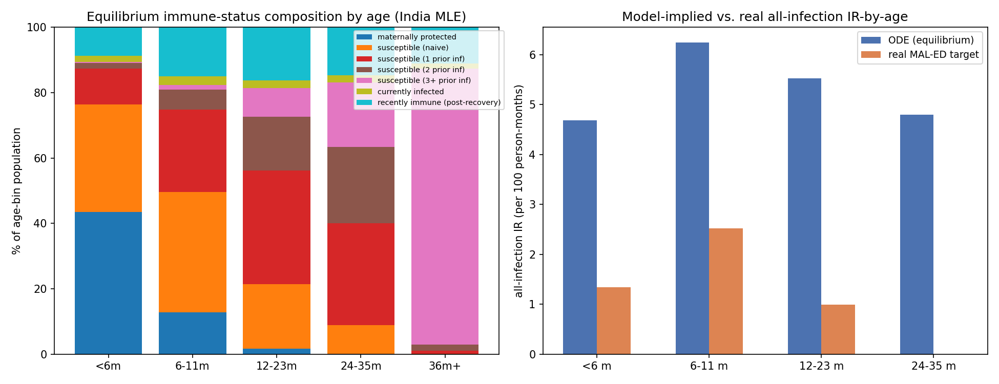
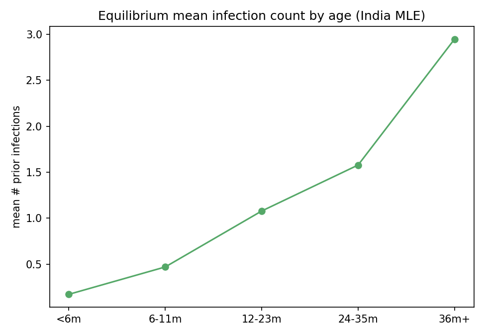

# Exp 55 — India Vellore: age-structured extension of exp54's ODE

**Date:** 2026-08-14.

**Question.** See README.md — compute the equilibrium age-structured immune
status distribution (for ABM initialization) and check it against the real
all-infection IR-by-age targets as a fidelity check.

**Result.** The equilibrium age structure is exactly the mechanical pattern
expected — immune status accumulates smoothly with age, purely from time-
since-birth, with no age-dependence built into transmission or
susceptibility at all:

| age_bin | maternally protected | susceptible (naive) | susc. (1 prior inf) | susc. (2 prior inf) | susc. (3+ prior inf) | mean prior infections |
|---|---|---|---|---|---|---|
| <6m | 43.6% | 32.8% | 11.0% | 1.7% | 0.3% | 0.17 |
| 6-11m | 12.8% | 36.9% | 25.2% | 6.0% | 1.4% | 0.47 |
| 12-23m | 1.7% | 19.7% | 34.7% | 16.5% | 8.7% | 1.08 |
| 24-35m | 0.2% | 8.7% | 31.2% | 23.2% | 19.9% | 1.58 |
| 36m+ | 0.0% | 0.1% | 1.1% | 1.9% | 84.3% | 2.95 |

By age 3, nearly everyone (97%, and 84% specifically at the "3+" floor
susceptibility) has been infected at least 3 times — consistent with
India/Vellore being characterized as a high-FOI setting throughout this
project.

**The model-implied all-infection IR-by-age gets the shape right but not
the magnitude.** Both the ODE and the real MAL-ED target peak at 6-11m and
decline afterward, but the ODE's equilibrium rate runs ~2-5x higher across
every bin (model 4.7/6.2/5.5/4.8 vs target 1.3/2.5/1.0/0.0 per 100
person-months). This is a real, honestly-reported discrepancy, not
swept under the rug — see Observations.

## Observations

1. **The age-structure result itself doesn't depend on the magnitude
   mismatch.** The *relative* composition — what fraction of each age bin
   sits in each immune compartment — is a self-consistent equilibrium
   property of the order/aging dynamics regardless of the absolute
   transmission rate's fit quality, so it's usable for ABM initialization
   even before the magnitude gap is resolved (rescaling the whole system's
   throughput doesn't change *how* immune status accumulates with age, only
   *how fast*).
2. **Most likely explanation for the magnitude gap: the real ABM's 5-10
   year calibration window may not actually be at this ODE's true infinite-
   time equilibrium.** exp54 already showed order-dynamics take several
   years of damped oscillation to settle; the age-structured version adds a
   second, slower equilibration timescale (the "36m+" bucket absorbs
   everyone for the rest of their life, and its internal order-composition
   depends on decades of accumulated history in the full ABM, not just the
   first 5-10 years). If the ABM is still relaxing toward a higher endemic
   level than what's observed at year 5-10, that alone could produce
   exactly this kind of "right shape, inflated magnitude" mismatch.
3. **Alternative/additional explanation: approximation error in this
   reduction.** The per-age-bin single-exponential exit-rate approximation,
   the Erlang-chain maternal approximation, and the omission of any
   between-individual heterogeneity (everyone in a compartment is treated as
   identical) could each contribute some inflation. Not disentangled from
   observation 2 here.
4. **This does NOT change exp53/54's extinction-mechanism conclusions.**
   Those relied on relative comparisons across parameter points (R0, Re at
   the trough, trough case counts) that are far more robust to a uniform
   scaling error than an absolute-magnitude claim would be.

## Next

- **The most useful immediate follow-up given AK's original motivation**:
  turn the age-bin-by-compartment table above into actual ABM initial
  conditions (draw each simulated agent's starting infection-order state
  from this age-conditional distribution, weighted by the agent's age at
  t=0) and check empirically whether that removes or shrinks the fragile
  post-wave trough exp50/51/53/54 identified — directly testable by
  comparing extinction rates with vs. without equilibrium-initialization at
  the same N=40,000.
- **Resolve the magnitude gap** before trusting the IR-by-age numbers
  quantitatively: run the actual ABM (not the ODE) at the MLE parameters out
  to, say, 30-40 years and check whether its own symptomatic/all-infection
  IR keeps drifting upward past year 10, which would directly support
  observation 2.
- Sweep this age-structured equilibrium across more of the posterior (not
  just the single MLE point) to see how sensitive the age-composition
  picture is to the parameters that remain uncertain.
