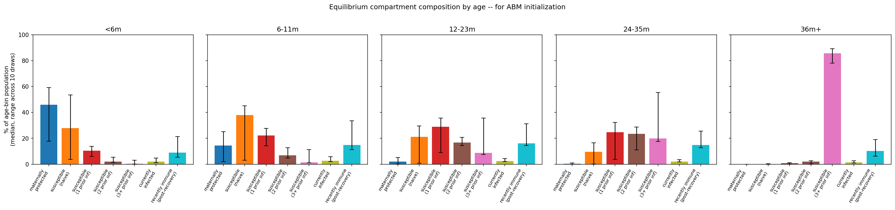
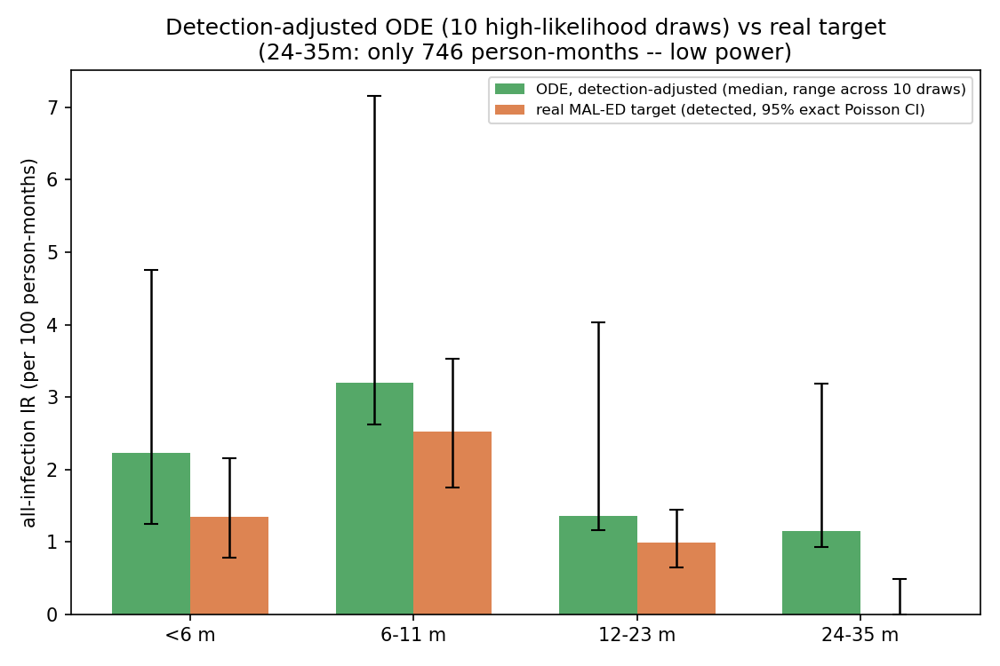
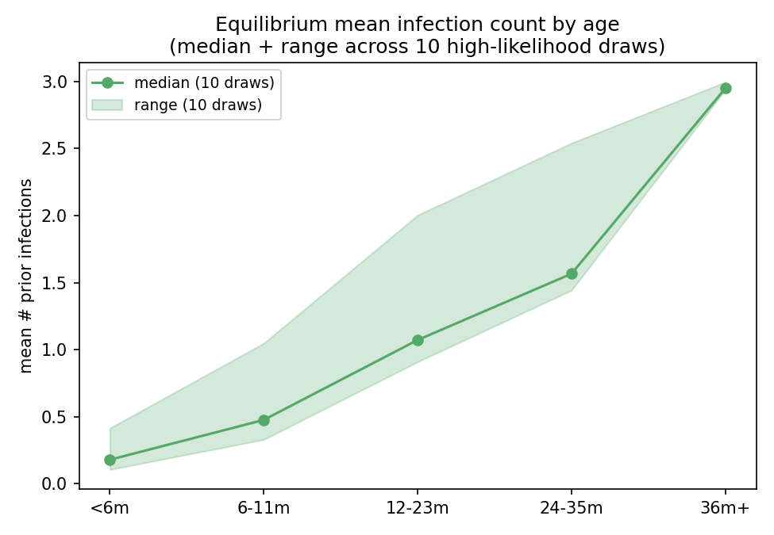

# Exp 56 — India Vellore: ODE equilibrium across 10 high-likelihood draws (parameter CI)

**Date:** 2026-08-17.

**Question.** See README.md — put a parameter-uncertainty range on exp55's
single-MLE equilibrium picture, using 10 high-likelihood draws from exp47's
completed trajectory-selection scoring, run entirely locally via the ODE.

**Result.** The quantity that actually matters for ABM initialization —
the equilibrium *compartment fractions* by age, not just the derived
IR-by-age — has **genuinely mixed tightness**: the oldest bin (`36m+`) is
tight and robust; the two middle bins (`12-23m`, `24-35m`) are wide,
specifically in the higher-order susceptible classes.

| age_bin | tightest compartment (range width) | widest compartment (range width) |
|---|---|---|
| <6m | susceptible order3+ (2.8pp) | susceptible order0/naive (49.6pp) |
| 6-11m | susceptible order2 (8.0pp) | susceptible order0/naive (42.1pp) |
| 12-23m | susceptible order2 (6.5pp) | susceptible order3+ (28.2pp) |
| 24-35m | maternal (0.9pp, but ~0 for everyone) | susceptible order3+ (37.8pp) |
| 36m+ | everything except order3+ (<3pp each) | susceptible order3+ (11.1pp, still the tightest *relative* to its own ~86% median) |

**Practical read for initialization:** the `<6m` maternal/naive split and
the `36m+` "everyone's at the 3+ floor" picture are both fairly reliable to
initialize from directly. The `12-23m`/`24-35m` order-composition — exactly
the age range where a child could plausibly be at order 1, 2, or 3+ — is
the least certain part of the picture: `susceptible_order3plus` alone spans
7.5-35.7% at `12-23m` and 17.7-55.5% at `24-35m` across the 10 draws. An ABM
initialization built from this table should treat those two bins as a
range to sample across (or wait for exp52's tighter posterior), not a
single fixed fraction.

Separately, the same 10 draws also give a range on the derived
detection-adjusted IR-by-age, which — combined with exact Poisson CIs on
the MAL-ED target (per exp55) — closes the earlier single-point gap
further: `<6m`, `6-11m`, and now also `12-23m` all overlap between model
and target; only `24-35m` (already flagged in exp55 as low-power — 746
person-months, the least of the four bins) does not.

| age_bin | model detected IR: median [min, max] | target IR (95% exact Poisson CI) | overlap? |
|---|---|---|---|
| <6m | 2.24 [1.25, 4.76] | 1.35 [0.78, 2.15] | **yes** |
| 6-11m | 3.20 [2.63, 7.15] | 2.52 [1.75, 3.53] | **yes** |
| 12-23m | 1.36 [1.16, 4.03] | 0.99 [0.65, 1.45] | **yes** |
| 24-35m | 1.15 [0.93, 3.18] | 0.00 [0.00, 0.49] | no (low-power bin) |

The equilibrium mean-infection-count-by-age pattern (exp55's other headline
result) is robust across all 10 draws — monotonically increasing with age,
converging toward ~2.9-3.0 prior infections by `36m+` in every draw — though
the exact rate of accumulation varies meaningfully in the middle bins
(`12-23m` ranges 0.91-2.00 across the 10 draws):

## Observations

1. **The order-composition uncertainty, not the age-structure mechanism
   itself, is what's wide.** All 10 draws agree qualitatively (maternal
   protection dominant at `<6m`, near-universal order-3+ by `36m+`); they
   disagree substantially on exactly how fast a child moves through orders
   1→2→3+ in between. That's a property of the *parameter* uncertainty in
   this top-10-by-logL set (mostly driven by `base_beta` ranging 0.052-0.726
   across the 10 draws — a 14x spread), not an artifact of the ODE
   reduction itself.
2. **This is a materially more reassuring picture than exp55's single-point
   comparison** on the IR-by-age side specifically. exp55 (single MLE)
   found `<6m` just barely outside its CI
   and `12-23m` moderately outside. Once the *same* detection-adjustment
   logic is applied across a spread of high-likelihood parameter draws
   rather than one point, `12-23m` moves into overlap too — the earlier
   near-miss was partly an artifact of picking a single draw rather than
   reflecting genuine posterior uncertainty.
3. **The model's range is wide, though — this isn't a tight validation.**
   Some draws (e.g. `orig_idx`/`idx` 1577, `base_beta=0.726`, the widest-beta
   draw in the top 10) push the upper end of the range considerably (up to
   ~7.15 at `6-11m`), reflecting real heterogeneity in the top-10-by-logL
   set, not numerical noise. A tighter posterior (once exp52's honest
   survival-vote TS finishes) would give a more decisive answer than this
   provisional, exp47-based selection can.
4. **This uses exp47's posterior, not exp52's.** exp47 predates the
   multi-seed survival vote and, per exp52's own diagnostics, sits in a
   region with materially higher measured extinction risk than earlier
   single-seed estimates suggested. Once exp52's TS run completes, this
   analysis should be redone against its (more honestly-weighted) top draws
   — the qualitative picture (order/age structure) should be robust, but
   the specific IR-by-age range could shift.
5. **Still entirely a transmission-side check.** Like exp54/55, this ODE
   has no detection layer of its own (the detection adjustment is applied
   post-hoc using each draw's own fitted `p_symp`) and cannot speak to the
   original `<6m`/`6-11m` cohort-fit tension directly — it's a fast,
   parallel sanity check on the age-structure/IR-by-age side, not a
   replacement for the real ABM fit.

## Next

- **Re-run this exact analysis against exp52's TS output** once it
  completes, using its top-N-by-(survival-weighted-logL) draws instead of
  exp47's — the natural, most valuable follow-up once the "full sims" this
  experiment was explicitly running alongside are done.
- If the range in observation 3 is judged too wide to be useful, consider
  restricting to the top-N draws by a stricter cutoff (e.g. within 2 logL
  units of the best, rather than a fixed N=10) so the "high-likelihood"
  selection is calibrated to the actual likelihood surface rather than an
  arbitrary count.
