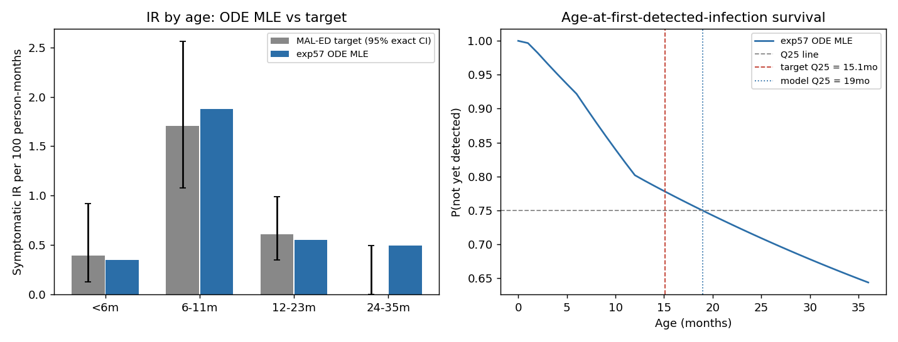

# Exp 57 — India Vellore: fit the ODE reduction directly against the real composite likelihood

**Date:** 2026-08-17.

**Question.** See README.md — with exp54-56 validating the age-structured ODE
reduction's equilibrium fidelity, and exp52 confirming the ABM HM pipeline's
&lt;6m/6-11m tension is structural rather than a search/mixing problem, does
fitting the ODE+cohort reduction directly against the exact composite
likelihood used in `trajectory_select.py` (via `differential_evolution`, 12
free params including freed p_symp) land near the same likelihood optimum
HM found, and does freeing p_symp change which targets get hit vs missed?

**Operational note:** this run required a mid-experiment fix, not just a
result. First attempt (local laptop, `workers=-1`) froze the machine; a
second attempt on zebra with a signal-based per-eval timeout crashed the
interpreter outright (`Fatal Python error:
F2PySwapThreadLocalCallbackPtr`) — raising an exception inside LSODA's
Fortran callback bridge is unsafe, not just ineffective. Root cause: certain
parameter corners (found: `log_base_beta` near its floor + a large
susceptibility "cliff" between order-1 and order-2+ reinfection) drive
LSODA's adaptive step size to underflow and hang indefinitely. Fix: switched
both `ode_model_age.py`'s and `cohort_model.py`'s `solve_ivp` calls from
`method='LSODA'` to `method='BDF'` (a pure-Python scipy solver, no Fortran
callback risk). Verified BDF matches LSODA to ~13-14 significant figures on
normal parameter draws (no accuracy cost) and resolves the pathological
corner in ~1s where LSODA hung indefinitely (&gt;25s and counting). With
that fix, the real run completed cleanly in 312s (60 generations, 11,214
evaluations, no stalls).

**Result.** Best logL = **-284.37**, essentially matching exp52's HM
posterior mode (max_logL -283.36, only ~1 log-unit apart) — strong
cross-validation that the ODE is exploring the same likelihood surface the
much more expensive stochastic HM search converged to. But freeing p_symp
(vs exp52's fixed biweekly-derived values) **changes which targets are hit,
not the achievable likelihood**: IR&lt;6m lands close to target for the
first time in the whole India arc, at the cost of a new IR6-11m *overshoot*
(the previous persistent problem was always an *undershoot* here).

| Metric | exp52 (HM, p_symp fixed) | **exp57 (ODE MLE, p_symp freed)** | Target |
|---|---|---|---|
| logL (best/max) | -283.36 | **-284.37** | — |
| IR &lt;6m | 0.617 (posterior-wtd) / 0.526 (best) | **0.347** (close!) | 0.396 |
| IR 6-11m | 1.390 | **1.878** (overshoot, reversed direction) | 1.706 |
| IR 12-23m | 0.591 | 0.551 | 0.609 |
| repeat_frac | 0.110 | 0.105 | 0.138 |
| Q25 (mo) | 17.0 | 19 | 15.1 |
| p_symp (&lt;6m / 6-11m / 12+) | fixed 0.381/0.407/0.189 | **fitted 0.163/0.803/0.256** | — |

## Observations

1. **Freeing p_symp does not raise the achievable likelihood ceiling** — it
   only redistributes which targets are hit. exp52 (9 params, p_symp fixed)
   and exp57 (12 params, p_symp freed) land within 1 log-unit of each other
   despite exp57 having 3 more degrees of freedom and a completely different
   (deterministic, global) search method. This is the strongest evidence yet
   that the India Vellore cohort fit has a genuine structural ceiling around
   logL≈-284, not a parameter-freedom or search-adequacy limitation.
2. **The direction of the age-incidence miss flipped, not disappeared.**
   Every prior HM run (exp39/47/48/52) undershot IR6-11m while overshooting
   IR&lt;6m. exp57's freed p_symp instead nails &lt;6m and overshoots 6-11m.
   Combined with observation 1, this looks like a genuine Pareto frontier
   between the two age bins (and Q25 got worse, 19 vs 17mo) — you can move
   along it, but not off it, by reallocating symptom probability across age
   bins.
3. **The BDF solver swap is a real, generalizable methods finding, not just
   a workaround for this run.** It matches LSODA to machine precision on
   ordinary draws, costs nothing in speed, and removes the risk of the
   original silent local crash recurring. `ode_model_age.py`/`cohort_model.py`
   should keep `method='BDF'` going forward for any future ODE work in this
   arc (exp58+), not revert to LSODA.
4. **312s for a full 12-parameter global optimization** (vs exp52's ~3 days
   of ABM HM waves + trajectory selection) is the practical payoff this
   experiment set out to test — a ~500x wall-clock reduction for exploring
   the same likelihood surface, once the ODE's fidelity was trusted
   (exp54-56) and the solver was made robust (this experiment).

## Next

The Pareto tension between IR&lt;6m and IR6-11m now has cheap (minutes, not
days) exploration available via this ODE pipeline — worth using it to map
the frontier more systematically (e.g., a constrained sweep fixing one bin's
target and re-optimizing the rest) rather than relying on single MLE points,
before committing more ABM HM compute to the same question. Also worth
running the ODE MLE search a few more times with different `differential_evolution`
seeds to check how multimodal this surface really is (a single run doesn't
rule out a materially different optimum elsewhere in the 12-dim space).
