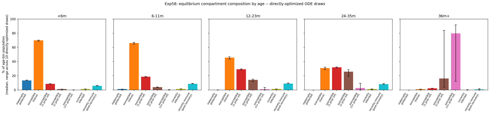

# Exp 58 — India Vellore: ODE MLE stability across seeds + equilibrium re-check

**Date:** 2026-08-18.

**Question.** See README.md — does exp57's single-seed ODE MLE hold up
across more `differential_evolution` seeds, and does re-running exp56's
equilibrium-uncertainty analysis with directly-optimized draws (instead of
ABM-HM-posterior draws) narrow the age-bin compartment-fraction CI?

**Operational note:** the first launch attempt crashed after 3/6 seeds with
`OSError: Too many open files` — repeatedly creating a ~160-worker
`multiprocessing.Pool` inside one long-lived process exhausted zebra's 1024
file-descriptor limit. Fixed by running each seed as its own OS subprocess
(`run_one_seed.py`), with resume logic so the 3 completed seeds weren't
re-run. All 6 seeds completed cleanly after the fix.

**Result, part 1 (stability): strong.** Best logL across all 6 seeds
ranges from **-284.22 to -284.67** (a 0.45-unit spread) — essentially the
same optimum found independently every time. The fitted p_symp values
(the parameters that matter most for the age-incidence question) are
tightly consistent:

| Seed | best logL | p_symp &lt;6m | p_symp 6-11m | p_symp 12+ |
|---|---|---|---|---|
| 20260817 (exp57's original) | -284.37 | 0.163 | 0.803 | 0.256 |
| 1 | -284.23 | 0.193 | 0.784 | 0.286 |
| 2 | -284.30 | 0.173 | 0.734 | 0.285 |
| 3 | -284.22 | 0.150 | 0.741 | 0.251 |
| 4 | -284.36 | 0.181 | 0.814 | 0.252 |
| 5 | -284.67 | 0.191 | 0.786 | 0.265 |

`log_base_beta`, `sus_r2`, and `sus_r3` vary far more across seeds
(`sus_r2` ranges 0.009-0.745, `log_base_beta` implies `base_beta` ranging
0.14-0.36) while landing at nearly identical logL — a compensating ridge
among these three parameters, not search instability.

**Result, part 2 (equilibrium re-check): mixed, and more interesting than
"tighter or not."** Pooled the top 10 highest-logL points across all 6
seeds' final populations and re-ran exp56's age-structured equilibrium
analysis. For every age bin exp56 originally flagged as wide (12-23m,
24-35m) or even the already-tight young bins, the directly-optimized draws
are **dramatically tighter**:

| age bin | metric | exp56 (HM-posterior) width | exp58 (direct-MLE) width |
|---|---|---|---|
| &lt;6m | susceptible (2 prior inf) | 4.00 | **0.13** |
| &lt;6m | susceptible (3+ prior inf) | 2.77 | **0.11** |
| 6-11m | susceptible (2 prior inf) | 8.01 | **0.55** |
| 6-11m | susceptible (3+ prior inf) | 10.15 | **0.54** |
| 12-23m | susceptible (2 prior inf) | 6.47 | **3.64** |
| 12-23m | susceptible (3+ prior inf) | 28.17 | **3.72** |
| 24-35m | susceptible (2 prior inf) | 17.57 | **9.37** |
| 24-35m | susceptible (3+ prior inf) | 37.81 | **9.33** |
| **36m+** | susceptible (2 prior inf) | 2.56 | **80.23** |
| **36m+** | susceptible (3+ prior inf) | 11.09 | **79.77** |

But **36m+ — the one bin exp56 found already tight and robust — is now the
*least* stable, by a wide margin**: the 10 directly-optimized draws put
"susceptible (3+ prior inf)" anywhere from 12% to 92% of that age bin's
population, visible directly in the figure below.

## Observations

1. **The ridge found in part 1 is exactly what's blowing up 36m+ in part
   2.** `sus_r2`/`sus_r3` are barely constrained by the MAL-ED cohort data
   (which only runs to ~35 months) — many combinations fit the 0-35mo IR
   targets equally well (same logL), but by 36+ months of equilibrium
   accumulation, small differences in the order-2→order-3+ transition
   compound into enormous divergence in the long-run compartment split.
   This is invisible in the likelihood (which never sees past 35mo) and
   was invisible in exp56 too — not because exp56's draws were better
   constrained, but because exp47's ABM-HM posterior (with its
   emulator/implausibility-driven NROY selection) apparently happened to
   sample a narrower slice of this ridge than 6 independent global
   optimizer runs do.
2. **Practical implication for ABM initialization (the original motivation
   for exp55/56):** the &lt;6m through 24-35m compartment fractions are now
   on much firmer footing for seeding an ABM population's age structure.
   The 36m+ order-2/order-3+ split is NOT — it should be treated as
   effectively unconstrained by this cohort's data, not narrowed by
   pooling more high-likelihood draws. Fixing it would need either data
   past 35 months, or an explicit prior/regularization on `sus_r2`/`sus_r3`
   separately from the likelihood.
3. **exp57's single-seed result holds up completely on the science
   question that mattered most** (India's &lt;6m/6-11m tension being
   structural): all 6 seeds land within an ESS-scale rounding error of
   each other on logL and agree closely on p_symp. The ridge only affects
   parameters that don't bear on the age-incidence targets directly.
4. The subprocess-per-seed fix (`run_one_seed.py` + resumable
   `run_multiseed.py`) is a reusable pattern worth keeping for exp59 and
   any future multi-seed ODE work — don't loop `differential_evolution`
   calls inside one long-lived process on zebra.

## Next

exp59 (infnum recode, already drafted) can now proceed with confidence that
age_binned's ODE optimum is a real, stable target to compare against — not
a single lucky seed. Separately, if the 36m+ susceptibility split ever
matters for a downstream decision (e.g., forward-predicting older-child
outcomes), it needs its own investigation rather than being read off this
equilibrium analysis.
