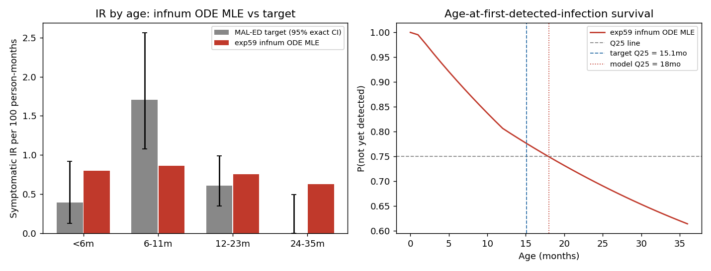

# Exp 59 — India Vellore: infnum vs age_binned in the ODE framework

**Date:** 2026-08-18.

**Question.** See README.md — infnum (p_symp by infection order) was the
original symptom structure tried for Vellore (exp31-35) before the arc
moved to age_binned, but that comparison predates the freed-p_symp,
neonatal-priming, and survival-vote decisions made since. Now that both
structures can be fit in ~5 minutes via the ODE pipeline (exp57/58), does
age_binned still win under current decisions?

**Result: decisively yes.** infnum's best logL across 6 seeds (**-293.37 to
-293.84**, spread 0.47 — just as stable as age_binned's optimum, see
below) is **~9 log-units worse** than age_binned's (**-284.22 to -284.67**,
exp58). In likelihood-ratio terms that's roughly a factor of 104
in favor of age_binned — not a close call.

| Metric | age_binned (exp58, 6 seeds) | infnum (exp59, 6 seeds) |
|---|---|---|
| best logL range | -284.22 to -284.67 | **-293.37 to -293.84** |
| spread across seeds | 0.45 | 0.47 (equally stable) |
| best-fit IR &lt;6m (target 0.396) | 0.35-0.62 (varies by run) | 0.800 (overshoot) |
| best-fit IR 6-11m (target 1.706, the peak) | 1.39-1.88 | **0.861** (completely misses the peak) |
| best-fit IR 12-23m (target 0.609) | 0.55-0.59 | 0.754 |
| best-fit repeat_frac (target 0.138) | ~0.10-0.11 | 0.111 |
| p_symp shape | strong 6-11m peak (0.73-0.81) vs &lt;6m (0.15-0.19) | **nearly flat across order** (0.30-0.41, order3+ scattered 0.11-0.85) |

## Observations

1. **The mechanism of failure is visible directly in the figure**: infnum's
   best-fit IR-by-age curve is nearly *flat* (0.80 / 0.86 / 0.75 / 0.63
   across &lt;6m / 6-11m / 12-23m / 24-35m) and completely fails to
   reproduce the sharp 6-11m peak (target 1.71, more than double every
   other bin). This is structural, not a search failure — p_symp keyed by
   infection order can't selectively boost symptom probability at a
   specific AGE the way age_binned's p_symp can, and the underlying
   transmission-driven infection-order distribution at 6-11m isn't
   concentrated enough in any one order to fake an age-specific bump
   through the order channel instead.
2. **infnum's fit is just as stable as age_binned's** (0.47 vs 0.45-unit
   spread across 6 seeds) — this is a confirmed, repeatable comparison, not
   noise on either side. `p_symp_order3plus` scatters more than
   order1/order2 (0.11-0.85) because order-3+ infections are rare within
   the cohort's follow-up window, so that parameter is weakly identified —
   same kind of ridge behavior exp58 found for `sus_r2`/`sus_r3`, but it
   doesn't rescue the overall fit here the way it didn't hurt age_binned's.
3. **This closes the loop on a question the India arc carried forward
   without re-testing since exp31-35** (which predates freed p_symp,
   neonatal priming, survival-vote scoring, and the corrected p_symp
   anchors). age_binned's selection for India is now re-confirmed under
   current decisions, via a completely independent, fast, deterministic
   method — not just inherited from an old ABM-HM comparison.
4. Both fits used the identical BDF-solver pipeline, timeout guard, and
   subprocess-per-seed structure from exp57/58 — no infnum-specific
   robustness issues came up (no crashes across any of the 6 seeds this
   time, unlike exp58's first attempt).

## Next

age_binned is the confirmed structure for India's ODE-pipeline work going
forward. Per AK's next question: use the confirmed-stable pools of
high-likelihood draws from BOTH exp58 (age_binned) and this experiment
(infnum, despite the worse natural-history fit) to compare achieved-VE
predictions across the different beta/susceptibility combinations each
model's ridge contains — the hypothesis being that similar underlying
vaccine efficacy could produce very different *achieved* VE depending on
which point on the ridge (which beta/sus_r2/sus_r3 combination) is used,
even within a single symptom-model structure.
