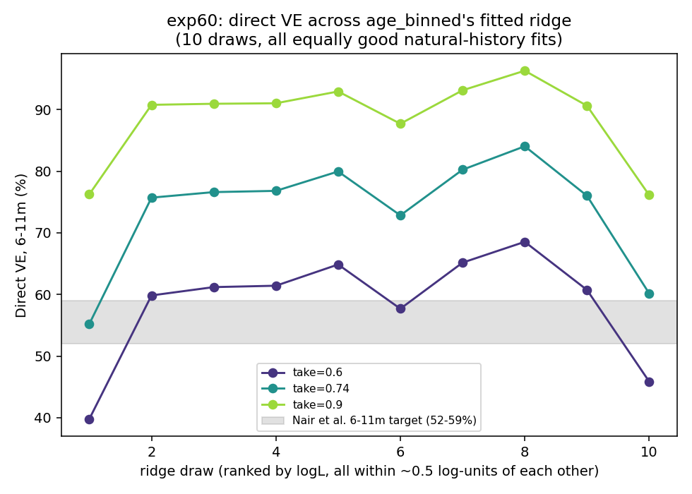

# Exp 60 — India Vellore: direct-VE sensitivity across age_binned's fitted ridge

**Date:** 2026-08-18.

**Question.** See README.md — exp58 found `log_base_beta`/`sus_r2`/`sus_r3`
sit on a ridge, with many combinations fitting the 0-35mo natural-history
data equally well. Does forward-predicted direct VE, at a fixed true
per-dose `take`, vary meaningfully across that ridge?

**Result: yes, substantially — confirmed hypothesis.** At a fixed `take`,
direct VE (6-11m, Rotavac 3-dose, low-coverage/direct-effect design matching
exp41 and Nair et al.'s test-negative estimand) spans a wide range across
the 10 equally-good ridge draws:

| take | median VE | min VE | max VE | spread |
|---|---|---|---|---|
| 0.60 | 61.0% | **39.8%** | **68.5%** | 28.7 pts |
| 0.74 | 76.3% | 55.2% | 84.0% | 28.9 pts |
| 0.90 | 90.9% | 76.1% | 96.3% | 20.2 pts |

**The single highest-logL draw of the entire ridge (seed 3, logL=-284.22 —
the best fit in exp58) gives VE=39.8% at take=0.6, clearly below Nair et
al.'s 52-59% target** — while a different, equally-good draw (seed 4,
logL=-284.36, only 0.14 log-units worse) gives 68.5%, clearly above it. If
either had been picked in isolation as "the" natural-history fit and used
to back out what `take` value matches Nair, they'd point to meaningfully
different answers (draw 1 needs a *higher* take to reach 52-59%; draw 8
already exceeds it at take=0.6).

## Observations

1. **This is a sharper, more consequential version of exp58's 36m+
   compartment-fraction finding.** There, the ridge only mattered for a
   quantity (older-age susceptibility split) nobody was using for a live
   decision. Here it directly affects the number a VE-take calibration
   exercise (like exp41/42's ABM-based attempts) would recommend — natural-
   history model selection is NOT sufficient to pin down VE forward-
   predictions for India, even after both symptom-structure (exp59) and
   seed-stability (exp58) are settled.
2. **Mechanistically, this is expected once stated plainly**: direct VE
   depends on the RATIO `sigma[order_after_dose] / sigma[order_before_dose]`
   (how much a vaccine-induced order-jump reduces susceptibility), which is
   governed by `sus_r2`/`sus_r3` — exactly the parameters exp58 found
   ridge-degenerate against the 0-35mo cohort data. A model that can't tell
   `sus_r2=0.06` from `sus_r2=0.28` from the natural-history fit alone (exp58's
   seeds 3 vs 2) will disagree just as much on vaccine impact, since the
   vaccine's whole mechanism runs through that same parameter.
3. **A genuine implication for methodology**, not just a caveat: this
   reframes exp42's earlier (ABM-based) attempt to add VE as an explicit HM
   scoring target. exp42 found that pulling the posterior toward VE
   plausibility only relocated the cohort-fit tension, not resolved it — but
   that was tried at the expense of expensive ABM waves. This ridge is
   cheap to explore directly now (this whole experiment ran in under 5
   minutes locally); a VE-aware selection among ridge points (not a full
   re-calibration) may be a more tractable next move than another ABM
   HM pass.
4. **Caveat on the vaccine mechanism's own simplification** (see
   `cohort_model.py`'s docstring): the dose-transfer is applied only to
   non-maternal compartments, i.e. a child still maternally protected at a
   dose age (6/10/14 weeks) gets no credit from that dose in this model —
   equivalent to assuming maternal antibody fully blunts vaccine response
   while present, a real but simplified assumption, not validated against
   the ABM's own (different) handling of this interaction.

## Next

Given the size of this effect, it's worth checking whether restricting the
ridge to draws that ALSO land near the Nair VE target (a VE-informed
sub-selection of the natural-history-equivalent ridge, cheap to do with this
pipeline) narrows `sus_r2`/`sus_r3` usefully — effectively using VE data as
an additional identifiability constraint the natural-history cohort data
alone can't provide, without the cost/complexity of exp42's full ABM
re-scoring approach.
