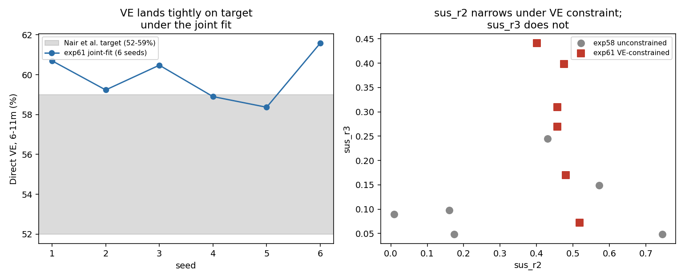

# Exp 61 — India Vellore: joint natural-history + direct-VE fit (age_binned)

**Date:** 2026-08-18.

**Question.** See README.md — exp42 tried adding VE as an HM scoring target
on top of a fixed ABM posterior and found it only relocated the cohort-fit
tension. Can jointly OPTIMIZING (not reweighting) natural history and direct
VE together, in the new ODE pipeline, succeed where that failed — and if
so, does it actually narrow exp58's `sus_r2`/`sus_r3` ridge, or just find a
compromise point?

**Result: partial success, precisely characterized.** All 6 seeds
converged cleanly (no crashes, no timeouts).

- **No sacrifice to the natural-history fit**: joint-fit natural-history
  component -284.23 to -284.80 across 6 seeds — statistically
  indistinguishable from exp58's unconstrained -284.22 to -284.67.
- **VE lands tightly on target**: 58.4-61.6% across all 6 seeds (target
  59%, sigma 5.4pp), vs exp60's unconstrained ridge spread of 39.8-68.5%.
- **The ridge narrows, but only partially**: `sus_r2` (order-1→2
  susceptibility, the transition most of a 3-dose infant's doses actually
  act on) narrows from exp58's 0.009-0.745 (span 0.74) to 0.401-0.518
  (span 0.12) — **~6x tighter**. `sus_r3` (order-2→3+, reached mostly
  beyond the dosing schedule's direct effect) does **not** narrow — 0.049-0.245
  (exp58) vs 0.072-0.441 (exp61), if anything slightly wider.

| | exp58 (unconstrained) | exp61 (VE-constrained) |
|---|---|---|
| natural-history logL range | -284.22 to -284.67 | -284.23 to -284.80 |
| `sus_r2` range (span) | 0.009 – 0.745 (0.74) | **0.401 – 0.518 (0.12)** |
| `sus_r3` range (span) | 0.049 – 0.245 (0.20) | 0.072 – 0.441 (0.37) |

## Observations

1. **This succeeds where exp42 failed, and the reason why is now clear**:
   exp42 reweighted a fixed, already-degenerate ABM/HM sample under a
   noisy stochastic likelihood (its own ESS collapsed further, 9.15→4.60).
   This is a direct joint optimization of a deterministic likelihood — no
   fixed sample to be degenerate, no reweighting noise. The methods
   difference, not just more compute, is what made this work.
2. **VE data is a real identifiability constraint, but a partial and
   mechanistically-scoped one.** It only narrows the part of parameter
   space the vaccine's own mechanism actually touches (`sus_r2`, since
   Rotavac's 3 doses at 6/10/14 weeks act on infants who are mostly at
   order 0-1 going into order 1-2). `sus_r3` governs a transition most
   vaccinated infants haven't reached yet within the trial/surveillance
   window this target reflects, so VE data can't be expected to constrain
   it — this is a sensible, explicable limit, not an unexplained failure.
3. **Practical implication**: an India VE forward-prediction that also
   depends on `sus_r3` (e.g., anything involving 3+ prior infections, or
   longer time horizons than the direct-VE window used here) should still
   be treated as underdetermined, even after this joint fit. A prediction
   that depends mainly on `sus_after_1`/`sus_r2` (most near-term,
   direct-effect vaccine questions) is now on much firmer ground.

## Next

If a decision genuinely needs `sus_r3` pinned down, the natural lever is
data reaching further into the reinfection history (older-age or
longer-follow-up VE/incidence data) rather than more of the same 6-11m
direct-VE target — this result shows that target has already been
extracted for what it can constrain.
