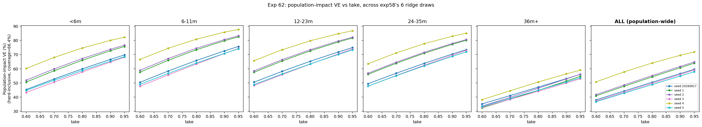

# Exp 62 — India Vellore: population-level vaccine impact vs take, across the ridge

**Date:** 2026-08-19.

**Question.** See README.md — does population-level (herd-inclusive) vaccine
impact vary across exp58's ridge as much as direct/individual VE did
(exp60's 29-point spread), and how does impact scale with take up to 95%?

**Result: impact is substantial and rises steadily with take, ridge
uncertainty is real but narrower than the direct-VE case, and — counter to
the a priori hypothesis in this experiment's own README — the oldest age
bin is the *most* stable across the ridge, not the least.**

Population-impact VE, median [min, max] across exp58's 6 ridge draws, by
age bin and take (this is the full range AK asked to see, not just the
spread width):

| take | &lt;6m | 6-11m | 12-23m | 24-35m | 36m+ | **ALL (population-wide)** |
|---|---|---|---|---|---|---|
| 0.60 | 47.9% [43.3, 60.2] | 54.0% [47.7, 66.6] | 54.0% [48.2, 65.7] | 52.7% [47.7, 63.5] | 33.5% [32.4, 38.1] | **39.4% [36.7, 50.7]** |
| 0.70 | 55.7% [50.6, 68.0] | 62.2% [55.6, 74.4] | 61.8% [55.8, 73.4] | 60.3% [55.0, 71.1] | 39.4% [38.4, 44.5] | **45.9% [42.7, 57.7]** |
| 0.80 | 62.9% [57.7, 74.6] | 69.6% [63.3, 80.8] | 68.9% [63.3, 79.7] | 67.3% [62.0, 77.6] | 45.5% [44.1, 50.6] | **52.3% [48.8, 64.0]** |
| 0.90 | 69.6% [64.7, 80.0] | 76.1% [70.7, 85.8] | 75.3% [70.1, 84.7] | 73.8% [68.7, 82.9] | 52.0% [49.9, 56.3] | **58.6% [54.8, 69.5]** |
| 0.95 | 72.7% [68.1, 82.2] | 79.1% [74.0, 87.7] | 78.3% [73.2, 86.7] | 76.8% [71.9, 85.0] | 55.3% [52.9, 59.0] | **61.7% [57.9, 71.8]** |

Spread (max − min) across the ridge is ~14-15 percentage points for the
overall number at every take level — real, but roughly **half** exp60's
direct-VE spread (28.7 points at take=0.74). The 36m+ column is visibly
tighter (5-7 points wide) than every other age bin (14-19 points wide) —
see Observation 1 for why.

## Observations

1. **36m+ being the most ridge-stable bin is the opposite of this
   experiment's own starting hypothesis** (that `sus_r3`, which sets
   `sus_after_3plus` and dominates the ~95%-of-population 36m+ bin, would
   make population impact *more* ridge-sensitive than exp60's direct VE
   found). The likely explanation: `sus_r3`'s large effect on the
   *equilibrium composition* at 36m+ (exp58/56 already found a huge range
   there) enters both the vaccinated and unvaccinated equilibria the same
   way, so a lot of it cancels in the **ratio** that defines VE — VE cares
   about the *relative* change vaccination causes, not the absolute
   susceptibility level. This is a genuinely useful, not-obvious-in-advance
   finding: high uncertainty in a state variable doesn't automatically mean
   high uncertainty in an impact ratio computed from it.
2. **The population-wide overall number is pulled hard toward the 36m+
   value**, not the young-age values, simply because 36m+ holds ~95% of
   the population (e.g. at take=0.9: overall 58.6% vs 36m+'s own 52.0%
   median vs the young bins' 70-76% median) — a real and important
   distinction for anyone tempted to quote a young-age direct-VE number as
   if it represented population-wide impact.
3. **Impact keeps rising meaningfully all the way to take=0.95** (no sign
   of saturation in this range) — median overall VE climbs from 39.4%
   (take=0.6) to 61.7% (take=0.95), a 22-point gain, with no flattening
   visible yet. Higher-take vaccine formulations/schedules would still buy
   real additional population impact in this setting, at least up to 95%.
4. Ridge spread *narrows* somewhat as take increases (e.g. overall spread
   14.0pts at take=0.6 vs 13.7pts at take=0.95) — modest, but consistent
   with higher take pushing more of the population toward strong,
   less-order-dependent protection regardless of exactly where each draw
   sits on the ridge.

## Next

The `sus_r3`-cancellation-in-ratio hypothesis (observation 1) is inferred
from the pattern, not directly tested — worth a quick follow-up correlating
each seed's `sus_r3` value against its 36m+ VE if this becomes decision-relevant,
rather than population composition uncertainty being naively read across
into impact-uncertainty claims. Coverage was fixed at 66.4% (NFHS-5)
throughout; a coverage sweep (flagged as a follow-on in the README) hasn't
been run.
