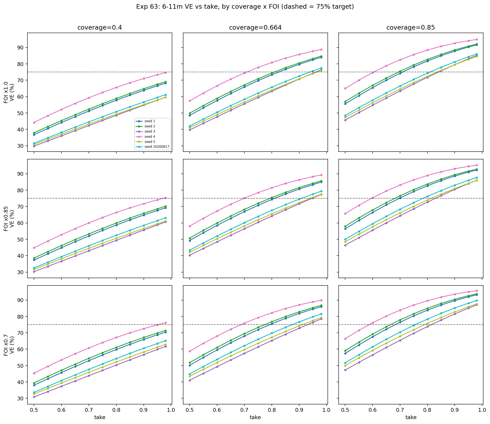
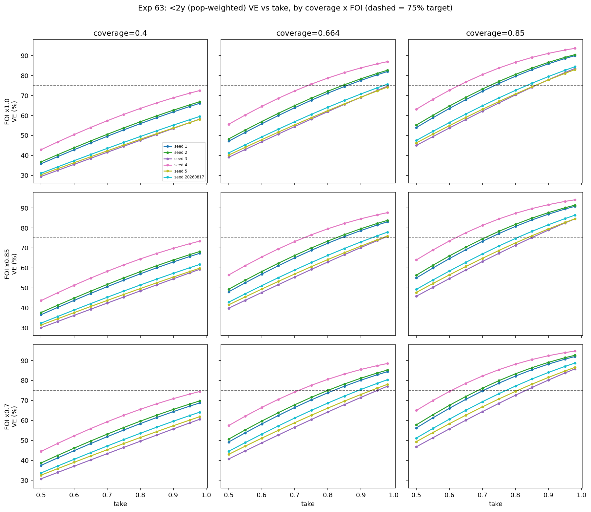
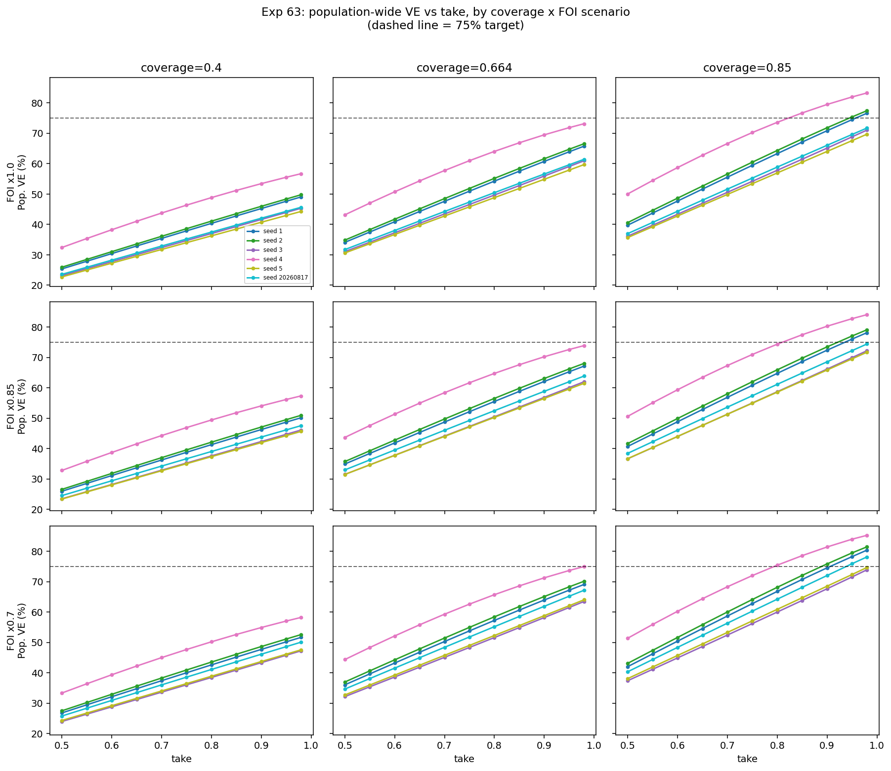
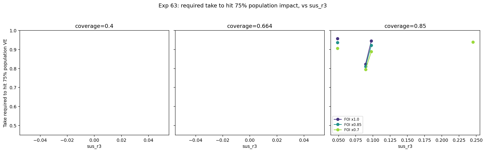

# Exp 63 — India Vellore: population impact vs take, across coverage and FOI scenarios

**Date:** 2026-08-19.

**Question.** See README.md — does the take→impact relationship change
across coverage levels, how does a lower-FOI counterfactual shift impact,
and — per AK's specific request — what take is required to hit 75%
population-wide impact, and how does that requirement move with the ridge?

**Operational note:** the first attempt hung indefinitely on zebra (0
completed tasks after 3+ minutes, later confirmed after being moved off
AK's laptop mid-run). Root cause, reproduced directly: `compute_vax`'s
~440-state Jacobian is large enough to cross OpenBLAS's internal
auto-threading threshold (unlike the ~110-state unvax model, which never
hit this) — a forked `multiprocessing.Pool` worker's first large BLAS
operation can deadlock initializing its own thread pool post-fork, a known
threaded-BLAS+fork gotcha. Fixed by forcing single-threaded BLAS
(`OMP_NUM_THREADS=1` etc., set before numpy is imported). Confirmed fix on
zebra: hung indefinitely without it, completed the full 612-simulation
grid in under 20 seconds with it.

**Headline result: the population-wide-only number is misleadingly
pessimistic for evaluating a new vaccine's benefit to children — broken
down by age bin, 75% impact in the child-relevant bins (6-11m, `<2y`) is
achievable at REALISTIC or moderately-improved coverage/take, not just the
85%-coverage extreme the population-wide number implied.**

The population-wide number is dominated by the 36m+ bin, which holds
~95% of the population (exp55/56/58) and benefits least from vaccination
(most 36m+ individuals have already accumulated natural immunity by then,
so a vaccine has less room to add protection there) — that single large,
low-marginal-benefit bin drags the *population-wide average* down far
below what the vaccine is actually delivering to the age group it's aimed
at. AK asked for the breakdown explicitly because of this; the corrected,
age-specific picture below should be the one used for the EDGE
conversation, not the population-wide number alone.

## By age bin: 6-11m and `<2y` (population-weighted `<6m`+`6-11m`+`12-23m`)

VE, median [min, max] across the 6 ridge draws:

**6-11m:**

| Coverage | FOI | take=0.6 | take=0.8 | take=0.95 |
|---|---|---|---|---|
| 0.40 | x1.0 | 41.2% [36.0, 52.2] | 54.3% [48.6, 65.6] | 63.1% [57.8, 73.4] |
| 0.40 | x0.7 | 43.3% [37.3, 53.5] | 57.0% [50.3, 67.1] | 66.1% [59.8, 74.9] |
| 0.664 | x1.0 | 54.0% [47.7, 66.6] | 69.6% [63.3, 80.8] | 79.1% [74.0, 87.7] |
| 0.664 | x0.7 | 56.7% [49.3, 68.0] | 72.6% [65.3, 82.2] | 82.1% [76.4, 88.9] |
| **0.85** | **x1.0** | 61.6% [54.7, 74.7] | **78.0% [71.8, 88.4]** | 87.3% [82.7, 94.1] |
| 0.85 | x0.7 | 64.5% [56.5, 76.1] | 81.1% [73.8, 89.6] | 90.0% [85.1, 95.0] |

**`<2y` (population-weighted):**

| Coverage | FOI | take=0.6 | take=0.8 | take=0.95 |
|---|---|---|---|---|
| 0.40 | x1.0 | 40.1% [35.5, 50.4] | 52.6% [47.5, 63.5] | 61.2% [56.4, 71.1] |
| 0.40 | x0.7 | 42.7% [37.1, 52.3] | 55.9% [49.6, 65.5] | 64.8% [58.7, 73.2] |
| **0.664** | **x1.0** | 52.5% [46.8, 64.5] | 67.6% [61.9, 78.7] | **77.1% [72.3, 85.8]** |
| 0.664 | x0.7 | 55.7% [48.7, 66.5] | 71.2% [64.2, 80.5] | 80.7% [75.0, 87.4] |
| 0.85 | x1.0 | 59.9% [53.7, 72.6] | 76.1% [70.2, 86.6] | 85.5% [81.0, 92.7] |
| 0.85 | x0.7 | 63.3% [55.7, 74.5] | 79.7% [72.6, 88.1] | 88.8% [83.7, 93.9] |

**At today's coverage (66.4%), median `<2y` impact already clears 75% at
take=0.95** — a real, near-term-achievable target, unlike the
population-wide framing. 6-11m specifically clears 75% at coverage=0.85,
take=0.8 (median 78.0%) — even *today's* coverage gets 6-11m to a median
79.1% at take=0.95.

**Required take to hit 75%, by ridge draw:**

*6-11m:*

| seed | sus_r2 | cov=0.664, FOI x1.0 | cov=0.85, FOI x1.0 |
|---|---|---|---|
| 4 | 0.009 | 0.688 | 0.588 |
| 2 | 0.161 | 0.775 | 0.666 |
| 1 | 0.174 | 0.793 | 0.683 |
| 20260817 | 0.430 | 0.875 | 0.756 |
| 5 | 0.572 | 0.912 | 0.790 |
| 3 | 0.745 | 0.931 | 0.815 |

*`<2y` (population-weighted):*

| seed | sus_r2 | cov=0.664, FOI x1.0 | cov=0.85, FOI x1.0 |
|---|---|---|---|
| 4 | 0.009 | 0.740 | 0.629 |
| 2 | 0.161 | 0.845 | 0.724 |
| 1 | 0.174 | 0.859 | 0.737 |
| 20260817 | 0.430 | 0.970 | 0.835 |
| 3 | 0.745 | not reached | 0.862 |
| 5 | 0.572 | not reached | 0.860 |

**Every seed reaches the 75% target for both 6-11m and `<2y` at
coverage=0.85** (unlike the population-wide case, where seeds 3 and 5 never
reached it even at take=0.98) — the required take just varies by ridge
draw, from as low as 0.59 (seed 4) to 0.86 (seed 3/5).

## Population-wide number, for context

Overall population-wide VE, median [min, max] across the 6 ridge draws
(the number this experiment originally reported, before the age-bin
breakdown above — at today's realistic coverage, 75% population-wide
impact is not reachable through `take` alone, not at take=0.98, not even
with a 30% FOI reduction; only coverage≈85% makes it reachable, and even
then not for every ridge draw):

| Coverage | FOI | take=0.6 | take=0.8 | take=0.95 |
|---|---|---|---|---|
| 0.40 | x1.0 | 29.3% [27.2, 38.2] | 38.9% [36.2, 48.8] | 46.0% [42.9, 55.5] |
| 0.40 | x0.85 | 30.3% [28.1, 38.7] | 40.2% [37.3, 49.4] | 47.4% [44.3, 56.2] |
| 0.40 | x0.7 | 31.5% [28.8, 39.3] | 41.8% [38.5, 50.2] | 49.4% [45.8, 57.0] |
| 0.664 | x1.0 | 39.4% [36.7, 50.7] | 52.3% [48.8, 64.0] | 61.7% [57.9, 71.8] |
| 0.664 | x0.85 | 40.7% [37.8, 51.3] | 54.0% [50.3, 64.7] | 63.6% [59.6, 72.6] |
| 0.664 | x0.7 | 42.4% [38.6, 52.1] | 56.2% [51.6, 65.7] | 66.2% [61.5, 73.6] |
| 0.85 | x1.0 | 46.0% [42.8, 58.7] | 61.1% [56.9, 73.6] | 72.0% [67.6, 81.9] |
| 0.85 | x0.85 | 47.5% [44.0, 59.4] | 63.0% [58.6, 74.4] | 74.1% [69.5, 82.8] |
| **0.85** | **x0.7** | 49.4% [44.9, 60.2] | 65.5% [60.0, 75.4] | **77.1% [71.5, 84.0]** |

Only the bottom-right cell (coverage=0.85, FOI×0.7, take=0.95) has even
its *median* clear the 75% line — and its own range still spans 71.5% to
84.0%, i.e. some ridge draws still miss it even in the best-case scenario
tested.

**Required take to hit 75%, by ridge draw (only reachable at coverage=0.85
within this take range — never reached at 0.40 or 0.664 for any seed or
FOI scenario):**

| seed | sus_r2 | sus_r3 | FOI x1.0 | FOI x0.85 | FOI x0.7 |
|---|---|---|---|---|---|
| 4 | 0.009 | 0.089 | 0.823 | 0.810 | 0.794 |
| 1 | 0.174 | 0.049 | 0.958 | 0.936 | 0.906 |
| 2 | 0.161 | 0.098 | 0.945 | 0.921 | 0.889 |
| 20260817 | 0.430 | 0.245 | not reached | not reached | 0.939 |
| 3 | 0.745 | 0.049 | not reached | not reached | not reached |
| 5 | 0.572 | 0.149 | not reached | not reached | not reached |

## Observations

0. **Which number you quote matters a lot.** For a vaccine-development
   conversation about protecting children, the age-specific numbers
   (6-11m, `<2y`) are the relevant ones and paint a genuinely encouraging
   picture — 75% is reachable at or near today's coverage. The
   population-wide number is real and useful for a different question
   (total disease burden averted across the whole population, relevant for
   e.g. health-economic burden calculations), but reporting it alone would
   understate what a higher-`take` vaccine could deliver to the age group
   it's actually protecting.
1. **The requested "required take" analysis tracks `sus_r2` more cleanly
   than `sus_r3`, contrary to this project's working assumption going in.**
   Seed 1 and seed 3 have nearly identical `sus_r3` (0.049 vs 0.049) but
   opposite outcomes — seed 1 reaches 75% easily (take≈0.91-0.96), seed 3
   never reaches it even at take=0.98. `sus_r2` cleanly separates them
   (0.174 vs 0.745) and orders all 6 seeds correctly: low `sus_r2`
   (seed 4, 0.009) reaches the target at the lowest required take; high
   `sus_r2` (seed 3, 0.745; seed 5, 0.572) never reaches it in this range.
   This is consistent with exp61's finding that the vaccine mechanism runs
   mainly through `sus_r2` (the order-1→2 transition doses actually act
   on) — and extends it: `sus_r2` matters for the *population-level*
   threshold question too, not just individual direct VE.
2. **Coverage is the dominant lever for whether 75% is achievable at all**,
   not take or FOI. Moving from 40%→66.4%→85% coverage shifts the
   take=0.95 median from 46.0%→61.7%→72.0% — a much bigger swing than
   FOI's contribution at fixed coverage (e.g. at 85% coverage, FOI×1.0→0.7
   only moves take=0.95 from 72.0% to 77.1%, about a quarter of the
   coverage effect). A next-gen vaccine's higher `take` only pays off fully
   if coverage also improves — a `take`-only improvement at today's ~66%
   coverage caps out around 62-72% population impact even at take→1.
3. **FOI reduction helps, but is a secondary lever and outside EDGE's
   control anyway** — included per AK's request for completeness, but the
   coverage effect dominates throughout the grid.
4. **The BLAS/fork fix (Observation in the operational note) is a durable
   methods finding**, not a one-off — any future experiment adding a
   larger-state ODE model to this multiprocessing pipeline should set the
   single-threaded BLAS env vars up front rather than rediscovering this.

## Next

Per AK: repeat this same ridge/coverage/FOI analysis for Bangladesh, since
its immunity structure differs from India's (genuinely non-identifiable
between age_binned/infnum, rather than a confirmed age_binned winner) —
the whole pipeline (exp57-63) needs to be re-run against Bangladesh's own
MAL-ED cohort data and posterior, not just re-parameterized.
