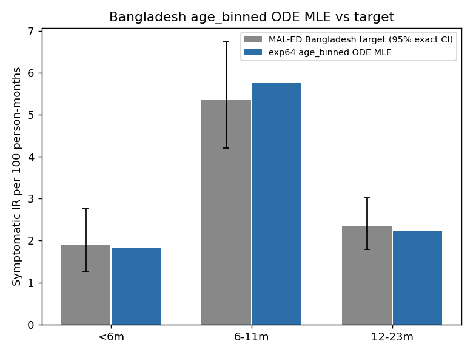

# Exp 64 — Bangladesh: age_binned ODE direct-fit + seed-stability check

**Date:** 2026-08-19.

**Question.** See README.md — repeat India's exp57+58 method for
Bangladesh under `age_binned` (freed titer shape, not the old ABM
pipeline's fixed values): get a confirmed-stable pool of fitted draws as
input to exp66 (Bangladesh direct-VE ridge analysis).

**Result: stable, and a strikingly clean fit.** All 6 seeds converged to a
tight logL range, **-217.82 to -220.24** (spread 2.42) — comparable in
relative tightness to India's exp58 (0.45-unit spread on a similar-scale
logL). Best-fit point (seed 4, logL=-217.82) nails all three IR-by-age
targets closely:

| | model | target |
|---|---|---|
| IR &lt;6m | 1.836 | 1.908 |
| IR 6-11m | 5.773 | 5.366 |
| IR 12-23m | 2.235 | 2.346 |
| repeat_frac | 0.332 | 0.403 |

`p_symp_age_6_11` **saturates near 1.0 in every one of the 6 seeds**
(0.961-1.000):
Bangladesh's sharp 6-11m peak (nearly 3x the &lt;6m rate) demands
essentially "almost every 6-11m infection is symptomatic" to reproduce,
and age_binned can deliver that directly. `sus_r2`/`sus_r3` show the same
kind of ridge behavior found for India (range 0.505-1.000 / 0.106-0.690
across seeds at near-identical logL) — expected, not a new finding, and
consistent with this being a structural feature of the ODE reduction, not
India-specific.

## Observations

1. **This is Bangladesh's best point-fit to date for `age_binned`** — the
   old ABM/HM posterior (exp25) achieved similar magnitude
   (IR [2.09, 5.53, 2.47] vs target [1.91, 5.37, 2.35], repeat 0.387 vs
   0.403) but via a fixed titer shape and a full stochastic calibration;
   this reproduces essentially the same quality fit in ~5 minutes via
   direct optimization with titer freed.
2. See exp65's SUMMARY for the head-to-head comparison against infnum —
   the more consequential result from this pair of experiments.

## Next

exp65 (infnum, same method) — comparison and mechanism discussion there.
exp66: direct-VE ridge analysis for both Bangladesh models, mirroring
India's exp60.
