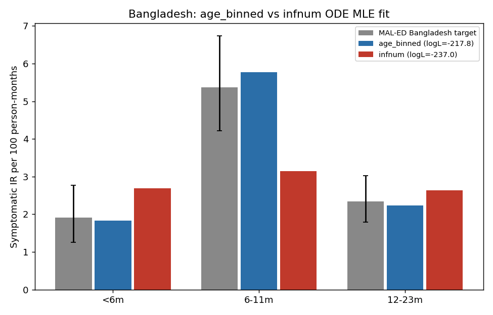

# Exp 65 — Bangladesh: infnum ODE direct-fit + seed-stability, and comparison to age_binned

**Date:** 2026-08-19/20.

**Question.** See README.md — repeat exp64's method under `infnum` for
Bangladesh, and (per AK: both models are usable for Bangladesh, simulate
both rather than pick one) compare the two head-to-head under the same
direct-optimization method.

**Result: infnum is also stable across seeds, but decisively worse than
age_binned — a ~19 log-unit gap, with a clear, mechanistic explanation.**

| | age_binned (exp64) | infnum (this experiment) |
|---|---|---|
| logL range (6 seeds) | -217.82 to -220.24 | -236.95 to -237.63 |
| spread | 2.42 | 0.68 (tighter, but at a much worse optimum) |
| best-fit IR &lt;6m (target 1.908) | 1.836 | 2.691 |
| best-fit IR 6-11m (target 5.366, the peak) | 5.773 | **3.148 (41% undershoot)** |
| best-fit IR 12-23m (target 2.346) | 2.235 | 2.638 |
| best-fit repeat_frac (target 0.403) | 0.332 | 0.352 |

## Observations

1. **Same mechanism as India (exp59), now confirmed for Bangladesh too.**
   Bangladesh's 6-11m rate is ~2.8x the &lt;6m rate — a sharp, real peak.
   `age_binned`'s age-keyed `p_symp_age_6_11` can target that specific age
   directly, and saturates near its ceiling in every one of the 6 seeds
   (0.961-1.000) to do so. `infnum`'s order-keyed `p_symp_order2` tops out
   at 0.734-0.904 across seeds — it can't reach the same peak because
   6-11m infections are a *mix* of orders, diluting any single order's
   symptom-probability boost. This is the identical structural limitation
   that decided India's model selection (exp59) — it just wasn't decisive
   enough to show up as a clean "winner" in Bangladesh's old ABM/HM
   comparison (exp20/28), for reasons in Observation 2.
2. **This refines, rather than flatly contradicts, the historical
   "genuinely non-identifiable" finding (exp20/28).** That comparison used
   the full stochastic ABM with FIXED titer maternal shape, and measured
   posterior *behavior* (ESS, VE-distribution overlap) — not a clean
   apples-to-apples peak-likelihood comparison. This experiment is a
   direct, deterministic MLE comparison with titer freed for both models
   (same method, same everything except symptom structure) — a sharper
   instrument for "which structure fits the peak of the likelihood
   better," at the cost of not telling us about posterior mixing/ESS the
   way the old HM comparison did. Both findings can be true at once: infnum
   may have had a smoother, higher-ESS posterior surface around a
   mediocre optimum, while age_binned has a sharper, better optimum that
   was harder for the old stochastic HM pipeline to characterize cleanly
   (echoing exp25's own history — age_binned's ESS 61.5 vs infnum's 107.9,
   but age_binned's point-fit was already competitive even then).
3. **AK's instinct (leaning toward infnum from ESS/identifiability) and
   this result (age_binned wins on peak fit) are not actually in tension**
   — they're answering different questions (posterior tractability vs.
   best achievable fit). Worth keeping both models' fits going forward
   given AK's request to simulate both regardless.
4. `sus_r2`/`sus_r3` show ridge-like scatter across seeds for BOTH models
   (age_binned: 0.505-1.000 / 0.106-0.690; infnum: 0.254-0.516 /
   0.033-0.781) — the same non-identifiability pattern found for India,
   not something specific to Bangladesh or to one symptom structure.

## Next

exp66: direct-VE ridge analysis for both Bangladesh models (mirroring
India's exp60), using each model's 6-seed pool from exp64/exp65.
